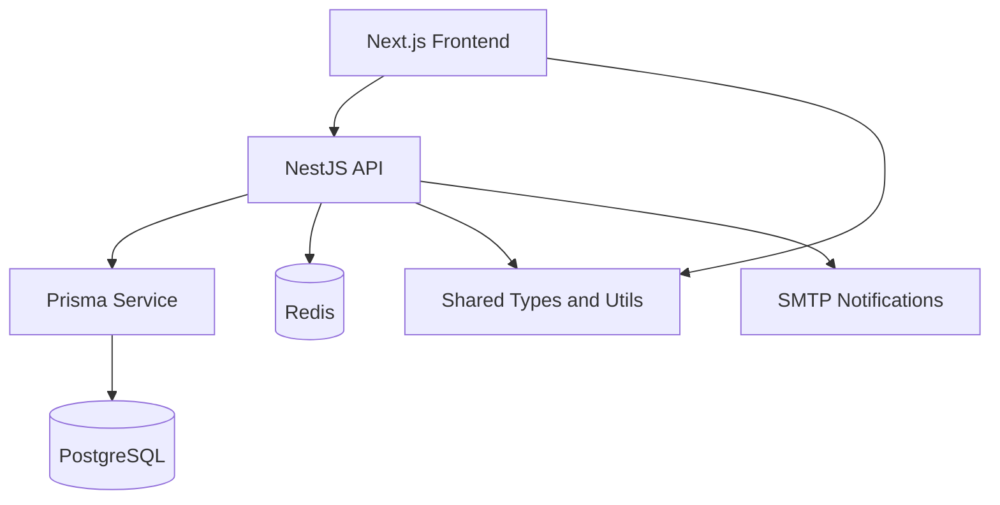

# Moul Hanout

Moul Hanout is a full-stack retail operations platform for traditional grocery stores. It replaces paper-based tracking with a structured digital workflow for authentication, catalog management, inventory control, point-of-sale checkout, alerts, reporting, and store team administration.

The project is built as a monorepo with a NestJS backend, a Next.js frontend, shared TypeScript contracts, Prisma for data access, PostgreSQL for persistence, Redis for runtime support, and Docker Compose for local full-stack orchestration.

The current product UI is primarily in French because it is designed for local store operators, while the engineering documentation in this README is written in English for contributor onboarding.

## What The Platform Covers

### 1. Secure access and role separation
- JWT-based authentication with login, refresh, logout, and password reset flows
- Owner and cashier roles with protected routes and scoped actions
- Rate limiting, DTO validation, centralized error formatting, and response wrapping

### 2. Product and catalog management
- Category creation and activation management
- Product CRUD with barcode uniqueness, pricing fields, stock threshold settings, and media support
- Shared API contracts between frontend and backend packages

### 3. Inventory supervision
- Real-time stock visibility
- Low-stock and out-of-stock detection
- Expiration tracking for perishable items
- Stock movement workflows and history-oriented inventory updates

### 4. POS checkout workflow
- Product selection by category and search
- Running cart with total calculation
- Payment-mode selection
- Receipt-oriented checkout flow for the cashier station

### 5. Alerts and operational follow-up
- Low-stock and near-expiry alerts derived from live inventory data
- Alert read-state management
- Optional SMTP-backed owner notifications when mail configuration is present

### 6. Reporting and export
- Revenue, transaction, average basket, and stock alert summaries
- Period-based analysis with daily trend views
- CSV export for operational reporting

### 7. Store administration
- Owner-managed user creation and activation flows
- Store profile management
- Email destination management for important notifications

## Feature Walkthrough

### Dashboard
The dashboard gives the owner a store-wide pulse: stock alerts, expiring products, daily revenue, transaction counts, and quick actions into the POS or inventory screens.


### POS Checkout
The sales workspace is designed for cashiers. It shows product tiles, remaining stock, category filters, a live cart, payment options, and receipt printing controls.


### Inventory Monitoring
The inventory workspace highlights stock rupture, low-stock warnings, active product counts, search and filtering, and products that require immediate attention.


### Product Creation Studio
Owners can create products with media, category assignment, unit configuration, pricing, descriptions, thresholds, and a live card preview.


### Category Management
Categories are managed through a dedicated screen that keeps the catalog organized and aligned with the cashier experience.


### User Administration
The team management area lets the owner create cashier accounts, review active users, and control access at the store level.


### Alerts Workspace
All inventory-driven alerts are centralized in one view so the owner can monitor stock health and follow up quickly.


### Profile And Notification Settings
The profile page stores the owner identity and the email used for important SMTP notifications such as stock and expiration alerts.


### Reports And Analytics
Reports aggregate revenue, transaction volume, average basket, and stock alerts over a selected period, with export support for offline analysis.


The reporting page also drills into daily performance tables, low-stock products, and near-expiration items to support practical store decisions.


## Architecture At A Glance



### Backend principles
- Modular NestJS backend with domain modules under `backend/src/modules`
- Thin controllers, service-owned business logic, Prisma-owned persistence
- Shared global behavior through validation pipes, exception filters, throttling, and interceptors

### Frontend principles
- Next.js App Router frontend under `frontend/src/app`
- Frontend consumes backend APIs instead of duplicating business logic
- Shared contracts come from `packages/shared-types` and `packages/shared-utils`

### Main backend modules
- `auth`
- `users`
- `categories`
- `products`
- `inventory`
- `sales`
- `alerts`
- `reports`
- `health`
- `mail`

## Tech Stack

| Layer | Technology |
| --- | --- |
| Frontend | Next.js 15, React 19, Zustand, Recharts, Tailwind CSS 4 |
| Backend | NestJS 11, Prisma 7, class-validator, JWT, Nodemailer |
| Data | PostgreSQL 16, Redis 7 |
| Shared contract | `@moul-hanout/shared-types`, `@moul-hanout/shared-utils` |
| Tooling | Docker Compose, ESLint, Jest, Prisma Migrate, Husky |

## Repository Structure

```text
/
|- backend/                  NestJS API
|- frontend/                 Next.js application
|- packages/
|  |- shared-types/          shared DTOs and domain types
|  |- shared-utils/          shared helpers
|- docs/                     architecture, task, and audit documentation
|- screens/                  UI screenshots used in this README
|- docker-compose.yml        local full-stack runtime
```

## Quick Start

### Prerequisites
- Node.js 20+
- npm 10+
- PostgreSQL
- Redis

### Local development with npm
1. Install workspace dependencies:

   ```bash
   npm install
   ```

2. Copy `.env.example` to `.env` and update the values for your environment.

3. Make sure at least these required variables are present:

   ```env
   DATABASE_URL=
   JWT_SECRET=
   JWT_REFRESH_SECRET=
   ```

4. If you want owner email notifications, configure the full SMTP set together:

   ```env
   SMTP_HOST=
   SMTP_PORT=
   SMTP_USER=
   SMTP_PASS=
   MAIL_FROM=
   ```

5. Generate Prisma Client and seed the database:

   ```bash
   npm run generate:prisma
   npm run seed
   ```

6. Start backend and frontend together:

   ```bash
   npm run dev
   ```

7. Open:
- Frontend: `http://localhost:3000`
- API: `http://localhost:4000/api/v1`
- Swagger in non-production: `http://localhost:4000/api/docs`

### Local full stack with Docker Compose
If you want the database, Redis, backend, and frontend to run together in containers:

```bash
docker compose up --build
```

Notes:
- The sample `.env.example` is Docker-oriented and uses `postgres` as the database host.
- If you run the backend outside Docker, make sure `DATABASE_URL` points to your local PostgreSQL host instead of the container hostname.

## Seeded Demo Accounts

After running the seed script, the default accounts are:

| Role | Email | Password |
| --- | --- | --- |
| Owner | `owner@moulhanout.ma` | `Admin@123!` |
| Cashier | `cashier@moulhanout.ma` | `Cashier@123!` |

The seed also creates a baseline shop, sample categories, and sample products so inventory, alerts, POS, and reports have realistic starting data.

## Useful Commands

| Command | Purpose |
| --- | --- |
| `npm run dev` | Start backend and frontend together |
| `npm run dev:backend` | Start the NestJS API only |
| `npm run dev:frontend` | Start the Next.js app only |
| `npm run generate:prisma` | Generate Prisma Client |
| `npm run seed` | Seed baseline shop, users, categories, and products |
| `npm run build` | Build shared packages, backend, and frontend |
| `npm run lint` | Run backend and frontend linting |
| `npm run test` | Run backend tests |
| `npm run check:backend` | Generate Prisma client, run backend tests, e2e tests, and build |
| `npm run check:frontend` | Lint and build the frontend |
| `npm run verify` | Run shared, backend, and frontend verification steps |

## API And Engineering Notes

- API routes are exposed under `/api/v1`
- Successful responses are normalized by a global transform interceptor
- Validation is enforced globally through NestJS `ValidationPipe`
- Errors are normalized with a centralized HTTP exception filter
- Request throttling is enabled application-wide
- Swagger is available only outside production

## Additional Documentation

- [Project overview](docs/overview.md)
- [Architecture](docs/architecture.md)
- [Task documentation baseline](docs/task-project-documentation-baseline.md)
- [Documentation and audit files](docs/)

## Current Status

This repository is no longer just an auth foundation. It already contains the main MVP business flows for a single-store grocery operation. The main work ahead is hardening, validation, and production-readiness rather than inventing the product from scratch.
