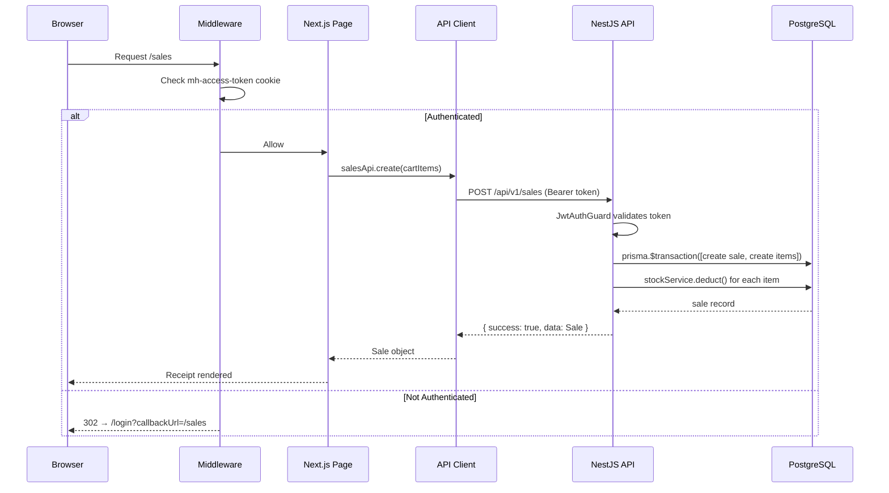

# 🏗️ Moul Hanout — Production Architecture Reference

> Full architecture specification for the POS SaaS system.
> Keep this document updated when making major structural decisions.

---

## 1. Complete Folder Tree

```
root/
├── .env.example                        ← Docker Compose env template
├── .gitignore
├── docker-compose.yml                  ← Postgres + Redis + Backend + Frontend
├── README.md                           ← Dev onboarding guide
│
├── scripts/
│   ├── setup.sh                        ← One-command dev bootstrap
│   └── migrate.sh                      ← Prisma migration helper
│
├── docs/
│   └── ARCHITECTURE.md                 ← (this file)
│
├── packages/
│   ├── shared-types/                   ← @moul-hanout/shared-types
│   │   ├── src/index.ts                ← All shared interfaces + enums
│   │   └── package.json
│   └── shared-utils/                   ← @moul-hanout/shared-utils
│       ├── src/index.ts                ← Pure utility functions
│       └── package.json
│
├── backend/                            ← NestJS 11 API
│   ├── Dockerfile                      ← 3-stage multi-stage build
│   ├── .env.example
│   ├── package.json                    ← All NestJS ecosystem deps
│   ├── prisma.config.ts
│   ├── tsconfig.json
│   ├── prisma/
│   │   ├── schema.prisma               ← SINGLE SOURCE OF TRUTH for DB
│   │   ├── migrations/                 ← Auto-generated (DO NOT EDIT)
│   │   └── seeds/
│   │       └── seed.ts                 ← Default users + categories
│   └── src/
│       ├── main.ts                     ← Bootstrap (Swagger, CORS, pipes)
│       ├── app.module.ts               ← Root module
│       ├── config/
│       │   ├── app.config.ts           ← App name, port, env
│       │   ├── jwt.config.ts           ← JWT access + refresh secrets
│       │   └── database.config.ts      ← DATABASE_URL, REDIS_URL
│       ├── database/
│       │   ├── database.module.ts      ← @Global() exports PrismaService
│       │   └── prisma.service.ts       ← PrismaClient wrapper + lifecycle
│       ├── common/
│       │   ├── enums/index.ts          ← Role, StockStatus, SaleStatus, ...
│       │   ├── decorators/
│       │   │   ├── roles.decorator.ts  ← @Roles(Role.OWNER)
│       │   │   └── current-user.decorator.ts ← @CurrentUser()
│       │   ├── guards/
│       │   │   ├── jwt-auth.guard.ts   ← JwtAuthGuard (respects @Public)
│       │   │   └── roles.guard.ts      ← RolesGuard (reads @Roles metadata)
│       │   ├── filters/
│       │   │   └── http-exception.filter.ts ← Uniform error envelope
│       │   └── interceptors/
│       │       ├── transform.interceptor.ts ← { success, data, timestamp }
│       │       └── logging.interceptor.ts   ← Log [METHOD] url — Xms
│       └── modules/
│           ├── auth/
│           │   ├── dto/auth.dto.ts     ← LoginDto, RegisterDto, RefreshTokenDto
│           │   ├── strategies/jwt.strategy.ts ← Passport JWT + DB validation
│           │   ├── auth.service.ts     ← login, register, refresh, logout
│           │   ├── auth.controller.ts  ← POST /auth/login|register|refresh|logout
│           │   └── auth.module.ts
│           ├── users/
│           │   ├── users.service.ts    ← findAll, findOne, updateRole, deactivate
│           │   ├── users.controller.ts ← @Roles(OWNER) — GET/PATCH /users
│           │   └── users.module.ts
│           ├── products/
│           │   ├── dto/
│           │   │   ├── create-product.dto.ts
│           │   │   ├── update-product.dto.ts
│           │   │   └── query-product.dto.ts ← Pagination + search + category
│           │   ├── products.service.ts ← CRUD + barcode + paginated search
│           │   ├── products.controller.ts ← GET /products/barcode/:code
│           │   └── products.module.ts
│           ├── categories/
│           │   ├── categories.service.ts ← CRUD + product count
│           │   ├── categories.controller.ts
│           │   └── categories.module.ts
│           ├── stock/
│           │   ├── jobs/
│           │   │   └── stock-expiry.job.ts ← @Cron(EVERY_DAY_AT_2AM)
│           │   ├── stock.service.ts    ← findAll, adjust (upsert), deduct
│           │   ├── stock.controller.ts ← GET /stock/low-stock|expired
│           │   └── stock.module.ts     ← registers StockExpiryJob
│           ├── sales/
│           │   ├── sales.service.ts    ← Prisma transaction + stock deduct
│           │   ├── sales.controller.ts ← @CurrentUser cashierId injection
│           │   └── sales.module.ts     ← imports StockModule
│           ├── reports/
│           │   ├── reports.service.ts  ← Prisma aggregate queries
│           │   ├── reports.controller.ts ← @Roles(OWNER) all endpoints
│           │   └── reports.module.ts
│           └── health/
│               ├── health.controller.ts ← /health — DB + disk + memory
│               └── health.module.ts
│
└── frontend/                           ← Next.js 15 App Router
    ├── Dockerfile                      ← 3-stage + standalone output
    ├── .env.example
    └── src/
        ├── middleware.ts               ← Edge route protection (RBAC)
        ├── app/
        │   ├── (auth)/                 ← Unauthenticated route group
        │   │   ├── login/page.tsx
        │   │   └── register/page.tsx
        │   └── (dashboard)/            ← Authenticated route group
        │       ├── layout.tsx          ← Sidebar + Navbar shell
        │       ├── products/page.tsx
        │       ├── sales/page.tsx      ← POS terminal interface
        │       ├── stock/page.tsx
        │       ├── reports/page.tsx    ← OWNER only
        │       └── settings/page.tsx   ← OWNER only
        ├── components/
        │   ├── ui/                     ← shadcn/ui re-exports + variants
        │   ├── layout/                 ← Sidebar, Navbar, PageHeader, Breadcrumb
        │   └── shared/                 ← DataTable, Charts, Badge, Pagination
        ├── features/                   ← Colocated feature components + hooks
        │   ├── auth/
        │   │   ├── components/         ← LoginForm, RegisterForm
        │   │   └── hooks/              ← useAuth (wraps authApi + auth store)
        │   ├── products/
        │   │   ├── components/         ← ProductCard, ProductForm, ProductTable
        │   │   └── hooks/              ← useProducts, useProductMutation
        │   ├── sales/
        │   │   ├── components/         ← SaleCart, ProductScanner, Receipt
        │   │   └── hooks/              ← useSale (submit), useCart (cart store)
        │   └── stock/
        │       ├── components/         ← StockTable, StockAlert, AdjustForm
        │       └── hooks/              ← useStock, useLowStockAlerts
        ├── lib/api/
        │   └── api-client.ts           ← Typed fetch client + silent refresh
        ├── store/
        │   ├── auth.store.ts           ← Zustand auth (persisted)
        │   └── cart.store.ts           ← Zustand cart (in-memory)
        ├── hooks/                      ← Shared hooks (useDebounce, useLocalStorage)
        ├── types/                      ← Frontend-only types (form state, etc.)
        └── utils/                      ← Frontend-only utilities
```

---

## 2. Data Flow



---

## 3. API Endpoints Summary

### Auth (`/api/v1/auth`) — Public
| Method | Endpoint         | Description                    |
|--------|-----------------|--------------------------------|
| POST   | /auth/login      | Login → `{ accessToken, refreshToken }` |
| POST   | /auth/register   | Register (CASHIER role default) |
| POST   | /auth/refresh    | Refresh access token           |
| POST   | /auth/logout     | 🔒 Invalidate refresh token   |

### Products (`/api/v1/products`) — Authenticated
| Method | Endpoint                    | Role          |
|--------|----------------------------|---------------|
| GET    | /products?search=&page=    | ALL           |
| GET    | /products/barcode/:code    | ALL (POS scan)|
| GET    | /products/:id              | ALL           |
| POST   | /products                  | OWNER only    |
| PATCH  | /products/:id              | OWNER only    |
| DELETE | /products/:id              | OWNER only    |

### Stock (`/api/v1/stock`) — Authenticated
| Method | Endpoint          | Role       |
|--------|------------------|------------|
| GET    | /stock           | ALL        |
| GET    | /stock/low-stock | ALL        |
| GET    | /stock/expired   | ALL        |
| POST   | /stock/adjust    | OWNER only |

### Sales (`/api/v1/sales`) — Authenticated
| Method | Endpoint     | Description                   |
|--------|-------------|-------------------------------|
| POST   | /sales       | Create sale (auto-deducts stock) |
| GET    | /sales       | List (OWNER sees all, CASHIER sees own) |
| GET    | /sales/:id   | Sale detail with items        |

### Reports (`/api/v1/reports`) — OWNER Only
| Method | Endpoint                   |
|--------|---------------------------|
| GET    | /reports/daily-sales?date= |
| GET    | /reports/top-products?limit= |
| GET    | /reports/cashier-performance?startDate=&endDate= |
| GET    | /reports/inventory         |

---

## 4. Response Envelope

**Success:**
```json
{
  "success": true,
  "data": { ... },
  "timestamp": "2026-03-03T10:00:00.000Z"
}
```

**Error:**
```json
{
  "success": false,
  "statusCode": 401,
  "error": "Invalid credentials",
  "path": "/api/v1/auth/login",
  "method": "POST",
  "timestamp": "2026-03-03T10:00:00.000Z"
}
```

---

## 5. Environment Variables Reference

| Variable                | Where     | Required | Description                        |
|-------------------------|-----------|----------|------------------------------------|
| `DATABASE_URL`          | Backend   | ✅       | PostgreSQL connection string        |
| `JWT_SECRET`            | Backend   | ✅       | Access token signing key (64 bytes) |
| `JWT_REFRESH_SECRET`    | Backend   | ✅       | Refresh token signing key (64 bytes)|
| `JWT_ACCESS_EXPIRES_IN` | Backend   | —        | Default: `15m`                     |
| `JWT_REFRESH_EXPIRES_IN`| Backend   | —        | Default: `7d`                      |
| `FRONTEND_URL`          | Backend   | —        | CORS allow origin. Default localhost|
| `REDIS_URL`             | Backend   | —        | Optional, for future job queues     |
| `NODE_ENV`              | Both      | —        | `development` \| `production`      |
| `PORT`                  | Backend   | —        | Default: `4000`                    |
| `NEXT_PUBLIC_API_URL`   | Frontend  | ✅       | Backend API base URL               |
| `NEXTAUTH_SECRET`       | Frontend  | ✅       | NextAuth session secret            |
| `NEXTAUTH_URL`          | Frontend  | ✅       | App canonical URL                  |

---

## 6. Key Architectural Decisions (ADRs)

### ADR-001: Global PrismaService
- **Decision**: `DatabaseModule` is `@Global()` — no need to import it in each feature module
- **Reason**: Every module needs DB access; avoids repetitive imports

### ADR-002: Response Envelope via Interceptor
- **Decision**: `TransformInterceptor` wraps all 2xx responses in `{ success, data, timestamp }`
- **Reason**: Frontend can always expect a consistent response shape; avoids per-controller boilerplate

### ADR-003: Roles Guard + @Roles() Decorator
- **Decision**: RBAC via `@Roles(Role.OWNER)` on individual handlers
- **Reason**: Fine-grained access without separate route setups; easy to see permissions in one glance

### ADR-004: Cars are In-Memory, Auth is Persisted
- **Decision**: Cart store uses no persistence middleware (volatile), auth store uses `persist()`
- **Reason**: Cart auto-resets on page refresh (expected POS behavior); auth survives refresh

### ADR-005: No NextAuth — Custom JWT + Cookie Middleware
- **Decision**: Backend issues JWTs, frontend stores them in cookies (httpOnly from server action), Edge Middleware checks them
- **Reason**: Full control over token rotation; no extra NextAuth dependency; works with App Router

### ADR-006: Single schema.prisma — Strict Team Rules
- **Decision**: Only the developer who owns the feature creates the migration; others pull & generate
- **Reason**: Avoids conflicting auto-generated migration names; keeps `migrations/` linear

---

## 7. Next Steps (Roadmap)

| Priority | Feature                                  | Module         |
|----------|------------------------------------------|----------------|
| 🔴 High  | Create product form (frontend)           | frontend/products |
| 🔴 High  | POS cart + checkout UI                   | frontend/sales   |
| 🔴 High  | Stock dashboard with alerts              | frontend/stock   |
| 🟡 Med   | PDF receipt generation                   | backend/sales    |
| 🟡 Med   | Dashboard charts (daily revenue)         | frontend/reports |
| 🟡 Med   | Barcode scanner integration (PWA)        | frontend/sales   |
| 🟢 Low   | Redis caching for product list           | backend/products |
| 🟢 Low   | BullMQ job queue for stock notifications | backend/stock    |
| 🟢 Low   | PWA offline mode                         | frontend         |
| 🟢 Low   | Multi-store support                      | backend/stores   |
