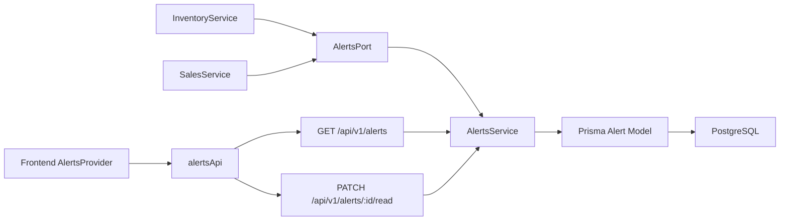
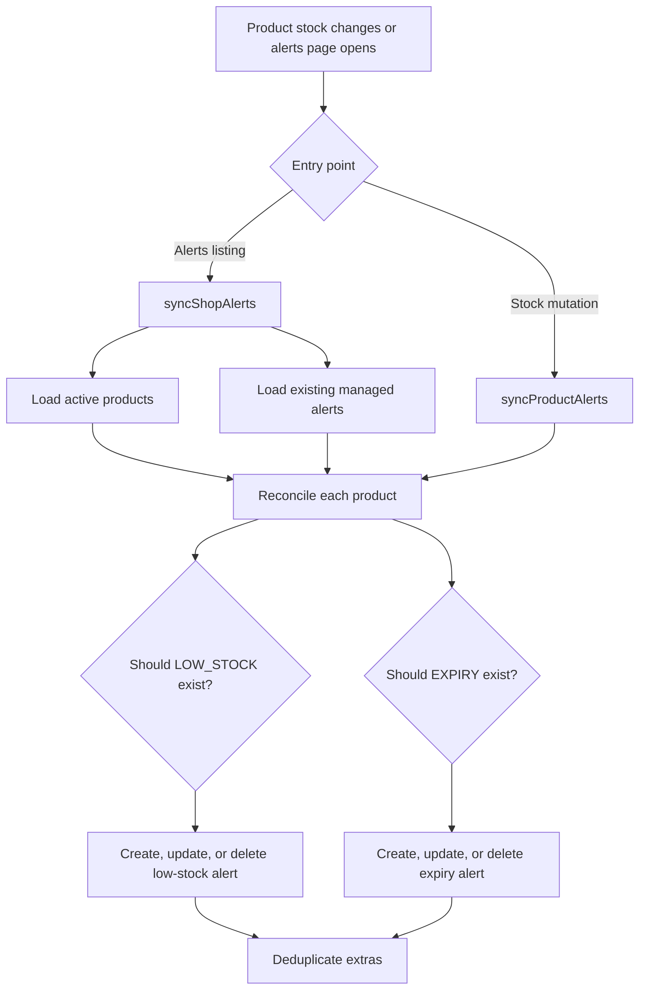
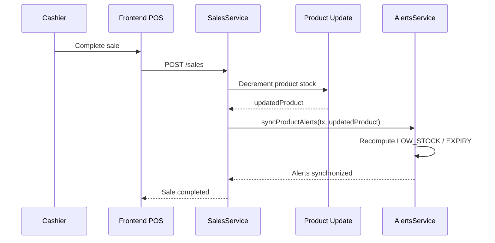
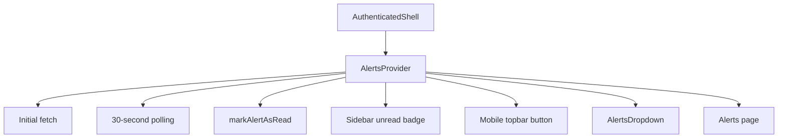
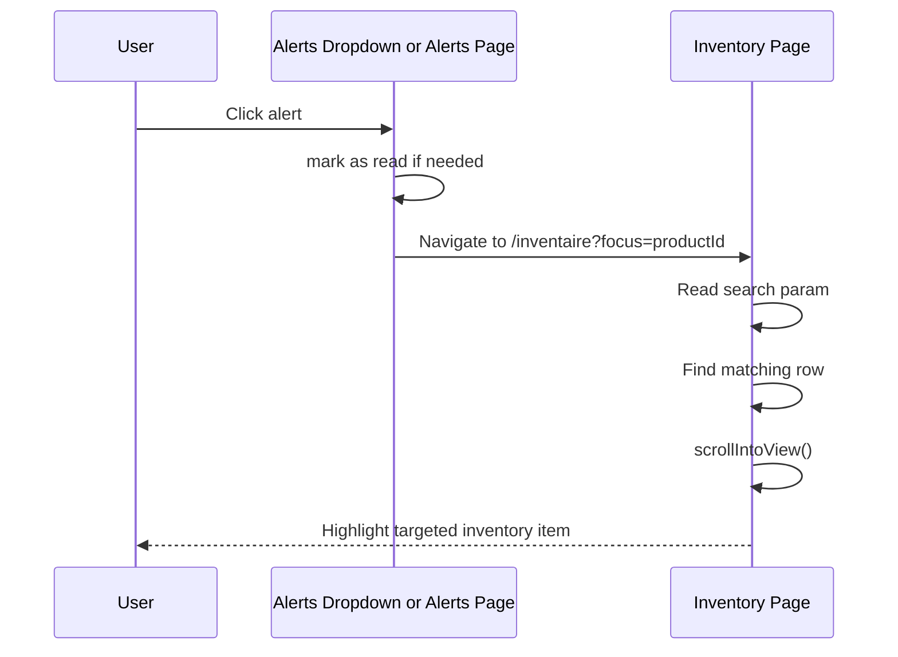
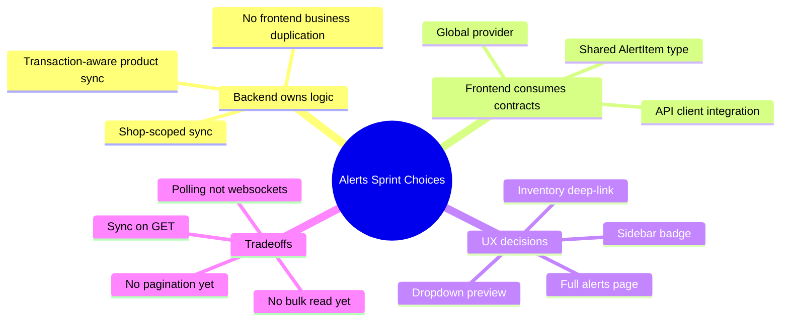

# Alerts System Implementation Audit

Date: 2026-04-20

## Purpose

This document explains, in a way that should be accessible to an engineering student, what was implemented for the Alerts System sprint, why the implementation was designed this way, what files were changed, what tradeoffs were made, and how the backend and frontend now work together.

This is both:

- an implementation summary
- a detailed engineering audit

It focuses on the work completed for:

- `GET /api/v1/alerts`
- `PATCH /api/v1/alerts/:id/read`
- alert generation for low stock
- alert generation for expiry
- frontend polling and unread badge
- alerts dropdown and alerts page
- deep-linking alerts back to inventory

---

## 1. Overview For An Engineering Student

At a simple level, the Alerts System answers this product question:

> "How does the store owner or cashier know that something needs attention without manually checking every product?"

The answer implemented here is:

1. the backend computes and stores alerts
2. the frontend fetches those alerts regularly
3. the UI shows the unread count in navigation
4. the user can open an alert
5. the alert links directly to the relevant product in inventory

From a software engineering point of view, this sprint is a good example of full-stack feature work because it required:

- API design
- domain logic
- data synchronization
- contract typing
- UI state management
- navigation integration
- verification

The important thing is that this was not implemented as a purely visual feature.

The backend remains the source of truth.
The frontend only consumes the backend contract and renders the state.

That matches the architecture rules in `AGENTS.md`.

---

## 2. What Was Implemented

### Backend

New module:

- `backend/src/modules/alerts`

New endpoints:

- `GET /api/v1/alerts`
- `PATCH /api/v1/alerts/:id/read`

New behavior:

- create or update a `LOW_STOCK` alert when a product stock falls to or below its threshold
- create or update an `EXPIRY` alert when a product has stock and expires within 5 days
- delete managed alerts when the condition is no longer true
- deduplicate alerts so there is only one managed alert per type per product
- remove stale alerts for inactive or missing products during shop sync

Integration points:

- stock changes from `InventoryService`
- stock changes from `SalesService`

### Frontend

New pieces:

- alerts API client
- shared `AlertItem` and `AlertType` contracts
- `AlertsProvider` for polling and unread-count state
- alerts dropdown
- dedicated `/alertes` page
- unread badge in sidebar
- compact alerts button in mobile topbar
- inventory deep-linking using `?focus=<productId>`

### Verification

Completed verification included:

- backend build
- backend e2e tests
- targeted backend eslint on touched backend files
- shared-types build
- frontend lint
- frontend production build

---

## 3. Files Added Or Modified

### Backend files added

- `backend/src/modules/alerts/alerts.controller.ts`
- `backend/src/modules/alerts/alerts.module.ts`
- `backend/src/modules/alerts/alerts.port.ts`
- `backend/src/modules/alerts/alerts.service.ts`

### Backend files modified

- `backend/src/app.module.ts`
- `backend/src/modules/inventory/inventory.module.ts`
- `backend/src/modules/inventory/inventory.service.ts`
- `backend/src/modules/sales/sales.module.ts`
- `backend/src/modules/sales/sales.service.ts`
- `backend/test/app.e2e-spec.ts`

### Frontend files added

- `frontend/src/components/alerts/alert-utils.ts`
- `frontend/src/components/alerts/alerts-provider.tsx`
- `frontend/src/components/alerts/alerts-dropdown.tsx`
- `frontend/src/app/alertes/alerts-workspace.tsx`
- `frontend/src/app/(authenticated)/alertes/page.tsx`

### Frontend files modified

- `frontend/src/components/layout/authenticated-shell.tsx`
- `frontend/src/components/layout/app-sidebar.tsx`
- `frontend/src/app/inventaire/inventory-workspace.tsx`
- `frontend/src/app/(authenticated)/inventaire/page.tsx`
- `frontend/src/lib/api/api-client.ts`
- `frontend/src/styles/theme.css`
- `frontend/src/app/globals.css`
- `packages/shared-types/src/index.ts`

---

## 4. Backend Audit

## 4.1 Why A Dedicated Alerts Module Was Created

The first major design choice was to create a real `alerts` module instead of adding alert logic inside `inventory` or `reports`.

Why this was the correct choice:

- alerts are their own domain concern
- alerts already exist in the Prisma schema as a dedicated model
- the sprint required dedicated alert endpoints
- mixing alert orchestration directly into inventory or sales would make those modules harder to understand

Engineering reasoning:

- `InventoryService` is responsible for stock operations
- `SalesService` is responsible for sales operations
- `AlertsService` is responsible for deciding which alerts should exist

This keeps each service focused.

---

## 4.2 Why `AlertsPort` Was Introduced

File:

- `backend/src/modules/alerts/alerts.port.ts`

This file adds:

- `AlertSyncProduct`
- `AlertsPort`
- `ALERTS_PORT`

This is a small abstraction layer between the alerts module and other modules.

Why this matters:

- `InventoryService` and `SalesService` need to trigger alert synchronization
- they should not depend too tightly on the concrete internal details of the alerts implementation

The port says:

- "here is what the outside world can ask the alerts domain to do"

That makes the design cleaner than directly scattering alert-specific helper methods across unrelated services.

Engineering lesson:

- a port or interface is useful when one module needs a capability from another module
- it makes the collaboration explicit

---

## 4.3 API Endpoints Implemented

File:

- `backend/src/modules/alerts/alerts.controller.ts`

Implemented endpoints:

- `GET /alerts`
- `PATCH /alerts/:id/read`

Security:

- guarded by `JwtAuthGuard`
- guarded by `RolesGuard`

Meaning:

- only authenticated users can access alerts
- the endpoints remain inside the same secured application boundary as inventory and sales

Important decision:

- alerts were made available to authenticated users in general
- they were not restricted only to owners at the controller level

Why that is reasonable:

- the sprint goal was "surface alerts"
- operational staff may need to see them
- the controller still scopes everything by `shopId`

If the business later decides only owners should see alerts, this can be tightened with a `@Roles(Role.OWNER)` decorator.

---

## 4.4 Core Sync Design In `AlertsService`

File:

- `backend/src/modules/alerts/alerts.service.ts`

This is the most important backend file in the sprint.

The service has two major synchronization entry points:

- `syncShopAlerts(shopId)`
- `syncProductAlerts(prismaClient, product)`

### `syncShopAlerts(shopId)`

Purpose:

- load all active products in a shop
- load existing managed alerts
- remove stale alerts
- reconcile desired alerts for each active product

Why this method exists:

- expiry alerts are time-sensitive
- a product may become "expiring soon" even if nobody changed stock today
- therefore, alert generation cannot depend only on stock-in or stock-out actions

This is a strong design choice because it prevents a class of bugs:

- "expiry alert never appears unless someone performs a stock operation"

Instead, when the frontend calls `GET /alerts`, the backend first runs `syncShopAlerts(shopId)`, which ensures that the returned list is up to date for the entire shop.

### `syncProductAlerts(prismaClient, product)`

Purpose:

- reconcile alerts for one product immediately after a stock-affecting transaction

Why this method exists:

- stock changes happen inside transactions in inventory and sales
- alerts should stay aligned with those changes immediately

This method accepts a Prisma transaction client so it can run in the same transaction scope as the stock mutation.

That is a very important data-consistency choice.

---

## 4.5 Why Alert Reconciliation Was Chosen Instead Of "Always Insert New Alerts"

Inside `reconcileProductAlerts(...)`, the service:

1. computes the alerts that should exist
2. groups existing alerts by type
3. updates, creates, deletes, or deduplicates as needed

This is better than "always create a new alert row" because otherwise the database would quickly accumulate noisy duplicates such as:

- low stock for product X
- low stock for product X
- low stock for product X

every time stock changed while the condition was still true.

The reconciliation strategy provides:

- one logical alert per type per product
- stable unread behavior
- cleaner UI
- easier reasoning

This is one of the best engineering choices in the feature.

---

## 4.6 How Low-Stock And Expiry Conditions Are Computed

### Low stock

Rule:

- create `LOW_STOCK` when `currentStock <= lowStockThreshold`

Why this is correct:

- the existing inventory logic already uses the same threshold rule for `isLowStock`
- reusing the same rule keeps UI and backend consistent

### Expiry

Rule:

- create `EXPIRY` when:
  - product has stock
  - product has an expiration date
  - expiration is within 5 days

Why `product.currentStock > 0` matters:

- it avoids warning about products that technically have an expiration date but no remaining stock

Why 5 days matters:

- it matches the project's existing inventory and MVP rules

Why message regeneration matters:

- if stock or expiry details change, the alert message can change
- when the message changes, the implementation resets `isRead` to `false`

This is a thoughtful decision because a changed alert is effectively new information.

---

## 4.7 Integration Into Inventory And Sales

### Inventory integration

Files:

- `backend/src/modules/inventory/inventory.module.ts`
- `backend/src/modules/inventory/inventory.service.ts`

The inventory module now imports `AlertsModule`.

Then, after a successful:

- `stockIn(...)`
- `stockOut(...)`

the inventory service calls:

- `await this.alertsPort.syncProductAlerts(tx, updatedProduct)`

This means:

- the product stock is updated
- stock movement is recorded
- audit log is recorded
- alert state is synchronized

all in the same transaction flow

That keeps the system coherent.

### Sales integration

Files:

- `backend/src/modules/sales/sales.module.ts`
- `backend/src/modules/sales/sales.service.ts`

After each product stock decrement during sale creation, the sales service now also calls:

- `await this.alertsPort.syncProductAlerts(tx, updatedProduct)`

This is crucial because sales are one of the main causes of stock dropping below threshold.

Without this integration, alerts would lag behind real sales activity.

---

## 4.8 Data Hygiene Decisions

The implementation also removes or normalizes bad alert states:

- duplicate alerts for the same managed type
- alerts for inactive or missing products
- managed alerts whose triggering condition is no longer true

Why this matters:

- alerts are only useful if they reflect live operational truth
- stale alerts reduce trust in the system

This is a quality-oriented design choice, not just a functional one.

---

## 4.9 Backend Testing Audit

File:

- `backend/test/app.e2e-spec.ts`

Added coverage for:

- `GET /api/v1/alerts` returning synced expiry alerts
- `PATCH /api/v1/alerts/:id/read` marking an alert as read
- stock-out creating a low-stock alert when threshold is crossed

Why this is good:

- it tests the public API behavior, not only internal helper logic
- it validates both read and write flows
- it proves that alert creation is linked to stock changes

Good engineering habit shown here:

- when a new module is added, add e2e coverage for the actual HTTP contract

---

## 5. Frontend Audit

## 5.1 Shared Contract Changes

File:

- `packages/shared-types/src/index.ts`

Added:

- `AlertType`
- `AlertItem`

Why this matters:

- the project's shared layer is the source of truth between backend and frontend
- adding alert types directly here avoids frontend-local duplicate contracts

This is the correct architectural move.

If the frontend had created its own local alert type instead, it would have violated the shared-contract rule from `AGENTS.md`.

---

## 5.2 API Client Integration

File:

- `frontend/src/lib/api/api-client.ts`

Added:

- `alertsApi.list()`
- `alertsApi.markAsRead(alertId)`

Why this is correct:

- the API client is the frontend's central gateway to backend HTTP calls
- adding alerts here keeps the rest of the UI clean and typed

This also means the rest of the frontend does not need to know raw endpoint strings such as:

- `/alerts`
- `/alerts/:id/read`

That improves maintainability.

---

## 5.3 Why A Provider Was Used

File:

- `frontend/src/components/alerts/alerts-provider.tsx`

The provider holds:

- the current alert list
- unread count
- loading state
- refresh function
- mark-as-read function

Why this design is strong:

- alerts are cross-cutting UI state
- multiple parts of the app need access:
  - sidebar badge
  - mobile topbar button
  - dropdown
  - alerts page

If every component fetched alerts independently, the system would have:

- redundant network calls
- inconsistent unread counts
- more complicated state synchronization

The provider centralizes this logic.

That is the right decision.

---

## 5.4 Polling Strategy Audit

In `AlertsProvider`, polling runs every:

- `30_000 ms`

Why polling was chosen:

- it is simple
- it fits the sprint scope
- no websocket or push infrastructure is currently required

Why 30 seconds is a reasonable interval:

- alerts do not need sub-second freshness like chat or multiplayer systems
- but they should update often enough to be useful during daily operations

Tradeoff:

- polling is not as efficient as push-based updates
- however, it is much cheaper to implement and maintain right now

This is a good MVP-stage engineering decision.

---

## 5.5 Dropdown Audit

File:

- `frontend/src/components/alerts/alerts-dropdown.tsx`

Implemented features:

- open/close state
- click outside to close
- escape key to close
- compact mode for mobile
- unread count
- recent alert preview list
- direct navigation to inventory
- mark unread alert as read before navigation

Good choice:

- only the first 5 alerts are shown in the dropdown

Why that is good:

- dropdowns are for preview, not full management
- full browsing belongs on `/alertes`

Another good choice:

- if mark-as-read fails, navigation still continues

Why:

- opening the relevant inventory item is more important than blocking the user because of a read-state update failure

This shows practical engineering judgment.

---

## 5.6 Alerts Page Audit

File:

- `frontend/src/app/alertes/alerts-workspace.tsx`

Implemented:

- page header
- refresh action
- toggle to hide or show read alerts
- overview cards
- detailed alert cards
- mark-as-read action
- link back to inventory

Why a dedicated page was needed:

- the dropdown is intentionally small
- users need a full place to review alert history and current state

The page improves usability by separating:

- quick access in navigation
- full alert management in a dedicated workspace

This is a strong UI separation.

---

## 5.7 Navigation Integration Audit

Files:

- `frontend/src/components/layout/authenticated-shell.tsx`
- `frontend/src/components/layout/app-sidebar.tsx`

Changes:

- wrapped authenticated shell in `AlertsProvider`
- added `/alertes` nav item
- added sidebar unread badge
- added alerts dropdown into sidebar footer
- added compact alerts button in mobile topbar

Why wrapping the shell is the correct scope:

- it makes alerts available everywhere inside the authenticated application
- it avoids duplicating provider setup per page

Why mobile topbar support matters:

- the app already supports responsive navigation
- alerts should be visible on mobile too, not only on desktop sidebar

This is a thoughtful cross-device implementation.

---

## 5.8 Inventory Linking Audit

Files:

- `frontend/src/app/inventaire/inventory-workspace.tsx`
- `frontend/src/app/(authenticated)/inventaire/page.tsx`
- `frontend/src/components/alerts/alert-utils.ts`

This part is especially important because it turns alerts from "messages" into "actionable entry points".

The flow is:

1. alert generates `?focus=<productId>`
2. inventory page reads `useSearchParams()`
3. matching row gets an `id`
4. row is scrolled into view
5. row is visually highlighted

Why this is a good design:

- alerts should not stop at notification
- they should guide the user to the relevant operational context

This is one of the best user-experience decisions in the sprint.

### Why Suspense Was Added

`useSearchParams()` in the App Router requires a suspense boundary.

So the authenticated inventory page was updated to wrap `InventoryWorkspace` in `Suspense`.

This was not just a technical fix.
It was required for the production build to pass.

This is a good example of implementation detail affecting architecture:

- a frontend feature choice created a framework constraint
- the correct adaptation was added without breaking the user flow

---

## 5.9 Styling Audit

Files:

- `frontend/src/styles/theme.css`
- `frontend/src/app/globals.css`

Styling added:

- alert badge
- dropdown panel
- alert type pills
- alert cards
- overview cards
- empty state
- mobile topbar actions
- highlighted inventory row
- ghost button variant

Why this matters:

- a feature that is technically correct but visually unclear is still weak from a product standpoint
- alert severity and unread state should be easy to scan

The styling choices support:

- discoverability
- readability
- actionability

---

## 6. Full Audit Of Engineering Choices

## 6.1 Strong Choices

### 1. Keeping the backend as source of truth

Very good choice.

The frontend does not compute "what counts as a real alert".
It only displays alerts returned by the backend.

That avoids duplicated business logic.

### 2. Adding shop-level sync before listing alerts

Very good choice.

This solves the "expiry alert without stock movement" problem elegantly.

### 3. Reconciling alerts instead of inserting duplicates

Very good choice.

It prevents alert spam and keeps the data model clean.

### 4. Triggering product-level sync from both inventory and sales

Very good choice.

These are the two stock-changing domains that most naturally affect alerts.

### 5. Centralizing alert UI state in a provider

Very good choice.

It avoids fragmented unread counts and repeated fetching.

### 6. Linking alerts directly back to inventory

Very good product and UX choice.

It turns a passive dashboard-style warning into a task-oriented workflow.

---

## 6.2 Reasonable Tradeoffs

### 1. Polling instead of real-time push

Reasonable choice.

Pros:

- easy to implement
- stable
- enough for MVP-style operational alerts

Cons:

- not truly real time
- generates recurring requests

### 2. `GET /alerts` triggers sync work

Reasonable but important tradeoff.

Pros:

- guarantees freshness
- no background job needed

Cons:

- read endpoint now does synchronization work
- could become heavier if shop size grows a lot

For current scope, this is acceptable.

### 3. Allowing all authenticated users to see alerts

Reasonable for now.

Pros:

- operationally useful
- simple

Cons:

- permissions may need tightening later

### 4. Mark-as-read happens per alert, not bulk

Reasonable for the current scope.

Pros:

- simple API
- easy mental model

Cons:

- bulk read actions would be useful later

---

## 6.3 Imperfections And Limitations

### 1. No pagination on alerts yet

Current behavior:

- alert list returns all alerts for the shop

Why this is acceptable now:

- likely small dataset in MVP stage

Why it may need change later:

- long-lived shops can accumulate many alerts

### 2. No "mark all as read"

Current behavior:

- read state is updated one alert at a time

This is fine for now, but not optimal at larger scale.

### 3. No scheduled background reconciliation

Current behavior:

- shop sync runs on alert listing

This keeps implementation small, but eventually a scheduler or event-driven approach may be better if alert volume increases.

### 4. Message text is embedded in service code

Current behavior:

- alert message strings are built directly in `AlertsService`

This is acceptable for current size, but later:

- localization
- message templates
- notification formatting

could justify a more structured approach.

### 5. Alerts are UI-visible, but not yet dashboard-integrated

Current behavior:

- sidebar and alert page surface them well

Possible future enhancement:

- dashboard widgets could reuse the same provider or summary endpoint

---

## 6.4 Risks Intentionally Avoided

This implementation intentionally did not:

- add websocket infrastructure
- add a new state management library
- duplicate alert logic in the frontend
- create alert logic in controllers
- use raw SQL
- modify unrelated modules beyond the needed integration points
- add unnecessary dependencies

This restraint is good engineering.

It kept the sprint aligned with:

- architecture consistency
- minimal precise changes
- low technical debt

---

## 6.5 What I Would Improve Next

If this feature continues, the next sensible improvements are:

1. Add pagination and filtering for alerts.
2. Add `mark all as read`.
3. Add optional owner-only visibility if the product decision requires it.
4. Add scheduled reconciliation for expiry alerts if shop size grows.
5. Add alert summaries on the dashboard.
6. Add more granular links, such as filtered inventory tabs for low stock vs expiry.
7. Add frontend tests for provider and dropdown behavior.

---

## 7. Verification Audit

### Commands successfully run

- `npm run build --workspace @moul-hanout/shared-types`
- `npm run build` in `backend`
- `npm run test:e2e` in `backend`
- `npx eslint src/modules/alerts/**/*.ts src/modules/inventory/inventory.service.ts src/modules/sales/sales.service.ts src/modules/inventory/inventory.module.ts src/modules/sales/sales.module.ts src/app.module.ts` in `backend`
- `npm run lint` in `frontend`
- `npm run build` in `frontend`

### What this proves

- shared contracts compile
- backend changes compile
- backend alert endpoints and stock-trigger behavior pass e2e coverage
- touched backend files are eslint-clean
- frontend code passes lint
- frontend code passes production build

### Important caveat

Repo-wide backend lint was not fully clean before this feature.

That means:

- the alerts feature itself was validated cleanly
- but the entire backend codebase still contains pre-existing lint issues outside this sprint

This is important to state honestly in an audit.

---

## 8. Final Engineering Summary

This sprint added a real operational alerts system, not just a badge.

The backend now knows:

- when an alert should exist
- when it should be updated
- when it should disappear

The frontend now knows:

- how to fetch alerts
- how to surface unread state globally
- how to guide the user back to the relevant inventory item

The most important success of the implementation is this:

- the feature respects module boundaries
- the backend owns the alert logic
- the frontend remains a consumer
- the alert experience is actionable, not decorative

That is exactly the kind of full-stack discipline a scalable system needs.

---

## 9. Mermaid Diagrams

## Diagram 1: High-Level Architecture

## Diagram 2: Backend Sync Logic

## Diagram 3: Sale To Alert Flow

## Diagram 4: Frontend Polling And UI State

## Diagram 5: Alert To Inventory Navigation

## Diagram 6: Design Decision Summary

