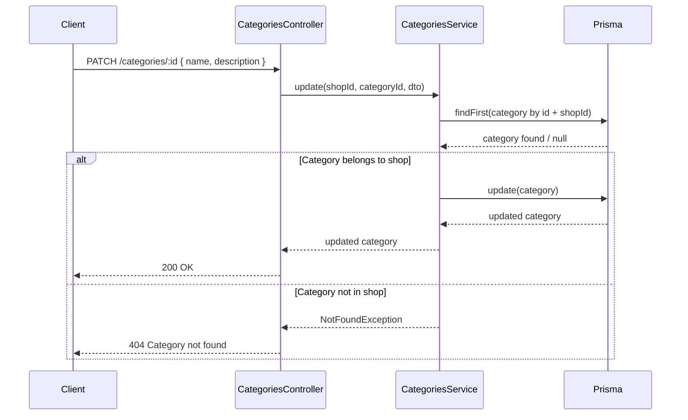
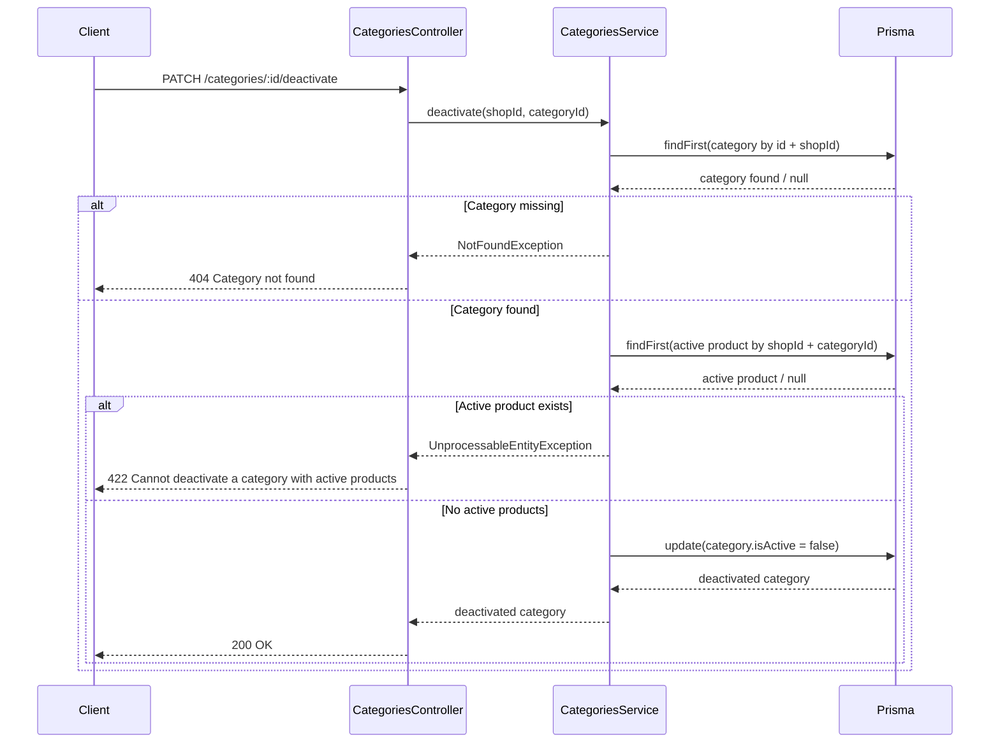
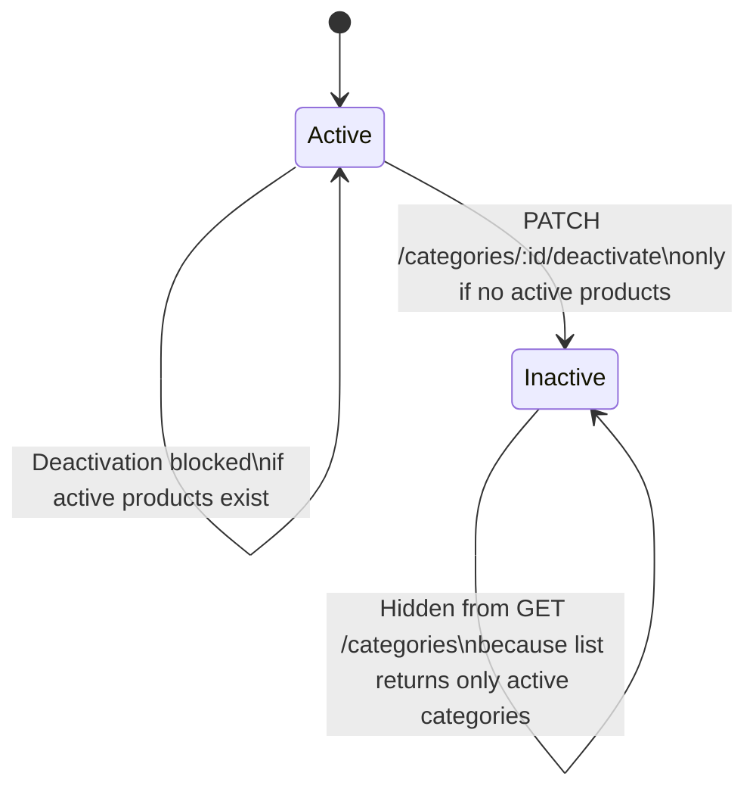
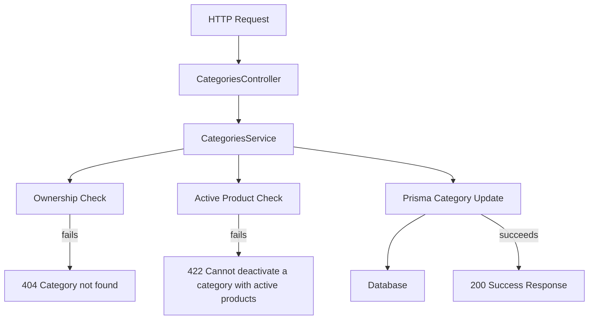

# Category Management Backend Audit — 2026-04-20

## Part 1 — Explanation for an Engineering Student

### What problem we solved

Before this change, the backend could only create categories and list active ones.
That means a merchant could keep adding categories forever, but could not:

- rename a category if the business vocabulary changed
- improve the description later
- deactivate an old category that should no longer be used

This creates operational clutter and also causes product organization to degrade over time.

### What we added

We added two new backend capabilities inside the category module:

1. `PATCH /api/v1/categories/:id`
This endpoint updates the category `name` and/or `description`.

2. `PATCH /api/v1/categories/:id/deactivate`
This endpoint performs a soft delete by setting `isActive = false`.

### Why this design fits the project architecture

The project rules say:

- controllers must stay thin
- business logic must live in services
- database access must go through Prisma

So the implementation follows this structure:

- `CategoriesController` receives HTTP input and authenticated shop context
- `CategoriesService` performs all category lifecycle rules
- `PrismaService` handles persistence

This keeps the code aligned with the NestJS architecture already used in the project.

### The key business rules

#### Rule 1: A category can only be changed inside its own shop

Every update and deactivation call now checks whether the category belongs to the authenticated shop.

If not, the API returns:

- `404 Category not found`

This is important for multi-tenant safety. One shop must never manage another shop's categories.

#### Rule 2: Deactivation is soft, not destructive

We do not delete the category row from the database.
Instead, we mark it inactive:

```ts
isActive = false
```

This is safer because:

- existing records still keep referential integrity
- historical reporting remains understandable
- we avoid breaking products or old references unexpectedly

#### Rule 3: A category cannot be deactivated if it still has active products

Before deactivation, the service checks whether the category still contains active products in that same shop.

If yes, the API returns:

- `422 Cannot deactivate a category with active products`

This rule prevents inconsistent business behavior.
If we allowed deactivation while active products still pointed to the category, the UI and reporting logic could become confusing.

### Files changed

- `backend/src/modules/categories/dto/category.dto.ts`
- `backend/src/modules/categories/categories.controller.ts`
- `backend/src/modules/categories/categories.service.ts`
- `backend/test/app.e2e-spec.ts`

### DTO design choice

I introduced a dedicated `UpdateCategoryDto` instead of reusing `CreateCategoryDto`.

That choice matters because update and create do not mean the same thing:

- create allows `isActive`
- update in this task should only allow `name` and `description`

Using a focused DTO keeps the API contract explicit and prevents accidental updates to fields that this endpoint should not control.

### Testing added

The e2e suite now validates:

- cashiers cannot update categories
- owners can update categories in their own shop
- cross-shop category updates are rejected
- deactivation is blocked when active products still exist
- deactivation succeeds when no active products remain
- deactivated categories disappear from the active category listing

This gives us confidence that the new lifecycle behavior works end to end, not just at the service level.

## Part 2 — Detailed Audit

### Audit objective

The goal of this implementation was not just to add endpoints.
It was to add category lifecycle management in a way that respects:

- multi-tenancy
- domain boundaries
- safe soft-delete behavior
- predictable API behavior

### Choice 1: Keep the controller thin

I placed only request wiring in the controller:

- extract `shopId` from `CurrentUser`
- extract `categoryId` from the URL
- validate body through DTOs
- delegate to the service

I intentionally did not add business checks in the controller.
That would violate the project rule that controllers remain thin.

### Choice 2: Centralize ownership validation in the service

I added a helper in `CategoriesService` that verifies a category belongs to the authenticated shop before update or deactivation.

Why this matters:

- the ownership rule is reused
- the rule stays close to the domain logic
- future category actions can reuse the same guard logic

This avoids duplicated query patterns and reduces the chance of forgetting tenant checks on later endpoints.

### Choice 3: Use `NotFoundException` for cross-shop access

When a category does not belong to the current shop, the service returns `Category not found`.

This is a deliberate security choice.
It avoids confirming whether a foreign category exists in another tenant.
From the caller's perspective, anything outside the shop boundary is treated as unavailable.

### Choice 4: Use soft delete instead of hard delete

I chose soft deactivation using `isActive = false` rather than deleting the category row.

Reasons:

- the schema already models category activity with `isActive`
- products reference categories using a restrictive relationship
- soft delete is safer for analytics and future recovery scenarios
- the existing list endpoint already filters by `isActive: true`, so the behavior integrates naturally

This is a low-risk extension of the current model instead of an architectural rewrite.

### Choice 5: Block deactivation when active products exist

The deactivation path checks for any active product with:

- the same `shopId`
- the same `categoryId`
- `isActive = true`

If such a product exists, the API returns `422`.

Why `422` is appropriate:

- the request format is valid
- the user is authenticated and authorized
- the operation is rejected because of domain state, not malformed syntax

This makes the failure semantic rather than structural.

### Choice 6: Restrict update input to the fields required by the task

The update endpoint accepts only:

- `name`
- `description`

I did not allow `isActive` in the update DTO because the task explicitly separates:

- edit
- deactivate

Keeping those concerns separate makes the API easier to reason about and prevents hidden soft-delete behavior from a generic patch endpoint.

### Choice 7: Extend the e2e mock instead of relying on partial assumptions

The project's e2e suite uses an in-memory Prisma mock.
Because of that, adding category update behavior required extending the mock with `category.update`.

That was necessary so the tests reflect real behavior:

- update the category
- preserve in-memory state for later requests
- verify that deactivated categories disappear from future `GET /categories` calls

Without that mock update, the tests would not truly validate the lifecycle flow.

### Verification summary

Successful verification:

- `npm run test --workspace backend`
- `npm run test:e2e --workspace backend`
- `npm run build --workspace backend`

Additional note:

- `npm run lint --workspace backend` still fails because the repository already contains many pre-existing type-safety lint violations outside this task's scope, especially in shared auth/common/test files.

### Risk review

Low-risk areas:

- no schema change was required
- no migration was required
- no unrelated module contracts were changed

Important future considerations:

- if the frontend later needs an "inactive categories" management screen, the API may need a second listing endpoint that includes inactive records
- if category names should be unique per shop, that rule is still not enforced here because it was not part of the requested scope or schema

## Part 3 — Mermaid Diagrams

### Request flow for category update



### Request flow for category deactivation



### Category lifecycle state diagram



### Backend responsibility diagram


