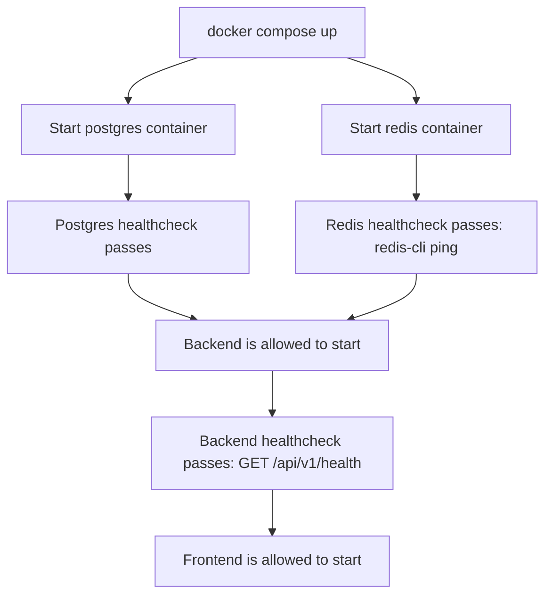
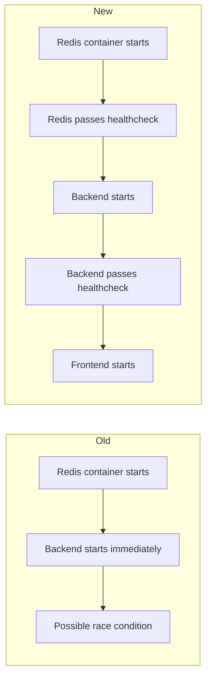
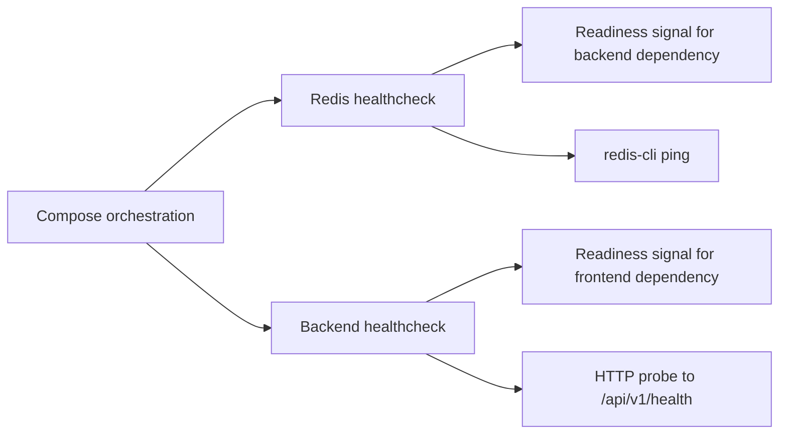
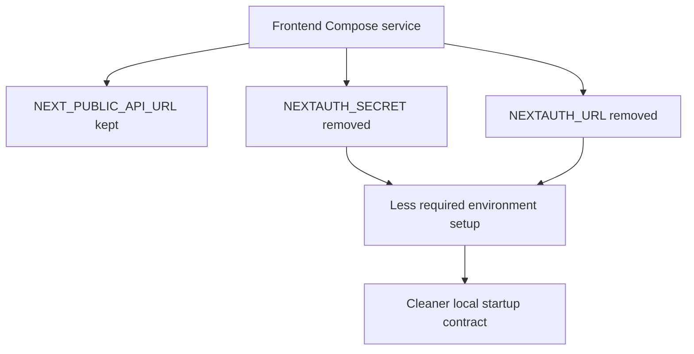

# Docker Compose Healthcheck Audit

## 1. Purpose Of This Document

This document explains, for an engineering student, what was changed to fix Docker Compose startup reliability for this project, why those changes were needed, and how they respect the architecture of the system.

The practical goal of the work was:

- make `docker compose up` succeed without manual sequencing
- ensure the backend waits for infrastructure that is actually ready
- ensure the frontend waits for a backend that is actually healthy
- remove unnecessary frontend environment requirements from the Compose stack

This was a small change in file count, but it was an important infrastructure correction because container orchestration problems can block the whole application even when the application code itself is correct.

---

## 2. What Was Implemented

I updated the Docker orchestration layer in two files:

- `docker-compose.yml`
- `.env.example`

### Main result

After this work:

- `redis` has an explicit healthcheck
- `backend` has an explicit HTTP healthcheck in Compose
- `backend` now waits for Redis to be healthy, not merely started
- `frontend` no longer requires `NEXTAUTH_SECRET` and `NEXTAUTH_URL` in the Compose service environment
- `.env.example` no longer suggests those frontend-only auth variables as required Compose inputs

### Validation result

The stack was validated with:

- `docker compose config`
- `docker compose up -d --build`
- `docker compose ps`

The final observed state was:

- `postgres`: healthy
- `redis`: healthy
- `backend`: healthy
- `frontend`: healthy

---

## 3. High-Level Explanation For A Student

If you are learning software engineering, the key lesson is:

> a container being "started" is not the same as a service being "ready".

That distinction matters a lot in distributed systems.

For example:

- Redis may have started its process, but still not be ready to answer commands
- the backend may have started its Node.js process, but still not be ready to serve HTTP traffic
- the frontend may try to rely on a backend that is technically running but not yet usable

Healthchecks solve this by turning "I launched the process" into "I verified the service works".

In this fix:

- Redis readiness is checked with `redis-cli ping`
- backend readiness is checked by hitting `http://localhost:4000/api/v1/health`

This is a better engineering approach because the checks reflect the real contract of each service:

- Redis is healthy if it can answer a Redis command
- backend is healthy if it can answer the health endpoint exposed by the API

That is stronger and more realistic than hoping startup timing will line up.

---

## 4. Detailed Audit Of The Work

## 4.1 I first verified the real Compose state before editing

Before changing anything, I inspected the actual `docker-compose.yml` and `.env.example` files instead of assuming the task description matched the repository exactly.

That verification showed:

- `postgres` already had a healthcheck
- `redis` had no healthcheck
- `backend` depended on Redis with `condition: service_started`
- `frontend` already depended on backend health
- the frontend service still exposed `NEXTAUTH_SECRET` and `NEXTAUTH_URL`
- `.env.example` still listed `NEXTAUTH_SECRET` and `NEXTAUTH_URL`

This verification step matters because good engineering work starts from the real codebase, not from memory or from assumptions.

---

## 4.2 I added a healthcheck to Redis

I added this block to the `redis` service:

```yaml
healthcheck:
  test: ["CMD", "redis-cli", "ping"]
  interval: 10s
  timeout: 5s
  retries: 5
```

### Why this was the correct check

This is a direct service-level readiness test.

It does not ask:

- "did the container process start?"

It asks:

- "can Redis answer a Redis command right now?"

That is the correct operational question.

### Why this choice is scalable

It avoids fragile timing assumptions such as:

- adding arbitrary sleep delays
- hoping Redis is ready before the backend tries to connect

Those approaches are unreliable. A healthcheck gives Compose a repeatable readiness signal.

---

## 4.3 I changed backend dependency gating from `service_started` to `service_healthy`

I changed the Redis dependency inside the backend service from:

```yaml
condition: service_started
```

to:

```yaml
condition: service_healthy
```

### Why this matters

`service_started` only guarantees that Docker launched the container process.

It does not guarantee:

- Redis is accepting commands
- the network service is ready
- the backend can connect successfully during its startup work

By using `service_healthy`, the backend starts only after Redis passes its own readiness check.

This reduces:

- race conditions
- startup flakiness
- environment-specific failures

In other words, it replaces timing luck with an explicit readiness contract.

---

## 4.4 I added an explicit backend healthcheck in Compose

I added this block to the `backend` service:

```yaml
healthcheck:
  test: ["CMD", "wget", "--quiet", "--tries=1", "--spider", "http://localhost:4000/api/v1/health"]
  interval: 15s
  timeout: 5s
  retries: 5
  start_period: 30s
```

### Why this was the right endpoint

The project already exposes a backend health route at:

`/api/v1/health`

That makes it the correct place to measure operational readiness because it tests the API over HTTP, which is how the rest of the system consumes the backend.

### Why use `wget --spider`

This is a lightweight HTTP probe that checks endpoint reachability without downloading a body for normal page usage.

The check is asking:

- is the backend actually answering HTTP requests on the expected port and route?

That is more meaningful than checking for a running process ID.

### Important audit note

The backend Docker image already contained a `HEALTHCHECK` instruction in `backend/Dockerfile`.

I still added the Compose-level healthcheck because:

- it matches the requested task exactly
- it makes the orchestration contract explicit in `docker-compose.yml`
- it keeps the startup dependency logic visible in the same file where service relationships are declared

This is not harmful duplication in this context because the Compose file is the operational entry point for local stack startup.

---

## 4.5 I removed unnecessary `NEXTAUTH_*` variables from the frontend Compose service

I removed these variables from the frontend service block:

- `NEXTAUTH_SECRET`
- `NEXTAUTH_URL`

I also removed them from `.env.example`.

### Why this was the correct cleanup

The Compose task was to make the stack boot successfully without requiring unrelated environment configuration.

For this stack:

- the frontend container already receives `NEXT_PUBLIC_API_URL`
- startup health for the frontend does not depend on `NEXTAUTH_SECRET`
- startup health for the frontend does not depend on `NEXTAUTH_URL`

Keeping those variables in the Compose service had two problems:

1. It suggested they were mandatory for baseline stack startup
2. It increased the chance of environment failure in machines that had not provisioned auth-specific values

So the removal reduces configuration noise and makes the Compose contract more honest.

### Why this aligns with architecture clarity

One good engineering habit is to keep each runtime configuration surface limited to what it truly needs.

That helps:

- onboarding
- debugging
- deployment predictability
- separation of concerns

If a variable is not needed for this service to boot in this stack, it should not be required by the stack definition.

---

## 4.6 I validated the YAML before testing the real stack

After patching the files, I ran:

```bash
docker compose config
```

This step matters because it validates the Compose configuration shape after editing.

It catches issues such as:

- bad indentation
- invalid service structure
- malformed environment expansion

This is a fast and low-risk verification step before doing a full build and startup.

---

## 4.7 I validated the change with a real end-to-end bring-up

I then ran:

```bash
docker compose up -d --build
```

This was important because configuration that looks valid on paper can still fail in reality.

The real startup sequence completed successfully:

- Redis started
- Redis became healthy
- backend started after Redis and Postgres were healthy
- backend became healthy
- frontend started after backend became healthy

I then confirmed final service status with:

```bash
docker compose ps
```

This showed all services healthy, which means the fix was validated against the actual runtime behavior, not just against static YAML parsing.

---

## 4.8 Why I kept the change set minimal

I deliberately changed only the files needed for this task:

- `docker-compose.yml`
- `.env.example`
- this documentation file

I did not refactor unrelated Docker settings.

That was intentional because the task was narrowly defined:

- improve startup reliability
- remove unnecessary frontend env requirements

Minimal change sets are a good engineering practice because they:

- reduce regression risk
- make review easier
- make rollback easier
- keep intent clear

---

## 5. Usage Example

To use the fixed stack:

```bash
docker compose up -d --build
```

To inspect health state:

```bash
docker compose ps
```

Expected behavior:

- Compose waits for Postgres health
- Compose waits for Redis health
- backend starts only after dependencies are healthy
- frontend starts only after backend is healthy

---

## 6. Engineering Takeaways

There are several useful lessons here for an engineering student:

- infrastructure code is real production code, not secondary code
- healthchecks are part of system design, not just DevOps decoration
- readiness should be tested using the actual service contract
- fewer required environment variables usually means a safer and clearer setup
- small configuration changes can unlock major reliability improvements

This task is a good example of how software quality often depends on operational correctness as much as application logic.

---

## 7. Final Audit Verdict

The change is successful because it improved startup determinism without changing domain behavior.

More specifically:

- no backend business logic was touched
- no frontend feature logic was changed
- no database schema was changed
- the Compose stack now has a stronger readiness model
- local and deployment startup behavior is easier to understand

This is a strong infrastructure fix because it is:

- small
- explicit
- testable
- low risk
- immediately useful

---

## 8. Mermaid Diagrams

## Diagram 1: Service Startup Dependency Flow



## Diagram 2: Old Behavior vs New Behavior



## Diagram 3: Healthcheck Responsibility Boundary



## Diagram 4: Configuration Simplification


