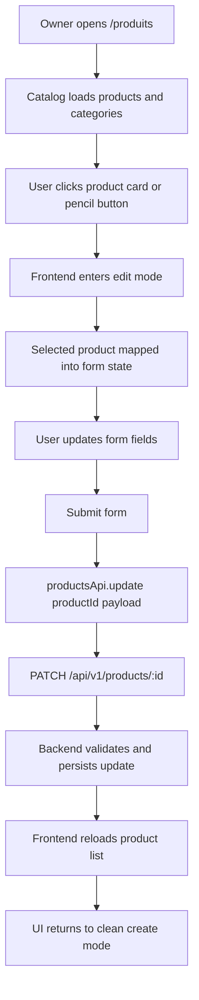
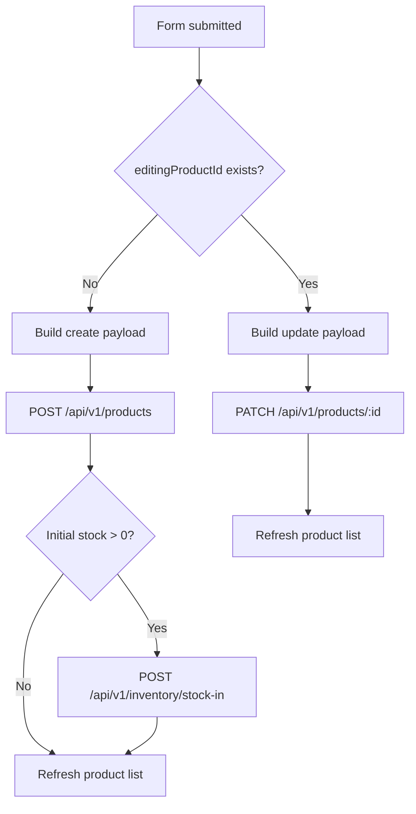
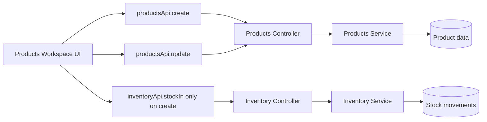
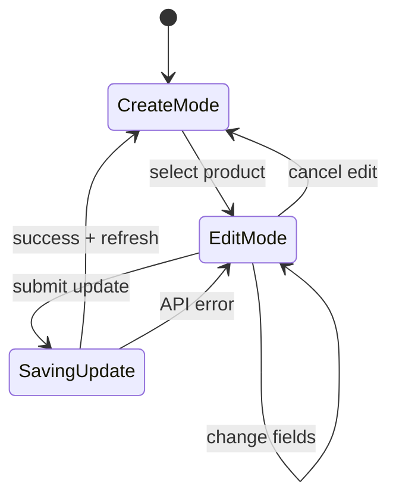

# Product Edit UI Implementation Audit

## 1. Purpose Of This Document

This document explains, for an engineering student, what I implemented to add product editing to the frontend, why I implemented it that way, and how the final solution fits the architecture of this project.

The goal of the change was simple:

- before this work, the product page could create products
- after creation, there was no frontend way to update them
- the backend already exposed `PATCH /api/v1/products/:id`
- the frontend now uses that existing backend capability through a real edit mode

This means the UI is no longer "write once". A product can now be selected from the catalog, loaded into the form, edited, and saved back through the backend.

---

## 2. What Was Implemented

I implemented a frontend edit workflow inside the existing product studio page.

### Main user-facing result

On the `/produits` page:

- each product card now has a visible pencil edit button
- clicking the product entry also opens edit mode
- the existing product form is reused instead of creating a second form
- the form becomes pre-filled with the selected product values
- submitting the form now chooses between create and update depending on whether edit mode is active
- after a successful update, the catalog refreshes automatically

### Files changed

- `frontend/src/app/produits/products-workspace.tsx`
- `frontend/src/app/globals.css`
- `frontend/src/lib/api/api-client.ts`

---

## 3. High-Level Explanation For A Student

If you are learning software engineering, the key idea here is:

> we did not build a second "edit page".

Instead, we reused the same form component and changed its behavior depending on context.

That is a good engineering choice because:

- it avoids duplicated UI logic
- it avoids duplicated validation rules in the frontend
- it reduces maintenance cost
- it keeps the user experience consistent between creating and editing

The component now has two modes:

1. Create mode
2. Edit mode

In create mode:

- the form starts empty
- submit calls `productsApi.create(...)`

In edit mode:

- the form is loaded from an existing `Product`
- submit calls `productsApi.update(productId, payload)`

This is a common and scalable pattern in frontend applications.

---

## 4. Detailed Audit Of The Work

## 4.1 I first verified the real codebase shape

The original task description mentioned a products table and a method named `updateProduct`.

But in the real codebase:

- the UI was not a table, it was a product catalog made of cards
- the frontend API client exposed `productsApi.update(...)`, not `updateProduct(...)`

So the first engineering decision was to adapt the implementation to the real application structure instead of forcing the code to match the wording of the task.

This matters because good implementation starts from real context, not assumptions.

---

## 4.2 I added a real edit mode state

Inside `products-workspace.tsx`, I introduced state to track:

- which product is currently being edited
- what the current form values are
- what the original loaded values were

Why the extra "baseline" form state matters:

- when a product is loaded into the form, the form is not empty anymore
- so a naive "dirty check" would always think there are unsaved changes
- storing a baseline snapshot lets the UI compare current values against the originally loaded values

This makes the footer message more accurate and prevents misleading UX.

---

## 4.3 I reused the existing product form instead of duplicating it

I kept the existing fields:

- name
- category
- sale price
- cost price
- barcode
- description
- unit
- photo
- low stock threshold
- expiration date
- initial stock

Then I added a conversion function that maps a `Product` coming from the backend into the local form state.

This is important because the backend model stores values like:

- numbers
- nullable optional fields
- ISO date strings

while the form expects:

- string inputs
- date input format like `YYYY-MM-DD`

So I added a small transformation layer from backend object to form object.

That transformation keeps the UI predictable.

---

## 4.4 I switched submit behavior by mode

The submit logic now works like this:

- if no product is selected for editing, submit creates a new product
- if a product is selected, submit updates the existing one

This is the central behavioral change.

### Create path

- builds a create payload
- calls `productsApi.create(...)`
- optionally performs initial stock-in through the inventory API

### Update path

- builds an update payload
- calls `productsApi.update(productId, payload)`
- refreshes the catalog
- resets the page back to clean create mode

This design respects the project architecture because the frontend stays a consumer of backend APIs only.

---

## 4.5 I kept stock management out of product update

This was one of the most important architectural choices.

The product edit form still shows the "initial stock" field because the UI was already built around that form.

But in edit mode:

- the field is disabled
- a note explains that stock changes belong to inventory management
- submit refuses edit requests that try to include initial stock

Why this is the correct decision:

- product update is about product metadata
- stock movement is business logic handled by the inventory module
- mixing stock mutation into product edit would blur module responsibility
- it would make the frontend hide an architectural rule instead of respecting it

So this change follows the project philosophy:

- backend is source of truth
- frontend consumes existing workflows
- architecture is more important than short-term convenience

---

## 4.6 I handled nullable update fields more carefully

A subtle problem appears when editing optional fields.

Example:

- suppose a product already has a barcode
- the user removes that barcode in the form
- if the frontend simply omits the field from the PATCH payload, the backend may keep the old value

That would be wrong, because the user intended to clear the value.

To solve this cleanly, I adjusted the frontend update payload typing so the request can send `null` for optional editable fields such as:

- `barcode`
- `description`
- `unit`
- `photo`
- `costPrice`
- `expirationDate`

This lets the frontend represent three different cases correctly:

1. do not change this field
2. set this field to a value
3. explicitly clear this field

That is a small change, but it is important for correctness.

---

## 4.7 I updated the catalog interaction model

The catalog cards now support edit entry in a visible way.

Each card includes:

- a clickable product area
- a pencil button
- a selected visual state when that product is being edited

Why this matters:

- the edit action is discoverable
- the user can see which product is currently loaded in the form
- the page feels like one connected workspace rather than two unrelated sections

I also added a top-level mode indicator so the user can immediately see whether they are:

- creating a product
- editing a product

That reduces confusion and helps prevent accidental updates.

---

## 4.8 I preserved existing validation behavior

The original form already enforced frontend validation rules such as:

- sale price must be non-negative
- cost price must be non-negative
- cost price cannot exceed sale price
- categories must exist

I preserved those rules for both create and edit mode.

This is important because a shared form should behave consistently regardless of mode.

I also kept the backend as the final authority:

- the frontend validates early for user experience
- the backend still validates for correctness and security

That layered validation model is the correct production pattern.

---

## 4.9 I refreshed the product list after successful update

After a product is updated:

- the frontend fetches the product list again
- the catalog reflects the latest backend truth
- the form resets back to create mode

I chose refresh-over-local-manual-patching because:

- it is more reliable
- it avoids stale derived data
- it keeps the frontend synchronized with the backend response model

For a system like this, where backend truth matters, this is safer than trying to hand-edit local arrays in many places.

---

## 4.10 I added styling only where the new behavior required it

The CSS updates were focused and intentional:

- mode pill for create/edit status
- edit-mode notice panel
- selected card state
- card edit button styling
- field note for inventory ownership

I did not redesign the whole page.

That was deliberate:

- the page already had an established visual language
- the task was a feature extension, not a redesign
- preserving the existing design system reduces regressions

This follows a good engineering rule:

> change only the surface area needed for the feature.

---

## 5. Architecture Review

## 5.1 Frontend boundary

The frontend still does not implement business logic that belongs to the backend.

It only:

- loads products
- loads categories
- sends create requests
- sends update requests
- sends inventory stock-in only during product creation, as already supported

The frontend did not:

- recalculate server-only rules
- mutate the database directly
- bypass existing APIs

---

## 5.2 Shared contract alignment

The main data model still relies on shared types:

- `Product`
- `CreateProductInput`

I introduced a frontend-side widened update payload shape only because clearing optional values requires a more expressive request body than the original narrow type allowed.

That is a transport-level typing refinement, not a business logic fork.

---

## 5.3 Module responsibility

The implementation respects module boundaries:

- products form edits product data
- inventory remains responsible for stock movement

This is exactly the kind of decision that keeps a codebase understandable over time.

---

## 6. Validation And Verification

I ran the following checks:

```bash
npm run lint --workspace frontend
npm run build --workspace frontend
```

Result:

- lint passed
- Next.js production build passed

This confirms:

- no frontend lint regressions
- no TypeScript errors
- the page compiles in production mode

---

## 7. Risks Avoided By This Approach

This implementation intentionally avoided several bad patterns.

### Risk 1: Duplicating the form

Avoided by reusing the existing form instead of building a separate edit page or edit modal.

### Risk 2: Mixing stock logic into product editing

Avoided by disabling initial stock changes in edit mode and keeping inventory as the owner of stock mutation.

### Risk 3: Losing the ability to clear optional fields

Avoided by letting update payloads send `null` for optional fields that the user removes.

### Risk 4: UI confusion about current mode

Avoided by adding:

- mode badge
- edit notice
- selected catalog card state

---

## 8. What An Engineering Student Should Learn From This Change

There are four main lessons here.

### Lesson 1: Reuse beats duplication

If create and edit share the same fields, one form with two modes is usually better than two separate forms.

### Lesson 2: Respect architecture, especially on "small" features

It is tempting to let product editing also update stock because the field is already on screen.
That would feel convenient, but it would weaken the architecture.

### Lesson 3: Data transformation matters

Backend data shape and form input shape are often not identical.
A good UI layer translates between them explicitly.

### Lesson 4: Small typing details can affect correctness

Allowing `null` for update payloads is not just a TypeScript trick.
It changes whether the user can truly remove existing values.

---

## 9. Final Outcome

After this work, the product page now supports a complete and realistic editing flow:

- browse products
- choose a product to edit
- see the form pre-filled
- update fields
- save changes through the backend
- refresh the catalog

This turns the product studio from a create-only page into a usable maintenance interface.

---

## 10. Mermaid Diagrams

## Diagram 1: Product Edit UI Flow



## Diagram 2: Create Mode vs Edit Mode Decision



## Diagram 3: Responsibility Boundary



## Diagram 4: Edit State Lifecycle


