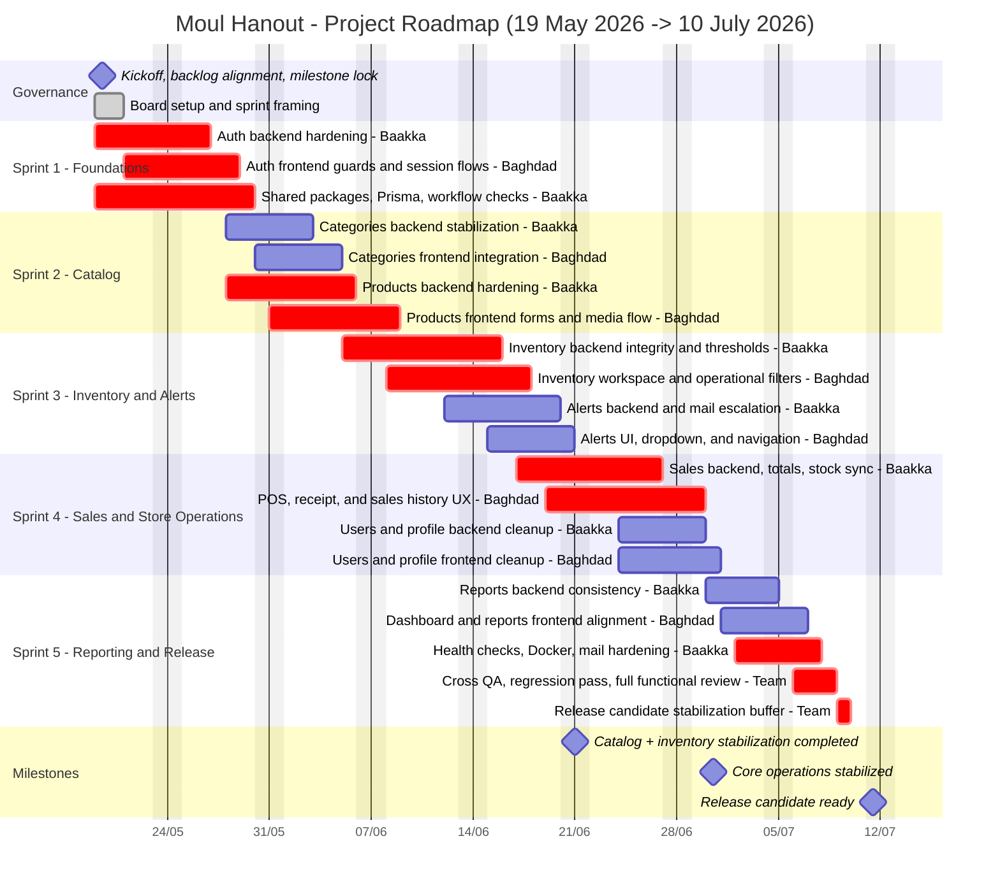

# Moul Hanout Project Gantt Roadmap

## Planning Assumptions
- Planning start date: `2026-05-19`
- Team size: `2`
- Team members:
  - `Baakka` — backend, shared contracts, Prisma, infrastructure, release hardening
  - `Baghdad` — frontend, UX integration, validation flows, cross-module UI consistency
- Planning horizon: `8 weeks`
- Method: overlapping module delivery with backend-first sequencing on critical business flows

## Delivery Strategy
The product already contains the main MVP modules. The realistic objective is no longer greenfield delivery, but hardening, stabilization, integration cleanup, and release readiness.

The delivery plan is therefore organized in this order:
1. Secure the foundations and shared contracts
2. Stabilize the catalog flows
3. Secure inventory and alerts
4. Stabilize POS and user operations
5. Finalize reporting, observability, and release hardening

## Team Allocation
### Baakka
- Auth backend and security hardening
- Shared packages and Prisma alignment
- Categories, products, inventory, alerts, sales, reports backend stabilization
- Mail, health checks, Docker, release readiness

### Baghdad
- Auth frontend and route protection
- Category, product, inventory, alerts, POS, reports, dashboard, and profile interfaces
- UX consistency
- Frontend validation states
- End-to-end functional verification with Baakka

## Mermaid Gantt

## Recommended Management Cadence
- `Daily`: 15-minute sync between Baakka and Baghdad
- `Weekly Monday`: sprint planning and dependency review
- `Weekly Thursday`: integration checkpoint and risk review
- `Weekly Friday`: demo, QA review, and next-week adjustment

## Main Risks
- Backend/frontend contract drift on auth, products, inventory, and sales
- Late discovery of inventory and sales edge cases
- Mail and Docker readiness not reflecting real runtime behavior
- Reports/dashboard metrics diverging from backend source of truth

## Mitigation
- Freeze shared contracts before each module integration closes
- Validate each sprint with explicit regression scenarios
- Keep release hardening inside the plan, not after the plan
- Reserve the final week buffer for integration defects only
