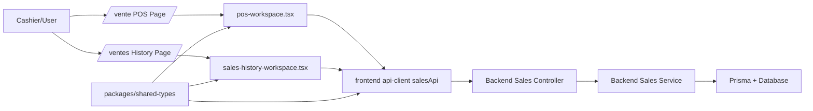
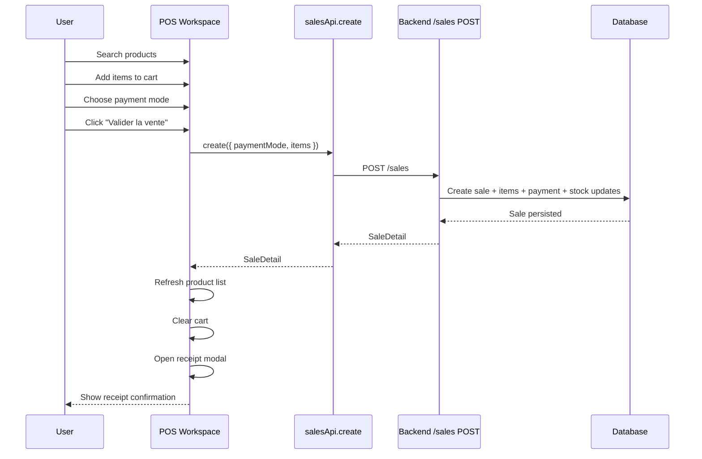
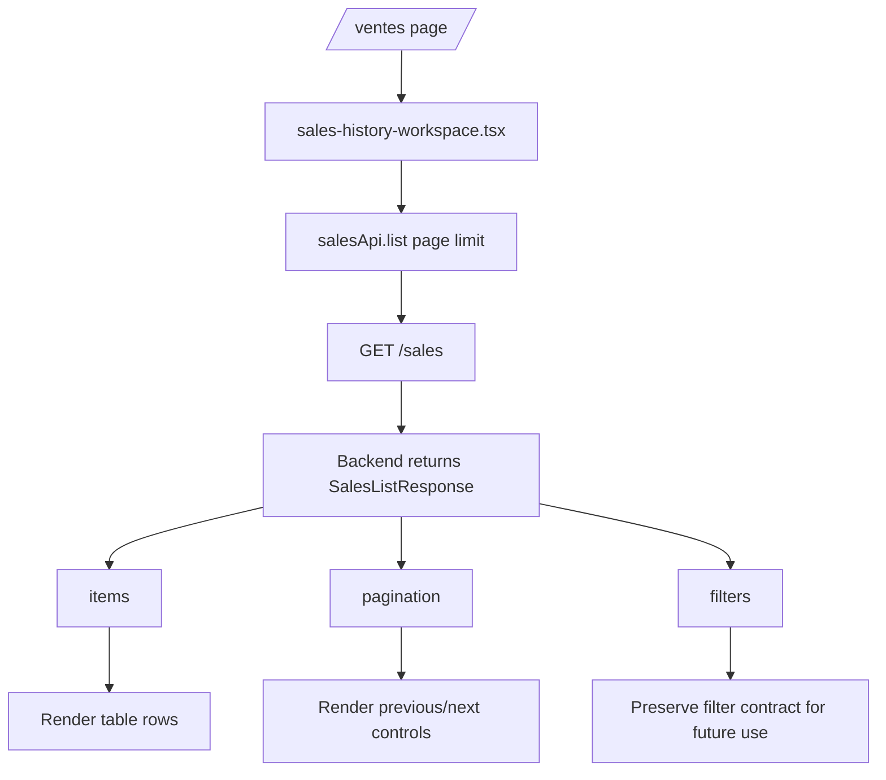

# Sales Frontend Implementation Audit

Date: 2026-04-19

## Purpose

This document explains, for an engineering student, what I implemented for the frontend sales flow, why I implemented it that way, and how the pieces fit together.

It covers the work completed around:

- `frontend/src/lib/api/api-client.ts`
- `frontend/src/app/vente/pos-workspace.tsx`
- `frontend/src/app/(authenticated)/vente/page.tsx`
- `frontend/src/app/ventes/sales-history-workspace.tsx`
- `frontend/src/app/(authenticated)/ventes/page.tsx`
- `frontend/src/components/layout/app-sidebar.tsx`
- `frontend/src/styles/theme.css`
- `packages/shared-types/src/index.ts`

This is not only a description of the result.
It is also an audit of my engineering choices.

---

## 1. What I Did In General

In general, I connected the frontend to the sales backend and turned the sales feature into something a cashier can actually use.

At a high level, I did four things:

1. I added a frontend API client for sales.
2. I created a POS page where a cashier can search products, build a cart, choose a payment mode, validate a sale, and view a receipt.
3. I added the "Vente" entry to the sidebar so the POS is reachable from the authenticated shell.
4. I created a sales history page that lists previously recorded sales with key information such as date, cashier, total, and status.

I also fixed an important contract issue:

- the frontend initially assumed `GET /sales` returned `Sale[]`
- the backend actually returns a paginated object with `items`, `pagination`, and `filters`

So part of the work was not just "adding UI".
Part of it was aligning the shared types and frontend client with the real backend behavior.

---

## 2. Why This Work Matters

Before this work, the backend sales module existed, but the frontend did not yet provide a complete operational flow for daily sales usage.

That means there was a gap between:

- backend capability
- frontend usability

This implementation closes that gap by giving the application:

- a sales API client in the frontend
- a cashier workflow
- a receipt confirmation UI
- a history view for previously recorded sales

In software engineering terms, this is the difference between "an API exists" and "a feature is usable end-to-end".

---

## 3. Step By Step: What I Did

## Step 1: I inspected the existing project structure before coding

I first inspected the frontend app structure, existing authenticated routes, workspace patterns, and design guidance.

Why:

- I needed to avoid introducing a new pattern that conflicts with the existing codebase.
- The project rules in `AGENTS.md` explicitly say that architecture consistency matters more than speed.

What I learned:

- authenticated routes use a thin `page.tsx` file that renders a client workspace
- the real logic lives in route-adjacent workspace components such as:
  - `frontend/src/app/produits/products-workspace.tsx`
  - `frontend/src/app/inventaire/inventory-workspace.tsx`
  - `frontend/src/app/utilisateurs/users-workspace.tsx`
- the app already had a shared header component:
  - `frontend/src/components/layout/app-page-header.tsx`
- the project already had a visual direction documented in `design.md`

Engineering lesson:

- before adding code, inspect the local conventions
- matching the codebase style is usually better than inventing a cleaner-but-isolated pattern

---

## Step 2: I added `salesApi` to the frontend API client

File:

- `frontend/src/lib/api/api-client.ts`

I added:

- `salesApi.create(...)`
- `salesApi.list(...)`
- `salesApi.getById(...)`
- `salesApi.dailySummary(...)`

I also added a reusable helper:

- `buildQuery(...)`

Why:

- the frontend needed a typed way to call `/sales`
- query string support was required for date filters and pagination

Important detail:

- I made `buildQuery(...)` accept both strings and numbers
- this became useful once sales pagination was added

Engineering lesson:

- a small helper can prevent repeated string-building bugs
- once a client starts supporting filters and pagination, query building should become explicit and reusable

---

## Step 3: I discovered and fixed a contract mismatch

Files:

- `frontend/src/lib/api/api-client.ts`
- `packages/shared-types/src/index.ts`

The initial frontend assumption was:

- `salesApi.list()` returns `Sale[]`

But the backend actually returns:

- `items`
- `pagination`
- `filters`

So I added new shared types:

- `SalesListPagination`
- `SalesListFilters`
- `SalesListResponse`

Then I updated the client:

- `salesApi.list(...)` now returns `SalesListResponse`

Why this matters:

- the shared layer is supposed to be the contract between backend and frontend
- if the contract is wrong, the UI may compile but still be conceptually broken

Engineering lesson:

- sometimes the most important frontend work is contract correction, not visual work
- a typed frontend is only as good as the accuracy of the shared types

---

## Step 4: I updated the create-sale client typing

Files:

- `frontend/src/lib/api/api-client.ts`
- `frontend/src/app/vente/pos-workspace.tsx`

Originally, the sales client was typed as if `create()` returned `Sale`.

But the backend create endpoint returns a full sale detail object.

So I changed:

- `salesApi.create(...)` to return `SaleDetail`

Then I simplified the POS flow:

- instead of calling `create()` and then calling `getById(...)`
- the POS now uses the returned sale detail directly for the receipt modal

Why this is better:

- fewer requests
- less network latency
- less duplicated work
- more accurate typing

Engineering lesson:

- if the server already gives you the data you need, do not immediately re-fetch the same thing
- redundant requests make systems slower and noisier

---

## Step 5: I created the POS route shell

Files:

- `frontend/src/app/(authenticated)/vente/page.tsx`
- `frontend/src/app/vente/pos-workspace.tsx`

I followed the existing route pattern:

- route file is small and simple
- workspace file contains the client logic

Why:

- this matches the existing app architecture
- it keeps route files easy to scan
- it makes the bigger interactive component easier to evolve later

Engineering lesson:

- thin route entry files make navigation and maintenance easier in Next.js app-router projects

---

## Step 6: I implemented product loading for the POS

File:

- `frontend/src/app/vente/pos-workspace.tsx`

I made the POS load products from:

- `productsApi.list()`

Important behavior:

- the page waits for auth hydration
- unauthenticated users are redirected to `/login`
- products are sorted alphabetically for easier cashier scanning

Why:

- the POS should consume backend APIs only
- the product list should always reflect real backend data

Engineering lesson:

- loading state and auth state are part of feature correctness, not just UI polish

---

## Step 7: I implemented product search and filtering

File:

- `frontend/src/app/vente/pos-workspace.tsx`

I added:

- a search input
- filtering by product name
- filtering by barcode
- filtering by category name

I also used:

- `useDeferredValue(searchTerm)`

Why:

- typing in search should feel smooth even if the product list grows
- deferred search reduces the chance of every keystroke causing a heavy synchronous UI update

Engineering lesson:

- this is a good example of React helping perceived performance
- it is not a replacement for server-side search at very large scale, but it is a sensible frontend optimization for a local catalog UI

---

## Step 8: I implemented cart state and totals

File:

- `frontend/src/app/vente/pos-workspace.tsx`

I introduced local cart state:

- `cartItems`

Each cart item stores:

- `productId`
- `name`
- `barcode`
- `unit`
- `unitPrice`
- `quantity`
- `lineTotal`
- `availableStock`

I also computed:

- `totalAmount`
- `totalQuantity`

Why:

- a POS needs immediate feedback
- the cashier should be able to see line totals and overall totals before submitting the sale

Important guardrails:

- adding a product stops when stock is exhausted
- quantity changes respect current stock
- removing a product is just quantity zero

Engineering lesson:

- local UI state is appropriate for transient interaction state such as a cart
- the backend still remains the source of truth for final validation

---

## Step 9: I implemented payment mode selection

File:

- `frontend/src/app/vente/pos-workspace.tsx`

I added a selector for:

- `CASH`
- `CARD`
- `OTHER`

Why:

- the backend create-sale contract requires `paymentMode`
- the UI needed a direct, explicit way to choose it

Design choice:

- I implemented it as a button group rather than a plain `<select>`

Why:

- payment mode is a small fixed set
- button groups are faster to scan and faster to click in a POS context

Engineering lesson:

- when the option set is tiny and frequently used, button groups are often better than dropdowns

---

## Step 10: I implemented sale submission and receipt display

File:

- `frontend/src/app/vente/pos-workspace.tsx`

The flow is:

1. build payload from cart
2. call `salesApi.create(...)`
3. receive `SaleDetail`
4. refresh products so stock values update
5. clear cart
6. reset payment mode
7. show receipt modal

Why:

- the cashier needs a clear confirmation that the sale was accepted
- the product grid needs refreshed stock after the sale

Receipt modal includes:

- receipt number
- sold date/time
- cashier
- payment mode
- line items
- total amount

Engineering lesson:

- after a successful mutation, the UI should refresh the affected read-model
- here the affected read-model is product stock

---

## Step 11: I added POS-specific styling

File:

- `frontend/src/styles/theme.css`

I added a dedicated POS visual section with styles for:

- two-column layout
- search bar
- product grid cards
- glass-style cart sidebar
- payment pills
- cart item controls
- receipt modal
- mobile responsiveness

Why:

- the user requested a specific split:
  - left panel for product search/grid
  - right glass panel for cart
- `design.md` explicitly asked for:
  - tonal layering
  - glassmorphism for floating cart elements
  - premium but operational feel

Engineering lesson:

- design systems are constraints, not decoration
- they help convert vague UI requests into concrete implementation rules

---

## Step 12: I added "Vente" to the sidebar

File:

- `frontend/src/components/layout/app-sidebar.tsx`

I added:

- `/vente`
- label: `Vente`
- icon: `ReceiptText`

Why:

- a POS page is only useful if the user can reach it easily from the authenticated shell

Important note:

- when asked later to "Add Vente to sidebar navigation", that work was already complete
- so I did not duplicate or re-edit it unnecessarily

Engineering lesson:

- part of good engineering is not making extra changes just because a later prompt repeats something already done

---

## Step 13: I created the sales history page

Files:

- `frontend/src/app/(authenticated)/ventes/page.tsx`
- `frontend/src/app/ventes/sales-history-workspace.tsx`

I created a new authenticated page to show past sales in a table.

The table shows:

- date
- ticket number
- cashier
- total
- status

I also added:

- a link back to `/vente`
- simple pagination controls

Why:

- the user explicitly requested a page of past sales
- once the API contract was corrected, a table-based history view became straightforward to build

Engineering lesson:

- once data contracts are accurate, simple CRUD-style screens become much easier to implement correctly

---

## Step 14: I verified the work

I ran:

- `npm run lint --workspace frontend`
- `npm run build --workspace @moul-hanout/shared-types`

Why:

- frontend lint catches JSX, import, and style issues
- shared-types build catches TypeScript contract issues in the shared layer

What this verification proves:

- the current frontend code is lint-clean
- the shared type exports compile

What it does not prove:

- full browser behavior
- real backend integration at runtime
- manual cashier workflow quality

Engineering lesson:

- verification should be described honestly
- passing static checks is valuable, but it is not the same as end-to-end runtime validation

---

## 4. Full Audit Of My Choices And Actions

This section is intentionally critical.
The goal is not only to justify the implementation, but to evaluate it.

## 4.1 Good choices

### 1. I respected the existing architecture

Good:

- I did not add business logic to the frontend that belongs in the backend
- I used backend APIs and shared types instead of inventing parallel frontend contracts
- I matched the authenticated route/workspace pattern already used in the project

Why this is important:

- consistency reduces maintenance cost
- future contributors can understand the feature using the same mental model as the rest of the app

### 2. I corrected the API contract instead of building around a wrong assumption

Good:

- I did not fake a `Sale[]` response in the page
- I created a proper `SalesListResponse` shared type

Why this is important:

- hiding a contract mismatch inside UI code creates technical debt
- fixing the contract is more scalable than coding around it

### 3. I reduced network overhead in the POS flow

Good:

- I changed `salesApi.create()` to return `SaleDetail`
- I stopped doing an immediate second fetch for receipt details

Why this is important:

- fewer requests
- lower latency
- simpler code path

### 4. I kept transient cart state local

Good:

- I did not put the cart in a global store

Why this is important:

- the cart belongs to the POS page session
- globalizing it too early would add complexity without clear benefit

### 5. I added responsive styling

Good:

- the POS layout collapses for smaller screens
- the sticky cart becomes static on smaller widths

Why this is important:

- the user explicitly asked that pages work on desktop and mobile

---

## 4.2 Reasonable tradeoffs

### 1. I used frontend filtering instead of backend search

Tradeoff:

- product search is local in memory after loading the product list

Why this is acceptable now:

- it is simple
- it avoids adding new backend endpoints unnecessarily
- it matches the current project scale better than premature server-side search work

Why it may become a problem later:

- for very large catalogs, loading and filtering everything on the client will stop scaling well

### 2. I used a custom modal instead of introducing a UI library dialog

Tradeoff:

- the receipt modal is implemented with existing local styling instead of a formal accessible dialog primitive

Why this is acceptable now:

- the project did not already have a dialog pattern in active use
- adding a dependency or a new primitive for one use would be heavier than needed

Why it may need improvement later:

- keyboard focus trapping and advanced accessibility behavior are not as strong as a dedicated dialog component

### 3. I added history as a separate route but did not expose it in the sidebar

Tradeoff:

- `/ventes` exists, but the sidebar currently exposes `/vente`

Why I accepted this:

- the user only asked to add `Vente` to the sidebar
- I avoided expanding scope without being asked

Why this may need follow-up:

- users may later want direct sidebar access to sales history as well

---

## 4.3 Imperfections and limitations

### 1. The POS does not yet support discounts in the UI

Reality:

- the backend create-sale contract supports item discounts
- the current POS UI does not expose discount editing

Impact:

- the feature is functional, but not complete relative to the full backend capability

### 2. The history page is intentionally basic

Reality:

- it shows the required columns
- it does not yet include:
  - detail expansion
  - date filters
  - receipt reopening
  - export

Impact:

- it satisfies the requested scope
- it is not yet a full reporting interface

### 3. Manual runtime testing is still needed

Reality:

- I verified lint and TypeScript build
- I did not run a full browser-based cashier flow during this documentation task

Impact:

- the code is statically verified
- the real UX still deserves manual validation

### 4. The POS currently depends on the existing `productsApi.list()` shape

Reality:

- the page assumes the current active product list is appropriate for cashier use

Potential issue:

- if later the business wants cashier-specific filtering, barcode-priority sorting, or only in-stock products from the backend, the endpoint may need to evolve

---

## 4.4 Risks I intentionally avoided

I intentionally did not:

- add a new dependency for modals
- move cart state to Zustand
- add backend search without a requirement
- modify unrelated backend sales logic
- invent frontend-only sales types outside `/shared`

Why this restraint matters:

- many engineering mistakes come from over-building
- minimal correct change is usually better than broad speculative refactoring

---

## 4.5 What I would improve next

If the project continues this feature, the next sensible improvements would be:

1. Add sales detail navigation from the history table.
2. Add date filters to the history page using the existing backend query support.
3. Add discount input in the POS UI.
4. Add barcode-focused input behavior for faster cashier use.
5. Add a stronger accessible dialog primitive for receipts.
6. Add end-to-end tests for:
   - add product to cart
   - validate sale
   - stock refresh after sale
   - sales history load

---

## 5. Final Engineering Summary

The most important part of this implementation was not the visual UI.

The most important part was this:

- making the frontend sales flow match the real backend contract
- preserving architectural boundaries
- giving the application a usable end-to-end sales workflow

In short:

- `api-client.ts` became sales-aware
- the POS became operational
- shared types became more accurate
- navigation gained access to the sales workflow
- the app gained a basic sales history page

That is the real value of the work.

---

## 6. Mermaid Diagrams

## Diagram 1: Overall Sales Frontend Architecture



## Diagram 2: POS Sale Submission Flow



## Diagram 3: Sales History Data Flow



## Diagram 4: Contract Correction

```mermaid
flowchart LR
    A[Initial frontend assumption] --> B[salesApi.list returns Sale[]]
    B --> C[Problem: backend actually returns paginated object]

    C --> D[Fix shared types]
    D --> E[SalesListPagination]
    D --> F[SalesListFilters]
    D --> G[SalesListResponse]

    G --> H[Update api-client]
    H --> I[Update history page to use response.items and response.pagination]
```

