# Sales Module — Full Documentation

> **Supersedes:** `sales-module-implementation-report-2026-04-19.md` and `sales-frontend-implementation-audit-2026-04-19.md`
>
> **Last updated:** 2026-05-17

---

## Table of Contents

1. [Overview](#1-overview)
2. [File Map](#2-file-map)
3. [Database Schema](#3-database-schema)
4. [API Reference](#4-api-reference)
5. [Backend — Transaction Workflow](#5-backend--transaction-workflow)
6. [Backend — Daily Summary & Timezone Logic](#6-backend--daily-summary--timezone-logic)
7. [Frontend — POS Workspace](#7-frontend--pos-workspace)
8. [Frontend — Receipt Printing](#8-frontend--receipt-printing)
9. [End-to-End Data Flow](#9-end-to-end-data-flow)
10. [Error Handling](#10-error-handling)
11. [Security Design](#11-security-design)
12. [Tests](#12-tests)
13. [Key Design Decisions](#13-key-design-decisions)
14. [Known Gaps & Future Work](#14-known-gaps--future-work)

---

## 1. Overview

The Sales module is the most critical module in Moul Hanout. A single checkout operation atomically coordinates five database writes:

1. Create `Sale` record
2. Create `SaleItem[]` (line items)
3. Create `Payment` record
4. Deduct `currentStock` per product + sync alerts
5. Create `StockMovement[]` (audit trail) + `AuditLog`

Any failure anywhere rolls back all five. No partial state is ever committed.

The frontend POS (`pos-workspace.tsx`) drives this flow with a real-time cart, barcode/name search, stock-aware quantity controls, payment mode selection, and iframe-based receipt printing.

---

## 2. File Map

```
backend/src/modules/sales/
├── sales.module.ts          NestJS DI module; imports AlertsModule
├── sales.controller.ts      4 REST endpoints; JWT + RolesGuard on all
├── sales.service.ts         561 LOC; all business logic
├── dto/sale.dto.ts          Input validation via class-validator
└── sales.service.spec.ts    Unit test: line total & payment creation

frontend/src/app/
├── vente/
│   └── pos-workspace.tsx    858 LOC client component; full POS UI
├── (authenticated)/
│   ├── vente/page.tsx       Route shell for POS
│   └── vente/recus/[saleId]/page.tsx   Receipt detail page
├── ventes/
│   └── sales-history-workspace.tsx     Sales history list
└── (authenticated)/
    └── ventes/page.tsx      Route shell for history

frontend/src/lib/
└── receipt-print.ts         Iframe-based print utility

packages/shared-types/src/index.ts
└── SaleDetail, SaleItem, PaymentMode, ...   Shared TS types
```

---

## 3. Database Schema

### Entity-Relationship Diagram

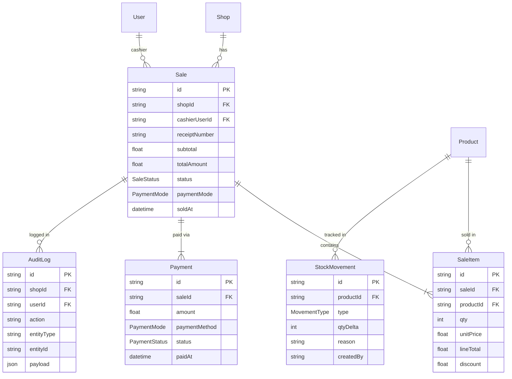

### Enums

```
SaleStatus    → COMPLETED (only value currently used)
PaymentMode   → CASH | CARD | OTHER
PaymentStatus → COMPLETED
MovementType  → OUT  (sales write OUT; inventory module writes IN/OUT/ADJUST)
```

---

## 4. API Reference

All endpoints require `Authorization: Bearer <JWT>`.
All endpoints allow roles: `OWNER` and `CASHIER`.

### Endpoint Summary

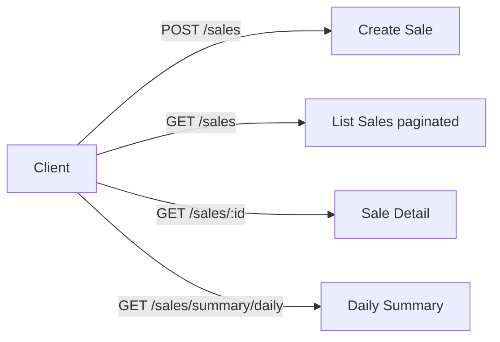

---

### `POST /sales` — Create Sale

**Purpose:** Process a checkout. Validates stock, creates all records atomically, deducts stock, fires alert sync.

**Request body:**

```ts
{
  paymentMode: "CASH" | "CARD" | "OTHER",  // required
  items: [
    {
      productId: string,    // required, non-empty
      quantity: number,     // integer, min 1
      discount?: number     // optional, float ≥ 0, must be < lineTotal
    }
  ]  // array, min 1 item
}
```

**Response `201`:** Full `SaleDetail`

```ts
{
  id: string,
  shopId: string,
  receiptNumber: string,       // "MAH-20260517-A3F9C1D2"
  subtotal: number,
  totalAmount: number,
  status: "COMPLETED",
  paymentMode: "CASH",
  soldAt: string,              // ISO 8601
  cashier: {
    id: string,
    name: string,
    email: string
  },
  items: [
    {
      id: string,
      productId: string,
      qty: number,
      unitPrice: number,       // locked from DB at sale time
      lineTotal: number,
      discount: number,
      product: {
        id: string,
        name: string,
        barcode: string | null,
        unit: string | null
      }
    }
  ],
  payments: [
    {
      id: string,
      amount: number,
      paymentMethod: string,
      status: "COMPLETED",
      paidAt: string
    }
  ]
}
```

**Error responses:**

| Status | Condition |
|--------|-----------|
| `400` | DTO validation failure (bad types, missing fields) |
| `401` | Missing or invalid JWT |
| `403` | Role not allowed |
| `404` | Product not found or not active in this shop |
| `422` | Insufficient stock for a product |
| `422` | Discount amount exceeds line total |

---

### `GET /sales` — List Sales

**Query parameters:**

| Param | Type | Default | Constraints |
|-------|------|---------|-------------|
| `page` | integer | 1 | ≥ 1 |
| `limit` | integer | 20 | 1–100 |
| `from` | ISO date string | — | YYYY-MM-DD |
| `to` | ISO date string | — | YYYY-MM-DD |

**Response `200`:**

```ts
{
  items: [{
    id: string,
    receiptNumber: string,
    soldAt: string,
    status: string,
    paymentMode: string,
    cashierId: string,
    cashierName: string,
    total: number,
    itemCount: number     // sum of all item quantities
  }],
  pagination: {
    page: number,
    limit: number,
    totalItems: number,
    totalPages: number
  },
  filters: {
    from: string | null,
    to: string | null
  }
}
```

**Date filter behavior:** If `from` or `to` is a date-only string (`YYYY-MM-DD`), the backend normalizes it:
- `from` → sets time to `00:00:00.000 UTC`
- `to` → sets time to `23:59:59.999 UTC`

---

### `GET /sales/:id` — Sale Detail

Returns the full `SaleDetail` shape (same as `POST /sales` response).

**Error:** `404` if sale ID not found within the authenticated shop's scope.

---

### `GET /sales/summary/daily` — Daily Summary

**Purpose:** Dashboard widget. Returns revenue and top products for a date window, timezone-aware.

**Query parameters:**

| Param | Type | Default |
|-------|------|---------|
| `from` | ISO date string | today in shop's timezone |
| `to` | ISO date string | today in shop's timezone |

Both are optional and default to today. If only one is provided, both default to the same date.

**Response `200`:**

```ts
{
  date: string,             // "2026-05-17" or "2026-05-01 to 2026-05-17"
  totalRevenue: number,
  transactionCount: number,
  topProducts: [            // max 5 entries
    {
      productId: string,
      productName: string,
      quantitySold: number,
      revenue: number       // lineTotal - discount
    }
  ]
}
```

Top products sorted by `quantitySold DESC`, then `revenue DESC` as tiebreaker.

---

## 5. Backend — Transaction Workflow

### `create()` — Full Sequence

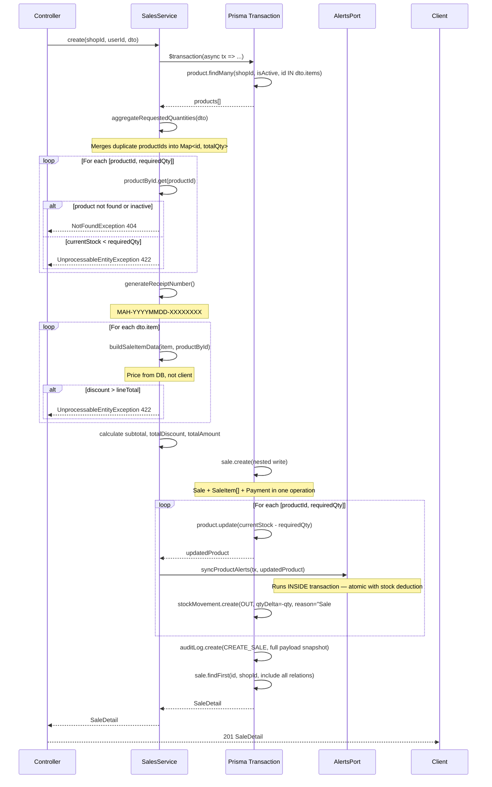

---

### `create()` — Internal State Machine

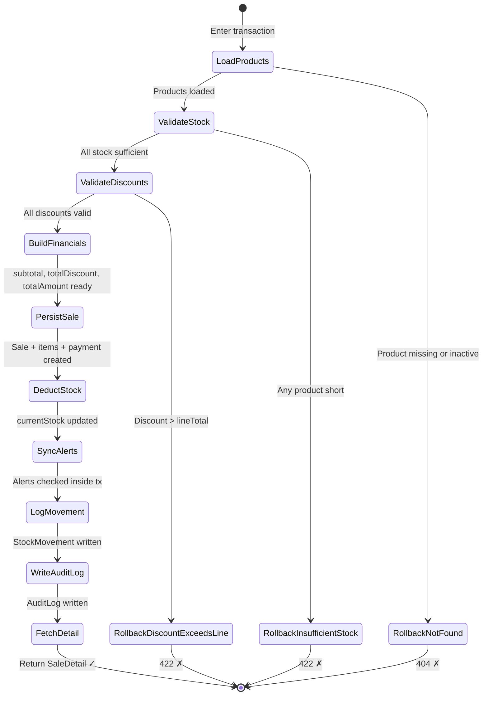

---

### Receipt Number Generation

```
generateReceiptNumber():
  datePart = new Date().toISOString().slice(0, 10).replace(/-/g, '')
             → "20260517"
  shortUuid = randomUUID().replace(/-/g,'').slice(0,8).toUpperCase()
             → "A3F9C1D2"

  result = "MAH-20260517-A3F9C1D2"
```

Not sequential — avoids enumeration attacks and requires no DB locking.

---

## 6. Backend — Daily Summary & Timezone Logic

### Why Timezone Handling Is Non-Trivial

All `soldAt` timestamps are stored in UTC. "Today's sales" means different UTC ranges for different shop timezones. A shop in Casablanca (UTC+1 in summer) needs `soldAt BETWEEN 2026-05-16T23:00:00Z AND 2026-05-17T22:59:59Z` to capture May 17 local time.

### Algorithm

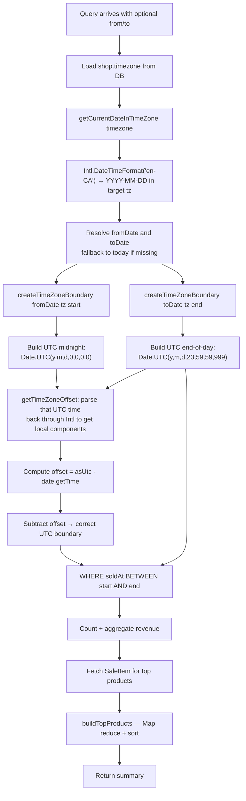

No external timezone library. Pure `Intl.DateTimeFormat` arithmetic handles DST automatically.

---

### `buildTopProducts()` Logic

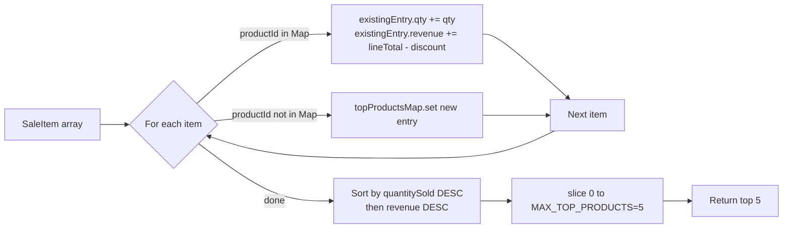

---

## 7. Frontend — POS Workspace

### Component State Map

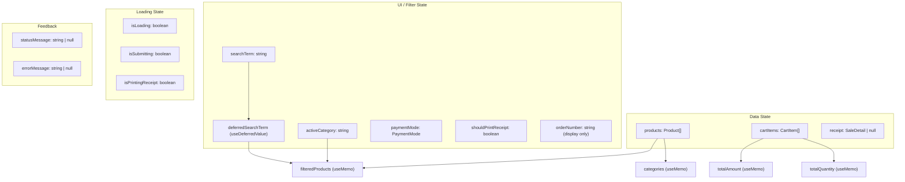

---

### CartItem Type

```ts
type CartItem = {
  productId: string;
  name: string;
  barcode?: string | null;
  unit?: string | null;
  unitPrice: number;       // snapshot from catalog at add-time
  quantity: number;
  lineTotal: number;       // quantity * unitPrice, recalculated on qty change
  availableStock: number;  // snapshot; refreshed after each successful sale
};
```

`CartItem` holds a price snapshot. If the catalog changes while the cashier is mid-cart, the price is refreshed via `syncProductStock()` only after the next successful checkout — not continuously. This is intentional: avoids mid-cart price flicker.

---

### User Interaction Flows

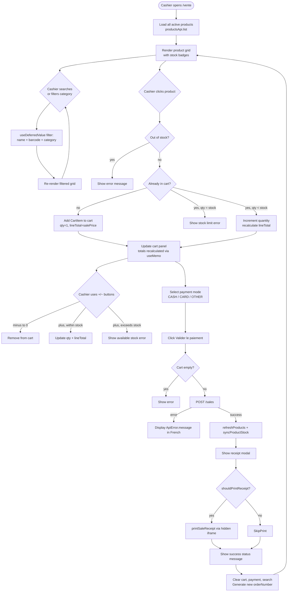

---

### `addToCart()` — Stock Guard Logic

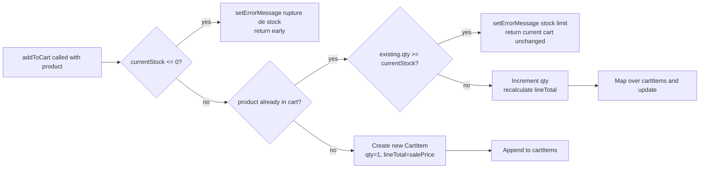

---

### `handleSubmitSale()` — Checkout Sequence

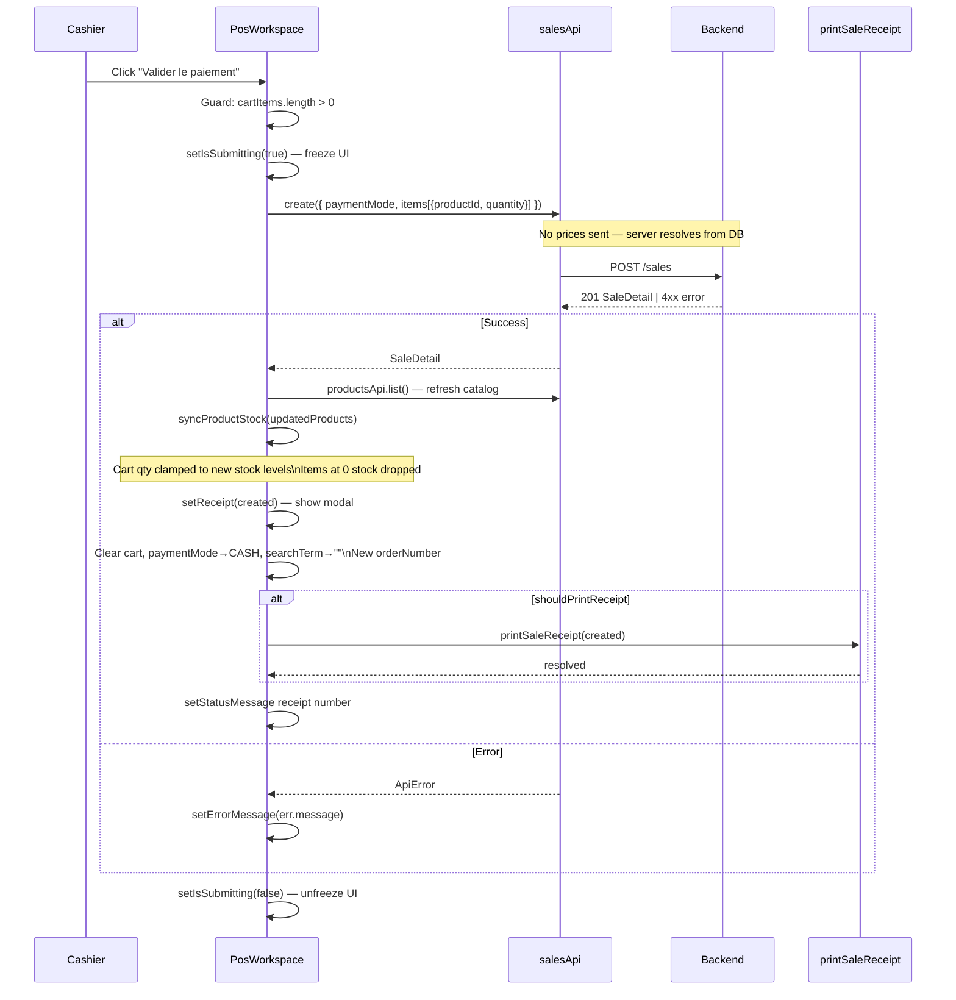

---

### `syncProductStock()` — Post-Sale Cart Reconciliation

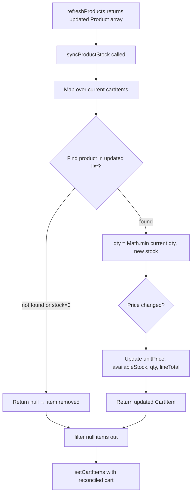

This prevents over-selling if two cashiers process the same product simultaneously.

---

## 8. Frontend — Receipt Printing

### `printSaleReceipt()` — Iframe Technique

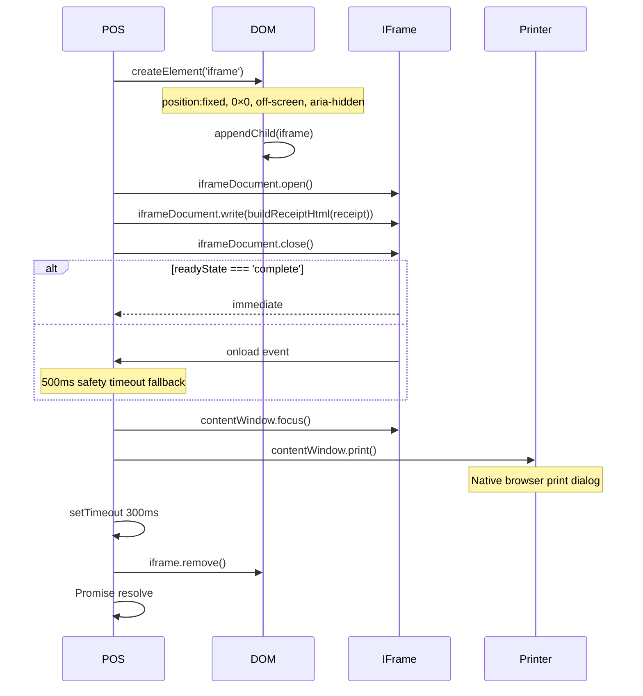

Uses iframe instead of `window.open()` to avoid popup blocker interference.

---

### Receipt HTML Structure

```
Receipt HTML
├── <head>
│   ├── charset, title = receiptNumber
│   └── <style> — inline CSS, print media query included
│       (no external deps — renders offline)
└── <body>
    └── .receipt-sheet (360px card)
        ├── eyebrow "Recu de vente"
        ├── h1 "Moul Hanout"
        ├── .receipt-number (MAH-YYYYMMDD-XXXXXXXX)
        ├── .receipt-block.receipt-meta
        │   ├── Date (fr-MA locale)
        │   ├── Cashier name
        │   └── Payment mode (French label)
        ├── .receipt-block (line items)
        │   └── .receipt-line × N
        │       ├── product name + qty × unitPrice
        │       └── lineTotal - discount
        └── .receipt-total
            ├── Sous-total
            ├── Remise (total discount)
            └── Total (bold, 20px)
```

All values passed through `escapeHtml()` before insertion — no XSS risk from product names or cashier names containing `<`, `>`, `&`, `"`, `'`.

---

## 9. End-to-End Data Flow

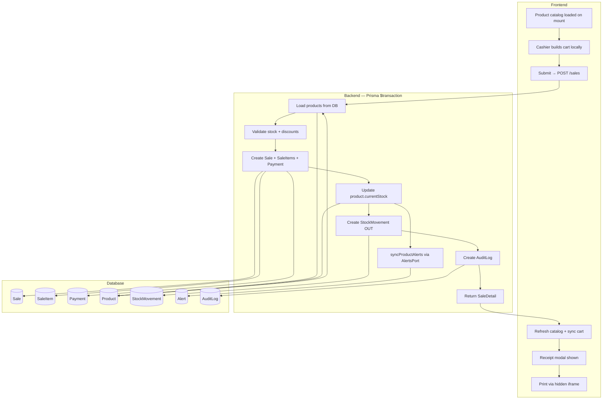

---

## 10. Error Handling

### Backend Error Matrix

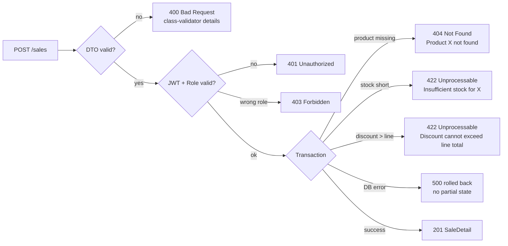

### Frontend Error Handling

| Scenario | Handling |
|----------|----------|
| Product out of stock (client-side) | `setErrorMessage` before API call |
| Stock limit reached in cart | `setErrorMessage`, cart unchanged |
| `ApiError` from backend (422, 404) | Display `err.message` in French |
| Generic network error | Display fallback French message |
| Print failure after successful sale | Error shown; sale is confirmed — print is best-effort |
| `isSubmitting` guard | All interactive elements disabled during API call |

---

## 11. Security Design

### Price Integrity

**Client sends:** `productId`, `quantity`, `discount`
**Server resolves:** `unitPrice` from DB at transaction time

Client cannot inflate or deflate prices. Discount is validated: `discount <= lineTotal` — enforced server-side.

### Shop Isolation

Every query is scoped with `shopId` extracted from the JWT via `@CurrentUser('shopId')`. A cashier at shop A cannot see or modify sales from shop B even with a valid JWT.

### Audit Trail

Every completed sale writes an `AuditLog` with:
- `shopId`, `userId` (who)
- `action: "CREATE_SALE"` (what)
- `entityId: sale.id` (which record)
- `payload`: full snapshot including items and amounts (what was sold)

Combined with `StockMovement` records, every stock change is traceable to a sale receipt.

### Alert Sync Inside Transaction

`alertsPort.syncProductAlerts()` runs inside the Prisma transaction. If alert sync fails, the entire sale rolls back. This ensures alert state never diverges from inventory state.

---

## 12. Tests

**File:** `backend/src/modules/sales/sales.service.spec.ts`

**Setup:** NestJS testing module with mocked `PrismaService` and `AlertsPort`. `prisma.$transaction` mock passes `tx` to the callback.

**Current test coverage:**

| Test | What it verifies |
|------|-----------------|
| `stores the computed line total for each created sale item` | `SaleItem.lineTotal = qty × unitPrice`, `Payment.amount = totalAmount`, `subtotal` calculation, correct nested write shape |

**Gaps (not yet tested):**

| Scenario | Risk if untested |
|----------|-----------------|
| Product not found → 404 | Silent regression if guard removed |
| Insufficient stock → 422 | Could ship over-selling bug |
| Duplicate productId in items | `aggregateRequestedQuantities` logic silent regression |
| Discount > lineTotal → 422 | Negative totals possible |
| `getDailySummary` timezone window | Wrong day boundary in production |
| `buildTopProducts` sorting | Wrong top-5 order on dashboard |
| `findAll` pagination | Off-by-one on page boundaries |

---

## 13. Key Design Decisions

### D1 — Atomic 5-Write Transaction
All five writes (Sale, SaleItem, Payment, StockMovement, AuditLog) are inside one `prisma.$transaction`. Failure at any point = full rollback. No compensation logic, no saga pattern needed at this scale.

### D2 — AlertsPort Interface (Dependency Inversion)
`SalesService` depends on `AlertsPort` (interface), not `AlertsService` (concrete class). The symbol `ALERTS_PORT` is injected at runtime. This allows:
- Alert logic to change without touching sales
- Unit testing sales without alert infrastructure
- Potential future alert implementations (push notifications, SMS) without modifying sales

### D3 — Price Locked Server-Side
Client sends quantity and optional discount only. Server fetches `salePrice` from `Product` table inside the transaction. Price cannot be spoofed.

### D4 — `useDeferredValue` on Search
React 18 concurrent feature. Search input updates immediately (`searchTerm`). The expensive filter computation runs on a deferred value that React can interrupt. On large catalogs, keystrokes stay responsive.

### D5 — `syncProductStock()` After Checkout
After successful sale, frontend re-fetches full catalog and reconciles cart. This handles the race condition where two cashiers sell the same product simultaneously. Cart quantities are clamped to new stock levels; zero-stock items are removed.

### D6 — Non-Sequential Receipt Numbers
`MAH-YYYYMMDD-XXXXXXXX` format uses 8 random UUID characters. No counter, no DB sequence. Avoids:
- Enumeration attacks (guessing valid receipt numbers)
- DB locking on a counter
- Gaps in sequence from rolled-back transactions

### D7 — Iframe Receipt Printing
`window.open()` triggers popup blockers in most browsers. Hidden iframe with `contentWindow.print()` bypasses this. The iframe is created, written, printed, and removed within ~800ms total.

### D8 — Discount Feature Partially Built
`SaleItem` schema supports per-item `discount`. Backend validates and applies it. Frontend `handleSubmitSale()` does not send discount values (sends `quantity` only). The "Remise" button in the UI is disabled with `title="Fonctionnalité à venir"`. Infrastructure exists; UI is not exposed.

---

## 14. Known Gaps & Future Work

| Gap | Impact | Notes |
|-----|--------|-------|
| Discount UI not exposed | No per-item discount at POS | Backend supports it; UI button disabled |
| "En attente" (hold order) button disabled | No parked carts | Feature placeholder |
| No refund / void endpoint | Completed sales cannot be reversed | No `REFUNDED` SaleStatus used |
| Test coverage thin | 1 test covers 1 happy path | See gaps in §12 |
| `findAll` does not filter by cashier | Owner can't filter by who sold | `cashierUserId` filter not in DTO |
| No real-time stock push | Two cashiers may see stale stock | `refreshProducts()` only runs post-sale |
| Receipt HTML is hardcoded "Moul Hanout" | Multi-shop branding impossible | Should use `shop.name` |
| `generateReceiptNumber` uses wall clock | UUID slice could collide | Collision probability ~1/4 billion per day — acceptable |
