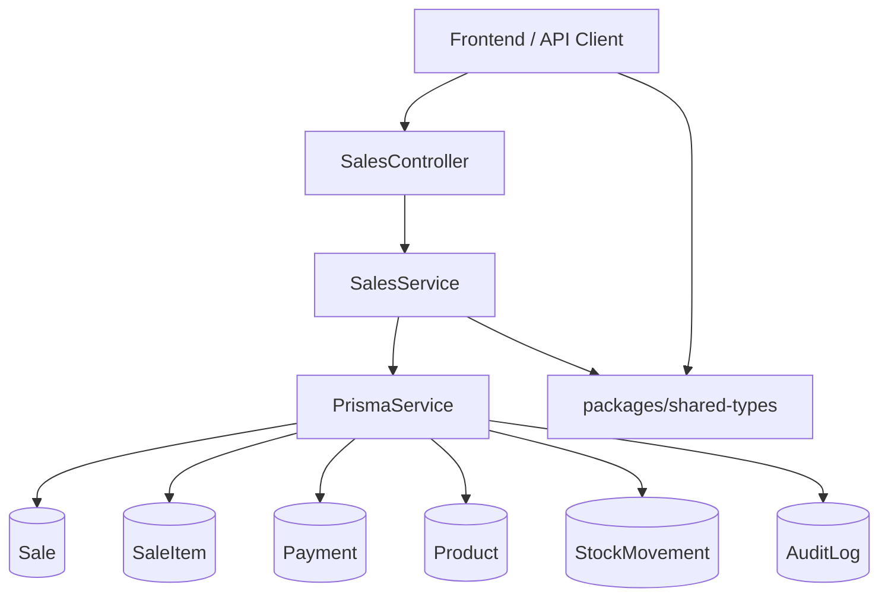
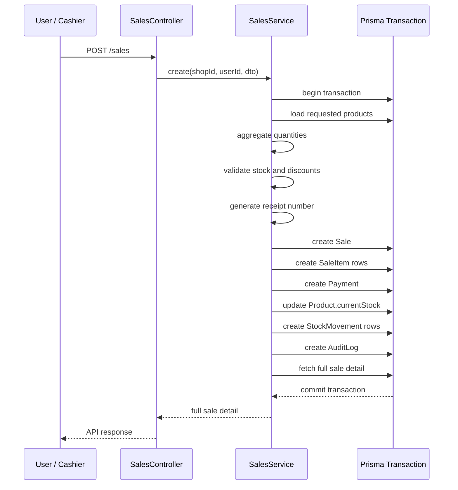
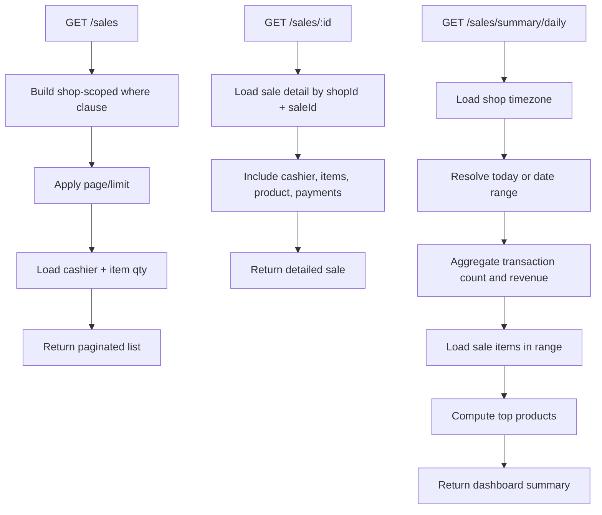

# Sales Module Implementation Report

Date: 2026-04-19

Scope of this report:
- Summarize everything implemented during this conversation
- Start with an audit of my actions and decisions
- Explain the work in a way that is useful to an engineering student
- Document the resulting API and shared contracts
- End with diagrams

## 1. Audit Of My Actions And Choices

This section is intentionally critical. The goal is not just to say what was built, but to evaluate whether the implementation choices were sound.

### 1.1 What I did well

1. I respected the project architecture.
   - I kept the NestJS structure as `Controller -> Service -> Prisma`.
   - I did not move business logic into controllers.
   - I kept the sales feature isolated in `backend/src/modules/sales/`.

2. I delivered the work incrementally in a clean backend-first order.
   - First: module scaffold
   - Then: create sale endpoint
   - Then: list endpoint
   - Then: detail endpoint
   - Then: dashboard summary endpoint
   - Then: shared frontend/backend contract types

3. I kept the controller thin.
   - The controller mainly handles route binding, auth guards, and DTO binding.
   - The service contains the business logic, validation, database access, and aggregation.

4. I used an atomic Prisma transaction for sale creation.
   - This is a strong design choice because sale creation affects several tables:
     - `Sale`
     - `SaleItem`
     - `Payment`
     - `Product`
     - `StockMovement`
     - `AuditLog`
   - A transaction guarantees consistency: either all writes succeed, or none of them do.

5. I matched the existing codebase style instead of inventing a new pattern.
   - I inspected existing modules before adding the sales module.
   - I used the same guard/decorator conventions already present in the repo.
   - I kept Swagger decorators and DTO validation consistent with the rest of the backend.

6. I validated compilation repeatedly.
   - I ran `npm run build` in `backend/` after major endpoint work.
   - I ran `npm run build` in `packages/shared-types/` after adding shared types.

### 1.2 Good engineering decisions

1. Route order was handled correctly.
   - `GET /sales/summary/daily` was placed before `GET /sales/:id`.
   - If I had placed `:id` first, requests to `/sales/summary/daily` could have been interpreted as `id = "summary"`.

2. The sale creation endpoint calculates line pricing from backend product data.
   - This is important because the backend is the source of truth.
   - The client should not be trusted to decide the authoritative sale price.

3. Shared types were added after the backend behavior stabilized.
   - This reduces the chance that the shared contracts drift from the actual API.

4. The daily summary endpoint uses the shop timezone.
   - This is correct for dashboards because "today" should mean the shop's business day, not just the server UTC date.

### 1.3 Tradeoffs and imperfect choices

1. I used Prisma type casts such as `as never` and one `as unknown as SummarySaleItem[]`.
   - Why this happened:
     - The codebase already uses this pattern in several places.
     - Prisma relation typing inside complex query expressions and transaction tuples can be noisy.
   - Why this is not ideal:
     - These casts reduce type safety.
     - They can hide mismatches that stronger typing would catch earlier.
   - Engineering judgment:
     - Acceptable as a short-term repo-consistent choice
     - Worth refactoring later into typed query helpers or inferred constants

2. I verified compilation, not full end-to-end runtime behavior.
   - I did not run seeded API requests against a live database in this conversation.
   - That means the implementation is structurally validated, but not fully behavior-tested in runtime conditions.

3. The summary `date` field is a label, not a strict normalized date object.
   - For a single day it returns something like `2026-04-19`.
   - For a range it returns something like `2026-04-01 to 2026-04-19`.
   - This is useful for UI display, but less strict as an API contract.
   - A future version might prefer:
     - `from`
     - `to`
     - `label`

4. I assumed immediate sale completion.
   - `Sale.status` is set to `COMPLETED`.
   - `Payment.status` is set to `COMPLETED`.
   - This is reasonable for a simple POS flow, but it is still an assumption.
   - If the product later supports partial payment, pending payment, or cancelled transactions, this flow will need extension.

5. I did not add automated tests in this conversation.
   - This is the biggest remaining gap from a Definition of Done perspective.
   - The code builds, but it still needs endpoint-level and service-level tests.

### 1.4 Corrections I made while working

1. I initially created only a scaffold for the sales module because the first request explicitly asked for a scaffold.

2. While implementing the list endpoint, I hit Prisma typing issues with included relations.
   - I fixed that by explicitly introducing typed payload aliases like `SalesListEntry`.

3. While implementing `GET /sales/:id`, I noticed that calling the root service method from inside a transaction callback would be a poor pattern.
   - I corrected this by extracting a shared `getSaleDetail(...)` helper that can work with either:
     - `PrismaService`
     - `Prisma.TransactionClient`

4. While implementing `GET /sales/summary/daily`, I initially tried to carry a complex tuple type through a transaction with relation data.
   - TypeScript rejected this.
   - I simplified the logic into:
     - transaction for count + revenue aggregate
     - separate typed query for sale items
   - This made the code simpler and easier to reason about.

### 1.5 Overall audit verdict

Overall, the implementation is strong in architecture, correctness of write flow, and backend contract definition. The main weaknesses are:
- no automated tests yet
- some Prisma typing casts
- a few assumptions that should be confirmed with product requirements later

For a task-focused implementation session, the result is solid and production-oriented, but not fully complete from a long-term quality gate until tests are added.

## 2. Detailed Explanation For An Engineering Student

This section explains the work as if you are learning how to design a backend feature properly.

### 2.1 What problem we were solving

We needed to create a `SalesModule` that lets the system:
- create a sale
- list sales
- fetch one sale in detail
- summarize daily sales for the dashboard
- expose shared TypeScript contracts so frontend and backend speak the same language

This is not just "adding routes." A sale is a business event that affects:
- money
- inventory
- auditability
- reporting

That means the implementation has to be careful and consistent.

### 2.2 Why start with a scaffold

Before building business logic, it is useful to create the module structure:
- `sales.module.ts`
- `sales.controller.ts`
- `sales.service.ts`
- `dto/sale.dto.ts`

Why?

Because in NestJS, a feature is usually built as a module with clear responsibilities:
- Module: declares the feature
- Controller: receives HTTP requests
- Service: contains business logic
- DTOs: define and validate input

This scaffold gives the feature a home in the architecture before real logic is added.

### 2.3 Why controllers should stay thin

A controller should not decide business rules like:
- whether stock is enough
- how totals are computed
- how receipt numbers are built
- what tables need updates

That logic belongs in the service layer because:
- it is easier to test
- it is reusable
- it keeps HTTP concerns separate from domain logic

That is why the controller mostly just forwards input to `SalesService`.

### 2.4 Why the create-sale flow uses a transaction

Creating a sale is not one database write. It is a bundle of dependent writes:

1. Validate stock
2. Create `Sale`
3. Create `SaleItem` rows
4. Create `Payment`
5. Decrease product stock
6. Create `StockMovement` rows
7. Create `AuditLog`

Imagine step 1 through 4 succeed, but step 5 fails.

Without a transaction:
- the sale might exist
- the payment might exist
- stock might not be reduced
- the system becomes inconsistent

With a transaction:
- either all of it is committed
- or all of it is rolled back

This is one of the most important concepts in backend engineering: when several writes represent one business action, they should usually happen atomically.

### 2.5 How stock validation works

The service first loads the requested products for the current shop and aggregates quantities by product.

Why aggregate quantities?

Because the request might contain the same product more than once. If you do not aggregate:
- line 1 could ask for quantity `2`
- line 2 could ask for quantity `3`
- stock check might incorrectly compare each line separately

By summing requested quantities per product first, the service checks the real total demand against `currentStock`.

### 2.6 Why pricing is calculated from backend product data

The request payload does not carry authoritative `unitPrice`.

Instead, the service reads each product's `salePrice` from the database and uses that to build sale items.

This is good backend design because the client should not be allowed to invent authoritative prices.

If the backend trusted client-supplied prices, a malicious or buggy client could submit:
- lower prices
- incorrect totals
- inconsistent discount behavior

The backend should be the source of truth for money-related calculations.

### 2.7 How receipt numbers are generated

The service generates receipt numbers like:

`MAH-YYYYMMDD-XXXXXXXX`

Example:

`MAH-20260419-AB12CD34`

This helps because receipts should be:
- human-readable
- traceable
- unique enough for operational use

### 2.8 Why stock movements are recorded separately

The `Product.currentStock` field is a convenient cached state.

But operational history matters too. That is why the service also creates `StockMovement` records with:
- `type = OUT`
- negative `qtyDelta`
- reason like `Sale #MAH-20260419-AB12CD34`

This gives both:
- current state
- event history

That is valuable for debugging, reporting, and auditing.

### 2.9 Why audit logs matter

An `AuditLog` is not just extra data. It answers questions like:
- Who created the sale?
- What was sold?
- What receipt number was involved?
- What totals were recorded?

In real systems, auditability matters for:
- accountability
- support investigations
- fraud detection
- operational traceability

### 2.10 How pagination and filtering work in the list endpoint

`GET /sales` supports:
- `page`
- `limit`
- `from`
- `to`

Pagination matters because sales data grows over time. Without pagination:
- responses become larger
- dashboards load more slowly
- reporting pages become inefficient

Date filtering matters because most business users ask questions like:
- show me today's sales
- show me this week's sales
- show me sales between two dates

The implementation returns:
- a list of sales
- pagination metadata
- applied filters

Each sale in the list includes:
- cashier name
- total amount
- item count

This is exactly the kind of information a dashboard or admin page usually needs.

### 2.11 Why a detail endpoint is different from a list endpoint

A list endpoint should be lightweight.
It should return enough information to browse and choose a record.

A detail endpoint should be richer.
It returns:
- cashier info
- items
- product names
- payment info

That is why `GET /sales/:id` returns a deeper object than `GET /sales`.

### 2.12 Why the summary endpoint is special

The dashboard does not usually need raw sales rows first. It often needs aggregated information:
- total revenue
- how many transactions happened
- what products are selling most

That is why `GET /sales/summary/daily` is a summary endpoint rather than another general listing endpoint.

This endpoint is optimized for a dashboard use case, not for record browsing.

### 2.13 Why timezone matters in reporting

Suppose the server runs in UTC, but the shop operates in `Africa/Casablanca`.

A sale at 00:30 local shop time might still be the previous UTC day.

If "today" is calculated incorrectly, dashboards become misleading.

So the summary logic:
- reads the shop timezone
- computes the correct business-day boundaries
- aggregates sales inside that window

This is a subtle but important backend reporting concept.

### 2.14 Why shared types were added

The project architecture says the shared layer is the contract between systems.

That means the frontend should not invent its own sales interfaces if the backend already defines the real shape.

By adding:
- `CreateSaleInput`
- `Sale`
- `SaleDetail`
- `DailySummary`

to `packages/shared-types/src/index.ts`, we make the contract reusable across applications.

Benefits:
- fewer duplicated types
- fewer frontend/backend mismatches
- easier refactoring later
- clearer API usage

This is a classic example of reducing contract drift in a full-stack TypeScript system.

## 3. Chronological Report Of What I Implemented

### 3.1 Task 1.1: Sales module scaffold

Created the backend feature structure:
- `backend/src/modules/sales/sales.module.ts`
- `backend/src/modules/sales/sales.controller.ts`
- `backend/src/modules/sales/sales.service.ts`
- `backend/src/modules/sales/dto/sale.dto.ts`

Registered `SalesModule` in `backend/src/app.module.ts`.

Purpose:
- establish the module in the NestJS architecture
- make the backend aware of the sales feature
- prepare a clean place for future sales endpoints

### 3.2 Task 1.2: `POST /sales`

Implemented the create-sale endpoint and service flow.

What it does:
1. Accepts validated input:
   - `paymentMode`
   - `items[]`
2. Loads products for the current shop
3. Aggregates required quantities per product
4. Verifies stock is sufficient
5. Generates a receipt number
6. Creates a `Sale`
7. Creates `SaleItem` rows
8. Creates a `Payment`
9. Updates `Product.currentStock`
10. Creates `StockMovement` entries
11. Creates an `AuditLog`
12. Returns the full created sale with detail relations

Important design decisions:
- done inside a Prisma `$transaction`
- backend calculates money values from product prices
- controller stays thin

### 3.3 Task 1.3: `GET /sales`

Implemented a paginated listing endpoint for the current shop.

Supported filters:
- `page`
- `limit`
- `from`
- `to`

Returned fields per row:
- sale id
- receipt number
- sold date
- status
- payment mode
- cashier id
- cashier name
- total
- item count

Purpose:
- drive list pages
- support report filtering
- avoid loading every sale at once

### 3.4 Task 1.4: `GET /sales/:id`

Implemented a detailed read endpoint for one sale.

Returned:
- sale header fields
- cashier object
- items
- each item's product info
- payments

I also extracted a reusable detail query helper in the service so:
- `POST /sales` can return the same shape
- `GET /sales/:id` can reuse that same logic

This improved consistency and reduced duplication.

### 3.5 Task 1.5: `GET /sales/summary/daily`

Implemented a dashboard-focused summary endpoint.

Returned fields:
- `date`
- `totalRevenue`
- `transactionCount`
- `topProducts[]`

Behavior:
- no filter means today's summary
- optional `from` / `to` allow a range
- shop timezone is used to compute day boundaries

Top products are ranked by quantity sold, with revenue included too.

This endpoint is directly usable by a dashboard because it provides business aggregates rather than raw transactional rows.

### 3.6 Task 1.6: shared sales types

Added shared types to `packages/shared-types/src/index.ts`:
- `CreateSaleInput`
- `Sale`
- `SaleDetail`
- `DailySummary`

Also added supporting types:
- `PaymentMode`
- `SaleStatus`
- `PaymentStatus`
- `CreateSaleItemInput`
- `SaleDetailCashier`
- `SaleDetailItemProduct`
- `SaleDetailItem`
- `SalePayment`
- `DailySummaryTopProduct`

This makes the sales API contract reusable by the frontend and any other packages in the monorepo.

## 4. Resulting Backend Surface

### 4.1 Module registration

The sales feature is now registered in the application root.

Relevant files:
- `backend/src/modules/sales/sales.module.ts`
- `backend/src/app.module.ts`

### 4.2 Routes added

The following routes now exist in the sales controller:

1. `POST /api/v1/sales`
2. `GET /api/v1/sales`
3. `GET /api/v1/sales/:id`
4. `GET /api/v1/sales/summary/daily`

All are guarded with:
- `JwtAuthGuard`
- `RolesGuard`

And all are available to:
- `OWNER`
- `CASHIER`

### 4.3 DTOs added

The sales DTO file now contains:
- `CreateSaleItemDto`
- `CreateSaleDto`
- `GetSalesQueryDto`
- `GetDailySalesSummaryQueryDto`
- `UpdateSaleDto`

These DTOs validate:
- payment mode
- item arrays
- quantity integer constraints
- pagination values
- date filter input

## 5. Files Changed

### Backend

- `backend/src/app.module.ts`
  - registered `SalesModule`

- `backend/src/modules/sales/sales.module.ts`
  - declared module, controller, and service

- `backend/src/modules/sales/sales.controller.ts`
  - added sales routes
  - applied auth and role guards
  - kept controller thin

- `backend/src/modules/sales/sales.service.ts`
  - implemented create-sale transaction
  - implemented paginated list query
  - implemented single-sale detail query
  - implemented daily summary aggregation
  - added helper methods for summary windows and detail reuse

- `backend/src/modules/sales/dto/sale.dto.ts`
  - added input DTOs and query DTOs

### Shared package

- `packages/shared-types/src/index.ts`
  - added shared contracts for sales

## 6. Verification Performed

I verified the implementation using compilation checks.

Commands run successfully:
- `backend: npm run build`
- `packages/shared-types: npm run build`

What this proves:
- TypeScript compiles
- NestJS module wiring is valid
- DTOs and service code are syntactically correct
- shared types package exports are valid

What this does not prove:
- database runtime behavior with real seeded data
- authorization behavior under real tokens
- edge cases like concurrent sale creation
- exact frontend consumption behavior

## 7. Remaining Risks And Recommendations

### 7.1 Risks

1. Missing automated tests
   - The most important next gap

2. Prisma type casts
   - Can hide schema/query mismatches

3. Sale status assumptions
   - Current implementation assumes immediate completion

4. Summary response shape
   - `date` doubles as a label for both one day and ranges

### 7.2 Recommended next steps

1. Add service tests for `SalesService.create`
   - sufficient stock
   - insufficient stock
   - duplicate product lines
   - discount overflow
   - audit log creation

2. Add controller/e2e tests for:
   - `POST /sales`
   - `GET /sales`
   - `GET /sales/:id`
   - `GET /sales/summary/daily`

3. Replace the looser Prisma casts with typed query constants or helper functions.

4. Consider a stricter summary contract:
   - `from`
   - `to`
   - `label`

5. Consider supporting:
   - pending payments
   - sale cancellation/refund flow
   - more explicit line-level monetary fields if receipts become more advanced

## 8. Key Engineering Lessons

If you are an engineering student, these are the most important concepts from this work:

1. Architecture matters.
   - Clean layering makes complex features easier to extend.

2. Transactions matter.
   - If one business action touches many tables, atomicity is essential.

3. Backend is the source of truth.
   - Prices, stock validation, and receipt generation should not be trusted to the client.

4. A list endpoint and a detail endpoint serve different jobs.
   - Keep list payloads smaller and detail payloads richer.

5. Reporting is not trivial.
   - Dates, timezones, and aggregation rules affect correctness.

6. Shared types reduce bugs in full-stack TypeScript systems.
   - Contracts should be defined once and reused.

7. Building is necessary, but not sufficient.
   - Compilation is not the same thing as runtime verification.

## 9. Diagrams

### 9.1 Module and data flow

### 9.2 `POST /sales` sequence

### 9.3 Sales read and summary flows

