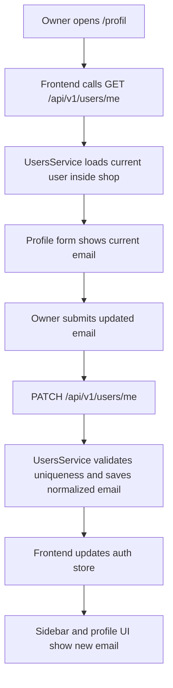
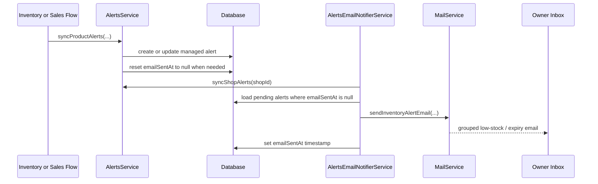
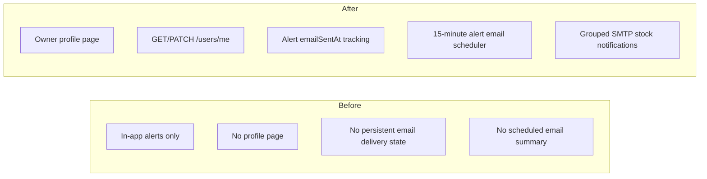

# Task Documentation

## 1. What Was Done
The objective of this task was to let the shop owner manage the email address from a profile screen and use that owner email as the destination for SMTP notifications about low-stock products and products that are close to expiration.

The original problem had two parts:
- there was no profile page where the authenticated owner could update the account email from the UI
- the system already created in-app alerts for low stock and expiry, but it did not send those alerts by email

The implemented solution added a complete end-to-end flow:
- a backend `GET /api/v1/users/me` endpoint to read the current profile
- a backend `PATCH /api/v1/users/me` endpoint to update the current account email safely
- a new frontend `/profil` page available from the sidebar so the owner can edit the email from the product UI
- a scheduled backend notifier that syncs alerts and sends grouped SMTP alert emails to owner accounts
- a Prisma migration that stores whether an alert has already been emailed, so the same alert is not sent repeatedly every scheduler cycle

The final result is that the owner can open the new profile page, update the email address used by the account, and that email becomes the destination for future SMTP stock-alert digests whenever SMTP is configured.

## 2. Detailed Audit
I started by inspecting the existing authentication, users, alerts, and mail flows before writing code. That inspection showed several important facts:
- users already had an `email` field in the database, so no new owner-contact table was needed
- the app sidebar showed the current user but there was no actual profile page or self-service profile endpoint
- low-stock and expiry alerts already existed in the backend inside `AlertsService`
- mail support already existed, but only for password reset

This was important because it meant the cleanest architecture was to extend the existing user account email, not to introduce duplicate "notification email" state somewhere else. That keeps the source of truth inside the user model.

### Backend profile work
I added `GET /users/me` and `PATCH /users/me` to the existing users module instead of creating a new profile module. This choice keeps account-read and account-update behavior in the user domain, which is where this logic already belongs.

The service logic was designed to be safe:
- it verifies that the authenticated user belongs to the current shop
- it normalizes the email to lowercase before saving
- it rejects updates when another user already owns the target email

This avoids a common bug where the same email can be stored with different casing and later cause confusing login or uniqueness behavior.

### Alert email delivery design
The next design problem was how to send low-stock and expiry alerts by email without spamming the owner every time the alert sync logic runs.

I explicitly did not send the email directly inside the inventory and sales write transactions. That would have been a poor design for several reasons:
- SMTP is an external network dependency and should not be coupled to a database write transaction
- alert syncing already runs in multiple code paths, so direct email sending would make duplicate sends much more likely
- expiry alerts can become relevant simply because time passes, not only because someone edits stock

Because of that, I introduced a scheduled notifier service in the alerts module. The scheduler does the following:
1. runs every 15 minutes
2. synchronizes current alerts for each shop
3. finds alerts that have not yet been emailed
4. groups them into a low-stock section and an expiring-soon section
5. sends one summary email per owner recipient
6. marks those alerts with `emailSentAt` so they are not sent again on the next cycle

This approach was chosen because it is operationally safer and more scalable than firing SMTP work inline with stock mutations.

### Why a database field was needed
To avoid repeated email sends, I added `emailSentAt` to the `Alert` model and created a matching migration.

That field is necessary because the alert system already persists alerts. Without a persistent delivery-state field, the scheduler would have no reliable way to distinguish:
- a brand new alert that still needs an email
- an old alert that has already been emailed

I also updated alert reconciliation so that when a managed alert is created or its message changes, `emailSentAt` is reset to `null`. This preserves the correct behavior:
- new alert -> send email
- changed alert -> send refreshed email
- unchanged alert already sent -> do not resend

### Mail service extension
The existing `MailService` only supported password reset. I extended it with:
- `isMailEnabled()` so the scheduler can skip cleanly when SMTP is not configured
- `sendInventoryAlertEmail()` to send grouped stock-alert summaries

I kept the password reset logic intact and added a second mail path rather than overloading the password reset method. That keeps responsibilities clearer and makes tests more focused.

### Frontend profile UX
On the frontend, I added a dedicated `/profil` page and linked it from the sidebar navigation plus the existing sidebar user card.

The page uses the existing UI patterns already present in the app:
- `AppPageHeader`
- `panel`
- `form-grid`
- `field`

I intentionally reused the existing design system instead of building a separate profile visual language. That respects the project rule to preserve established patterns within the current product.

The profile page loads the authenticated account from `/users/me`, pre-fills the current email, saves via `PATCH /users/me`, and updates the Zustand auth store so the sidebar and session UI reflect the change immediately without a reload.

### Runtime verification work
After implementation, I validated the feature at several levels:
- generated Prisma client after the schema change
- ran focused backend unit tests
- built the shared package
- built the backend
- built the frontend
- rebuilt the Docker Compose stack
- confirmed the new migration applied in the backend container
- confirmed the stack ended healthy
- logged into the real API with the seeded owner account
- called `GET /api/v1/users/me`
- called `PATCH /api/v1/users/me` with the owner email as a non-destructive runtime check

This runtime sequence matters because it proves the feature works beyond isolated tests:
- the new migration is valid
- the backend routes are reachable
- authentication still works
- the profile endpoint is correctly wired inside the running container

### Risks avoided
Several risks were intentionally avoided:
- no duplicate notification-email model was introduced, avoiding data drift
- no SMTP call was made inside stock write transactions
- no unrelated backend modules were refactored
- no placeholder SMTP secrets were hardcoded into environment files
- no repeated alert re-send loop was introduced because delivery state is persisted

### Logic preserved and logic changed
Logic preserved:
- user authentication and password reset behavior
- existing low-stock and expiry alert creation rules
- existing owner/cashier authorization structure
- existing frontend visual language

Logic changed:
- the user module now exposes self-profile read and update endpoints
- alerts now track delivery state with `emailSentAt`
- alert reconciliation now resets `emailSentAt` when a managed alert changes
- the alerts module now contains a scheduled notifier for owner email delivery
- the frontend now exposes a profile route and sidebar entry

## 3. Technical Choices and Reasoning
### Naming choices
I used `UpdateProfileDto`, `findProfile`, `updateProfile`, and `AlertsEmailNotifierService` because those names match the user-facing purpose directly and avoid vague verbs.

### Structural choices
I kept profile management inside the users module because the email being edited is part of the user account, not a separate notification domain.

I kept email dispatching inside the alerts module because the scheduler is an operational consequence of alert state, not of user management.

### Dependency decisions
No new external packages were added. The implementation reuses:
- Prisma for persistence and migration handling
- `@nestjs/schedule`, which was already installed
- the existing `MailService`
- the existing shared-types workspace

This avoids unnecessary dependency growth and follows the project rule against adding dependencies without need.

### Performance considerations
The scheduler groups pending alerts per shop and then per owner recipient. It does not send one email per alert. That reduces SMTP chatter and keeps notification volume reasonable.

The new database index on `(shopId, emailSentAt)` supports the main scheduler lookup pattern for pending email work.

### Maintainability considerations
The alert email delivery state is stored directly on alerts, which makes the email pipeline easy to reason about:
- alert exists
- alert needs email if `emailSentAt` is null
- alert has been emailed if `emailSentAt` is set

That is much easier to audit than relying on implicit timing, logs, or in-memory caches.

### Scalability considerations
Using a scheduler allows expiry alerts to be detected as time passes, even when no one changes stock manually. This is a better fit for a scalable inventory system than requiring a UI page visit to surface expiry conditions.

### Security considerations
The profile update endpoint only updates the authenticated account inside the authenticated shop context, and it still enforces email uniqueness. No secret values were introduced into the repository.

## 4. Files Modified
- `backend/prisma/schema.prisma` — added `emailSentAt` to alerts and indexed pending email lookups
- `backend/prisma/migrations/20260423130000_add_alert_email_delivery_state/migration.sql` — migration to persist alert email delivery state
- `backend/src/app.module.ts` — enabled Nest schedule support
- `backend/src/modules/alerts/alerts.module.ts` — registered the alert email notifier and imported mail support
- `backend/src/modules/alerts/alerts.service.ts` — reset `emailSentAt` when managed alerts are created or updated
- `backend/src/modules/alerts/alerts-email-notifier.service.ts` — added the scheduled alert-email workflow
- `backend/src/modules/alerts/alerts-email-notifier.service.spec.ts` — added tests for scheduler behavior
- `backend/src/modules/mail/mail.service.ts` — added inventory alert email sending and mail-enabled detection
- `backend/src/modules/mail/mail.service.spec.ts` — added coverage for grouped inventory alert emails
- `backend/src/modules/users/dto/update-profile.dto.ts` — added validated input for profile email updates
- `backend/src/modules/users/users.controller.ts` — added `GET /users/me` and `PATCH /users/me`
- `backend/src/modules/users/users.service.ts` — added self-profile read/update logic with duplicate email protection
- `backend/src/modules/users/users.service.spec.ts` — added tests for profile retrieval and email update rules
- `packages/shared-types/src/index.ts` — added the shared `UpdateProfileInput` contract
- `frontend/src/lib/api/api-client.ts` — added `usersApi.me()` and `usersApi.updateMe()`
- `frontend/src/components/layout/app-sidebar.tsx` — added the profile navigation entry and linked the footer profile card
- `frontend/src/app/profil/profile-workspace.tsx` — added the owner-facing profile workspace UI
- `frontend/src/app/(authenticated)/profil/page.tsx` — registered the authenticated profile route
- `frontend/src/app/globals.css` — added profile page layout and responsive styles
- `docs/task-admin-profile-alert-email-notifications.md` — added the required technical audit document

## 5. Validation and Checks
- Prisma client generation: `npm run prisma:generate --workspace backend` passed
- Shared package build: `npm run build --workspace @moul-hanout/shared-types` passed
- Backend build: `npm run build --workspace backend` passed
- Frontend build: `npm run build --workspace frontend` passed
- Focused backend tests: `env.validation.spec.ts`, `users.service.spec.ts`, `alerts-email-notifier.service.spec.ts`, and `mail.service.spec.ts` all passed
- Focused backend lint: targeted ESLint run on touched backend files passed
- Focused frontend lint: targeted ESLint run on touched frontend files passed
- Docker validation: `docker compose up -d --build` completed successfully after the changes
- Migration validation: the backend container applied `20260423130000_add_alert_email_delivery_state` successfully on startup
- Container health validation: `docker compose ps` showed `postgres`, `redis`, `backend`, and `frontend` healthy on April 23, 2026
- API validation: login with seeded owner account succeeded through `POST /api/v1/auth/login`
- API validation: `GET /api/v1/users/me` returned the authenticated owner profile successfully
- API validation: `PATCH /api/v1/users/me` succeeded with the current owner email as a non-destructive runtime check
- Manual UI validation: the frontend production build generated the new `/profil` route successfully
- SMTP delivery validation: not fully end-to-end tested against a real SMTP server in this local environment because real SMTP credentials were not configured during validation
- Repo-wide backend lint: not run as a full workspace command because the repository has an existing broader lint backlog outside this task; targeted lint for all touched backend files did pass

## 6. Mermaid Diagrams

