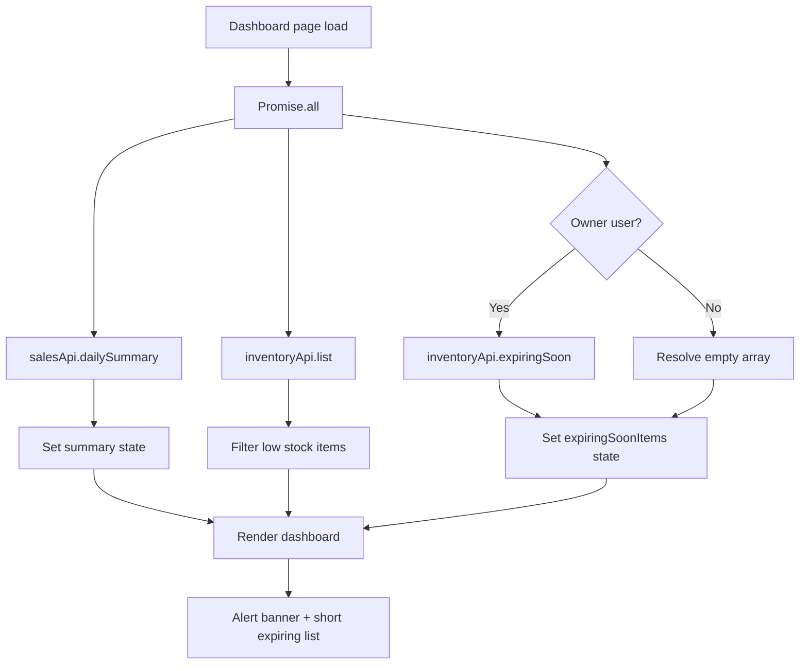
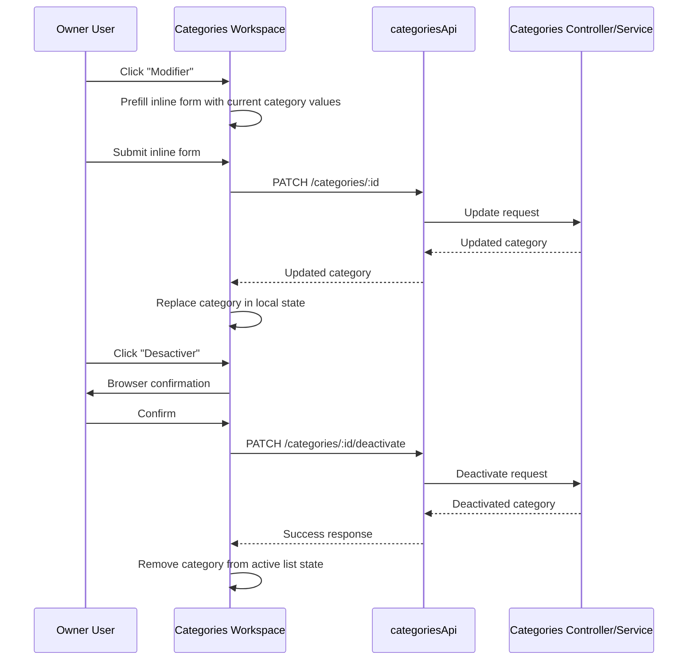

# Task Documentation

## 1. What Was Done
The objective was to close two remaining frontend MVP blockers without changing the architecture or introducing new screens.

The first blocker was on the authenticated dashboard. The page already loaded the daily sales summary and low-stock inventory, but it did not request or display products that are expiring soon. I added the `inventoryApi.expiringSoon()` call to the existing `Promise.all` loading flow, stored the result in a dedicated `expiringSoonItems` state, and rendered an alert banner plus a short list of expiring products using the same stock-list visual pattern already used on the dashboard.

The second blocker was category management. The categories workspace already supported creation, but it did not support update or deactivation from the UI. I added `update` and `deactivate` methods to the frontend API client, then implemented inline editing and deactivation actions directly inside the existing category cards. The edit form is prefilled from the selected category, the update is sent with a `PATCH /categories/:id` request, and the UI state is updated locally after success. Deactivation now asks for confirmation, calls `PATCH /categories/:id/deactivate`, and removes the category from the active list without requiring a page reload.

The final result is that the dashboard now surfaces expiring inventory to owners, and category maintenance can be completed from the existing workspace, which removes the requested MVP blockers.

## 2. Detailed Audit
1. I inspected the targeted frontend files first to avoid broad project re-analysis and to keep the change set limited to the requested pages and API client.
2. I verified the backend routes before wiring new frontend calls:
   `backend/src/modules/categories/categories.controller.ts` already exposes `PATCH /categories/:id` and `PATCH /categories/:id/deactivate`.
   `backend/src/modules/inventory/inventory.controller.ts` already exposes `GET /inventory/expiring-soon`, but it is owner-only.
3. I updated `frontend/src/lib/api/api-client.ts` by extending `categoriesApi` with:
   `update(id, payload)` mapped to `PATCH /categories/:id`
   `deactivate(id)` mapped to `PATCH /categories/:id/deactivate`
   This kept the frontend aligned with the existing backend contract instead of inventing new routes.
4. In `frontend/src/app/(authenticated)/page.tsx`, I integrated the expiring-soon fetch into the existing dashboard loader instead of creating a second load path. This preserved the existing architecture where the dashboard resolves its initial data in one effect with one `Promise.all`.
5. Because the expiring-soon inventory endpoint is restricted to owners, I guarded the call with `isOwner ? inventoryApi.expiringSoon() : Promise.resolve([])`. This avoided a regression where cashier users could hit a 403 during dashboard load.
6. I added `expiringSoonItems` state and reset it in the error path alongside the existing dashboard state reset. This preserved predictable UI behavior on retries and failures.
7. I rendered the expiring-soon alert as an additional banner plus a short list using existing dashboard stock list classes (`db2-stock-list`, `db2-stock-item`, `StockBar`) to stay within the no-redesign constraint.
8. In `frontend/src/app/categories/categories-workspace.tsx`, I added minimal local state for:
   the currently edited category id
   the inline edit form values
   the category currently being updated or deactivated
9. I kept create logic untouched and isolated the new edit/deactivate behavior into dedicated handlers:
   `handleEditStart` preloads the inline form with the selected category
   `handleEditSubmit` calls `categoriesApi.update(...)` and replaces the updated category in local state
   `handleDeactivate` shows a browser confirmation, calls `categoriesApi.deactivate(...)`, and removes the category from the active list in local state
10. I deliberately removed deactivated categories from the UI instead of keeping them in the list because the page is labeled `Categories actives` and the backend `list()` route already returns only active categories.
11. I added only two small CSS helpers in `frontend/src/app/globals.css` for edit/action spacing inside the existing card component. No new page, component system, or layout pattern was introduced.
12. I validated the result with frontend lint and a production Next.js build. This confirmed that the new API methods, JSX changes, and state updates compile correctly.

## 3. Technical Choices and Reasoning
The naming stays explicit and follows the project conventions: `expiringSoonItems`, `editingCategoryId`, `pendingActionCategoryId`, `handleEditSubmit`, and `handleDeactivate` describe intent clearly and avoid generic names.

The dashboard change was implemented inside the existing fetch effect because that is the smallest safe change and preserves the current loading/error model. Splitting this into separate effects would add coordination complexity and increase the chance of inconsistent partial state.

The category edit UI was implemented inline inside the current card list because the requirement explicitly forbids new pages and asks for UI consistency. Reusing the existing `field` and `app-btn` styles avoided design drift and kept the change minimal.

The deactivate flow uses confirmation before sending the request because deactivation is destructive from the user's perspective. The UI then updates local React state immediately after a successful API response, which keeps the screen in sync without a forced reload and avoids unnecessary extra queries.

From a maintainability perspective, the API client remains the single frontend contract layer for backend calls. From a scalability perspective, the new handlers are isolated and do not duplicate backend business rules. From a security and correctness perspective, the owner-only inventory route is respected on the frontend, and backend validation errors are still surfaced through `ApiError` instead of being hidden.

## 4. Files Modified
- `frontend/src/app/(authenticated)/page.tsx` — added owner-safe expiring-soon fetch, state, alert banner, and compact product list on the dashboard
- `frontend/src/lib/api/api-client.ts` — added `categoriesApi.update` and `categoriesApi.deactivate`
- `frontend/src/app/categories/categories-workspace.tsx` — added inline category editing, prefilled form state, confirmation-based deactivation, and immediate UI state updates
- `frontend/src/app/globals.css` — added minimal spacing helpers for category card actions and inline edit form

## 5. Validation and Checks
- Build status: passed with `npm run build --workspace frontend`
- Lint status: passed with `npm run lint --workspace frontend`
- Type-check status: passed as part of the Next.js production build (`Linting and checking validity of types ...`)
- API validation: route names were verified against `backend/src/modules/categories/categories.controller.ts` and `backend/src/modules/inventory/inventory.controller.ts`
- UI validation: implemented state updates so edit and deactivate actions update the category list without reload; dashboard expiring-soon content is rendered from loaded state without reload
- Manual test status: not run interactively in a browser during this task
- Regression check: limited to frontend build/lint validation; no unrelated modules were modified

## 6. Mermaid Diagrams

