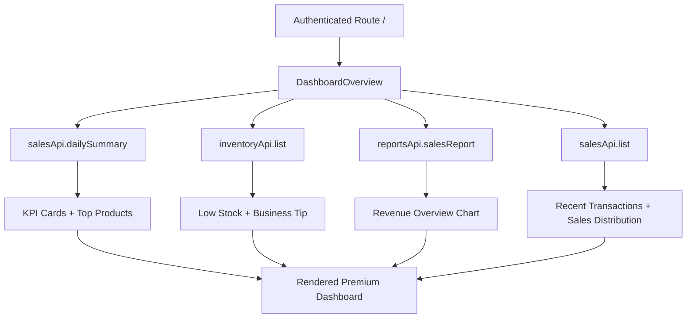
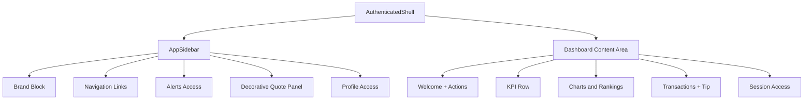

# Task Documentation

## 1. What Was Done
The authenticated dashboard UI was redesigned to closely match the provided premium reference while staying inside the current Next.js frontend structure.

The original dashboard already loaded live business data, but its presentation did not match the target composition, spacing, or visual hierarchy. The work focused on rebuilding the dashboard page and the small authenticated shell pieces it depends on, especially the sidebar and mobile shell.

The implemented solution:
- replaced the old dashboard page body with a dedicated dashboard overview component
- added a premium light visual system with soft off-white surfaces, green accents, rounded cards, and calmer spacing
- introduced a reference-aligned layout with welcome/actions, KPI cards, revenue chart, top products, sales distribution donut, recent transactions, business tip, and session access
- refreshed the authenticated sidebar and mobile header so the dashboard sits inside a more coherent premium shell

Final result:
- the dashboard now has a more polished SaaS look with subtle Moroccan-inspired decorative details
- existing frontend functionality remains connected to current APIs
- unsupported sections still render gracefully using clearly isolated fallback data

---

## 2. Detailed Audit
1. The existing authenticated dashboard page was audited first to understand what real data was already available.
Reason:
The task explicitly required using existing sources where possible and avoiding backend/API changes unless absolutely necessary.

2. The current frontend stack was inspected before any redesign work.
Reason:
The project already included `recharts`, a shared authenticated shell, and existing API clients. Reusing those pieces reduced risk and avoided unnecessary dependencies.

3. The dashboard page entry point at `frontend/src/app/(authenticated)/page.tsx` was simplified to mount a new focused dashboard component.
Reason:
This kept routing stable while moving dashboard-specific UI and logic into a dedicated component that is easier to maintain.

4. A new `dashboard-overview` component and CSS module were created.
Reason:
The previous page mixed loading logic and older dashboard markup directly in the route file. Extracting the dashboard into its own component made the redesign cleaner and kept page-level routing concerns separate from UI composition.

5. Existing API contracts were reused instead of inventing new endpoints.
Used data:
- `salesApi.dailySummary()` for today’s revenue, transaction count, and top products
- `inventoryApi.list()` for low-stock and expiring-soon derived states
- `reportsApi.salesReport()` for the revenue overview chart
- `salesApi.list()` for recent transactions and payment-mode distribution

Reason:
This preserved backend contracts and aligned with the rule that frontend should consume backend APIs rather than duplicate business logic.

6. The dashboard loader uses `Promise.allSettled` rather than a single failing `Promise.all`.
Reason:
The new UI has several independent cards. Partial success is better than a blank dashboard, so the implementation keeps working sections visible and shows a sync banner when some requests fail.

7. Fallback content was added only where backend data is missing or not expressive enough.
Fallback areas:
- top products visual ranking when `dailySummary.topProducts` is empty
- donut chart mix when recent sales do not provide enough data to derive a distribution
- recent transactions customer label, because the current sales list contract does not expose customer information

Reason:
The design needs stable visual structure, but the implementation still had to remain honest about current API limits.

8. The revenue chart and donut chart were implemented with `recharts`, which already exists in the project.
Reason:
This avoided adding new dependencies and kept the solution compatible with the current stack.

9. The authenticated shell and sidebar were refactored into dedicated CSS modules.
Reason:
The redesign needed stronger visual control over the shell without adding more brittle rules into the already large global stylesheet. CSS modules also limit style leakage into unrelated pages.

10. The sidebar was rebuilt to better match the reference image.
Changes:
- stronger brand presentation
- softer card-like container
- cleaner nav rows
- decorative quote panel near the bottom
- preserved alerts access and owner quick actions
- preserved profile access

Reason:
The reference layout depends heavily on the left navigation’s visual weight, so the shell needed a coordinated update instead of a page-only repaint.

11. The mobile authenticated shell was kept functional.
Changes:
- sticky mobile topbar
- menu drawer support
- overlay and escape handling

Reason:
The task required responsiveness for laptop, tablet, and mobile, so the redesign could not assume desktop-only use.

12. Chart container sizing was adjusted after verification.
Reason:
`recharts` can warn during prerender if containers do not resolve dimensions reliably. Explicit responsive heights were used so production build checks stay clean.

13. Validation was run after implementation.
Actions:
- `npm run lint`
- `npm run build`

Reason:
This matches the project’s DoD emphasis on type safety, lint correctness, and production-readiness.

14. A documentation file was added as a mandatory post-task artifact.
Reason:
The repository instructions require a technical post-task document before the task is considered complete.

Files impacted:
- dashboard route entry
- new dashboard component and styles
- authenticated shell component and styles
- sidebar component and styles
- shared brand mark component

Logic preserved:
- auth shell routing flow
- existing authenticated routes
- alert dropdown behavior
- dashboard data sources
- session/logout access through `AuthSessionPanel`

Logic changed:
- visual composition of the dashboard
- authenticated shell presentation
- sidebar structure and styling
- dashboard loading resilience through partial data handling

Risks avoided:
- no backend contract changes
- no new chart dependency
- no unrelated file cleanup in the dirty working tree
- no removal of existing useful access patterns such as alerts and session controls

---

## 3. Technical Choices and Reasoning
Naming choices:
- `DashboardOverview` was chosen because it describes the main dashboard container clearly and can evolve without coupling it to a route filename.
- `MoulHanoutMark` was added as a small shared visual primitive so branding is not duplicated across the sidebar and mobile shell.

Structural choices:
- CSS modules were used for the new dashboard and shell pieces instead of expanding `globals.css`.
- The route file remains minimal and delegates UI logic to a dashboard component.
- Shared shell pieces were updated only where the redesigned dashboard depends on them.

Dependency decisions:
- reused `recharts`
- reused existing `Button`, auth store, alerts dropdown, and API client layers
- added no new packages

Performance considerations:
- dashboard data requests run in parallel
- partial failures do not force a full blank-state reload
- derived UI data is memoized where it helps readability and avoids repeated transformation work

Maintainability considerations:
- dashboard-specific UI is isolated from unrelated pages
- shell styling is localized with CSS modules
- fallback data is explicitly marked temporary in code comments for easy replacement later

Scalability considerations:
- the dashboard loader can accept richer backend data later without changing the route structure
- the new card layout is modular, so sections can be replaced or expanded independently

Security considerations:
- no secrets or hardcoded backend URLs were introduced
- auth and route behavior were left intact
- session/logout flow continues to use existing auth actions

---

## 4. Files Modified
- `frontend/src/app/(authenticated)/page.tsx` — simplified the route entry to render the new dashboard overview component
- `frontend/src/components/dashboard/dashboard-overview.tsx` — implemented the redesigned dashboard UI, live data loading, fallback states, charts, table, and actions
- `frontend/src/components/dashboard/dashboard-overview.module.css` — added the local premium dashboard design system and responsive layout styles
- `frontend/src/components/layout/authenticated-shell.tsx` — refreshed the authenticated shell structure and mobile topbar
- `frontend/src/components/layout/authenticated-shell.module.css` — added shell-level layout, background, mobile topbar, and overlay styles
- `frontend/src/components/layout/app-sidebar.tsx` — redesigned the sidebar content and layout while preserving navigation and key functionality
- `frontend/src/components/layout/app-sidebar.module.css` — added sidebar-specific premium styling and decorative quote panel
- `frontend/src/components/layout/moul-hanout-mark.tsx` — created a reusable brand mark used in the shell
- `docs/task-dashboard-premium-redesign.md` — added the required post-task implementation and audit documentation

---

## 5. Validation and Checks
Build status:
- `frontend: npm run build` passed

Lint status:
- `frontend: npm run lint` passed

Type-check status:
- covered by the successful Next.js production build

Manual test status:
- no interactive browser session was run in this environment, so visual/manual QA was not fully executed

API validation:
- existing frontend API clients were reused without changing contracts
- dashboard sections were wired to current live endpoints where available

UI validation:
- responsive breakpoints were implemented for desktop, tablet, and mobile layouts in the new CSS modules
- chart container sizing was adjusted after build verification to avoid prerender warnings

Regression check:
- only dashboard-related frontend files and the shared authenticated shell/sidebar used by that dashboard were changed
- unrelated dirty backend/frontend files present in the repository were intentionally left untouched

Sections still using mock or temporary fallback data:
- top products ranking fallback when live summary top products are empty
- sales distribution fallback when recent sales do not provide enough payment-mix data
- customer label placeholder in recent transactions because the current sales list response has no customer field

---

## 6. Mermaid Diagrams

## Commit Message
feat: redesign authenticated dashboard ui
