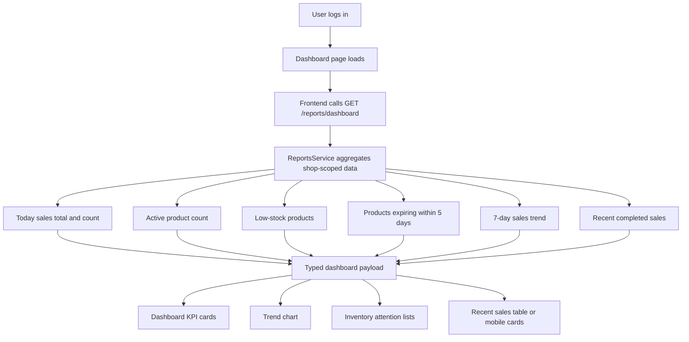
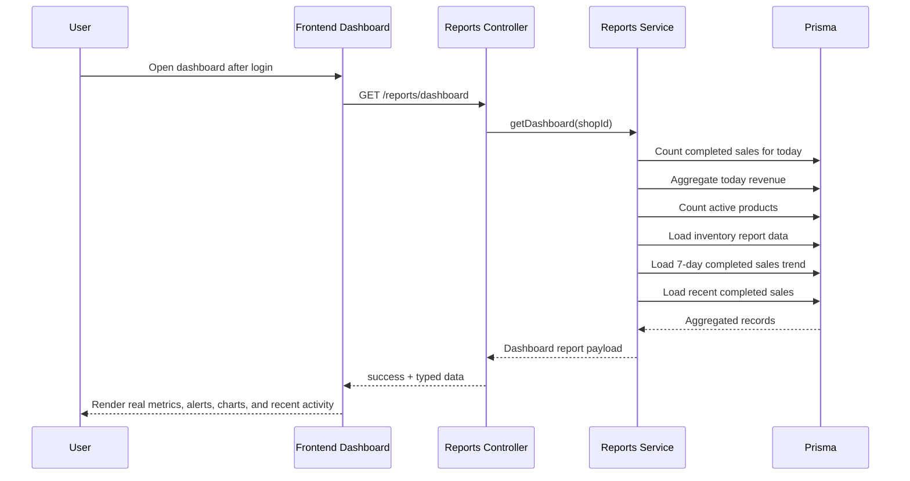

# Task Documentation

## 1. What Was Done
The objective was to make the post-login dashboard production-ready by replacing mock or fallback business numbers with real backend data, improving the dashboard layout, and making the sidebar/navigation work properly on desktop and mobile.

The main problem was that the dashboard UI was visually advanced but still depended on multiple mixed endpoints and fallback placeholders, so key sections were not fully tied to one authoritative business report. This created partial data states, duplicated fetch logic, and a risk that the dashboard would not represent the real shop state consistently after login.

The implemented solution was to upgrade the existing `GET /reports/dashboard` endpoint so it becomes the primary dashboard contract. It now returns the shop business date, today sales totals, today sales count, active product count, low-stock products, products expiring within 5 days, a 7-day sales trend, and recent completed sales. The frontend dashboard was then refactored to use that single report payload as its main source, while the UI was rebuilt around real loading, empty, and error states instead of fake fallback business values.

The final result is a dashboard that reads real operational data from the backend, presents it in a cleaner and more premium layout, behaves correctly on smaller screens, and keeps the navigation usable after login for both owner and cashier flows.

---

## 2. Detailed Audit
The first action was to inspect the existing frontend dashboard component, authenticated shell, sidebar, shared types, reports module, sales module, inventory module, and Prisma schema. This was necessary to understand whether the backend already exposed enough real business data and to avoid adding a new route if the current architecture could be extended safely.

That inspection showed that `GET /reports/dashboard` already existed, but the payload was too small for the required dashboard. It only returned today sales total, sales count, low-stock products, and expiring products. The frontend therefore still depended on other endpoints and on placeholder-based UI behavior. Because the route already existed and matched the desired architecture, the preferred solution was to extend this contract instead of creating a second dashboard endpoint or continuing to stitch multiple unrelated endpoints together in the page.

The reports service was then updated to aggregate additional dashboard data in one place. This included:
- `generatedAt` to identify report freshness
- `businessDate` to show the shop-local day used for the dashboard
- `totalProducts` to represent active catalog size
- `salesTrend` for the last 7 shop-local business days
- `recentSales` for recent completed transactions

This change was necessary because the dashboard needed to show more than just daily totals. It also reduced frontend complexity by moving aggregation logic to the backend, where the source-of-truth belongs according to project rules.

The sales trend was implemented by reusing the same internal report-window logic already used by sales reporting. A private helper was extracted so the reports module could generate a daily trend for the dashboard without duplicating date-window behavior in the frontend. This was preferred over computing chart data in the UI because date-window logic must remain aligned with shop timezone rules.

The recent sales block was added directly inside the reports service instead of calling the sales service. This respected the project rule that modules should not directly call each other’s services without an abstraction. The data shape was mapped locally in the reports service and exposed through shared types for the frontend.

The reports controller was updated to allow both `OWNER` and `CASHIER` roles on the dashboard route. This was necessary because the dashboard is the post-login landing page, and the frontend already exposes a cashier dashboard experience. Leaving the route owner-only would have broken the dashboard for cashier sessions once the page relied on the unified dashboard endpoint.

The shared types package was expanded with `DashboardRecentSale` and the richer `DashboardReport` structure. This was required so the frontend and backend continue to share a stable typed contract instead of duplicating interfaces locally.

On the frontend, the dashboard component was refactored so its main data flow is a single `reportsApi.dashboard()` request. This removed the old multi-request pattern that mixed `salesApi.dailySummary`, `inventoryApi.list`, `reportsApi.salesReport`, and `salesApi.list` for one page. That old approach was workable but fragmented. The new one is simpler, more reliable, and easier to reason about.

The old dashboard also contained fallback business numbers and fallback visual distributions to preserve cards when live data was missing. Those were removed because the task explicitly required real business information instead of mock numbers. Empty states now explain that no recent sales or no expiring products exist, rather than presenting fake values.

The dashboard UI itself was rebuilt around the real payload:
- KPI cards now show real today sales total, today sales count, total active products, low-stock count, and expiring-soon count.
- The trend chart now uses real 7-day backend data.
- The payment mix chart now derives from recent real sales only.
- Low-stock and expiring product sections now list actual backend items.
- Recent sales now render from backend data in both desktop table and mobile card formats.

This structure was preferred over keeping the older top-product fallback layout because the requested business priorities were daily sales, stock risk, expiring products, total products, and recent activity. The redesign stays closer to those requirements and removes sections that could not be backed with first-class real data.

The authenticated shell and sidebar were then improved for responsiveness and accessibility. The mobile overlay is now a real button element with a close label, the sidebar drawer closes when links are activated, the active route is marked with `aria-current="page"`, focus is returned to the menu button after closing the drawer, and the shell/sidebar styles now better prevent horizontal overflow. These changes were necessary because dashboard usability depends heavily on stable navigation on smaller screens.

The dashboard mobile experience was also adjusted to avoid horizontal table overflow. On small screens the recent-sales section switches from a wide table to stacked activity cards. This was preferred over keeping a scrollable table because the task explicitly asked to prevent horizontal scrolling and keep navigation/dashboard usage polished on mobile.

A targeted backend unit test was then expanded to validate the richer dashboard payload. The test now checks the new total products, sales trend, and recent sales fields in addition to the previous metrics. This preserved the existing report service coverage while validating the new aggregation logic.

Validation was then run in stages:
- shared types build
- targeted backend reports test
- backend build
- frontend lint
- frontend production build

Backend lint was also attempted, but it fails with a large set of pre-existing repository-wide issues outside the dashboard scope. That was documented rather than silently ignored, because claiming a green backend lint result would be inaccurate.

Files impacted were kept limited to the reports module, shared types, the dashboard component, and the authenticated shell/sidebar. Unrelated modules were not rewritten. Existing features like session controls, alerts access, sales history links, and profile access were preserved.

Logic preserved:
- shop-local sales window calculation in reports
- existing `GET /reports/dashboard` route instead of introducing a new parallel route
- existing authenticated shell structure
- existing alerts/session/profile integration

Logic changed:
- dashboard contract is richer and role access includes cashier
- dashboard frontend now uses one main business report source
- placeholder business data was removed
- mobile recent-sales rendering now uses stacked cards instead of relying on a horizontally wide table

Risks avoided:
- no fake numbers were introduced
- no raw SQL or cross-module service calls were added
- no unrelated business modules were rewritten
- no duplicate local type definitions were added outside the shared package

---

## 3. Technical Choices and Reasoning
Naming choices were kept explicit and domain-oriented. Fields such as `businessDate`, `totalProducts`, `salesTrend`, and `recentSales` are more descriptive than generic names and make the dashboard contract easier to understand for both backend and frontend developers.

The structural choice to extend `GET /reports/dashboard` instead of introducing a new route was intentional. The route already represented the reporting domain and was the closest architecture match to the requested feature. This keeps the backend simpler and prevents the dashboard from becoming a frontend-only aggregation layer.

No new runtime dependency was added. Existing tools already covered the needed UI, charting, and backend aggregation behavior. This follows the project rule against unnecessary dependencies.

Performance was considered by keeping aggregation inside `Promise.all`, limiting recent sales to a small fixed count, and using product count rather than fetching the full product list just to compute totals. The dashboard remains a small set of targeted queries instead of a broad data dump.

Maintainability improved because the frontend now depends on a stronger shared contract. The page no longer needs to coordinate several partially overlapping dashboard requests. This lowers the risk of future UI drift and makes backend contract changes more centralized.

Scalability improved because reporting logic stays in the reports module, where richer summary data can continue to grow. If future dashboard cards are added, they can extend the same reporting boundary rather than creating more fragmented UI fetch patterns.

Security and access control were considered by keeping authentication and guards unchanged and only broadening dashboard access to `CASHIER` where it is functionally required. The dashboard still uses authenticated shop-scoped data and does not bypass existing route protection.

On the UX side, the design choices favored calm spacing, soft surfaces, clearer hierarchy, and responsive layouts instead of more decorative or placeholder-driven cards. This matches the premium, Apple-inspired direction requested while still preserving the project’s established visual language.

---

## 4. Files Modified
- `backend/src/modules/reports/reports.controller.ts` — allowed cashier access to the unified dashboard report route
- `backend/src/modules/reports/reports.service.ts` — expanded dashboard aggregation with business date, total products, sales trend, and recent sales
- `backend/src/modules/reports/reports.service.spec.ts` — extended unit coverage for the richer dashboard payload
- `packages/shared-types/src/index.ts` — updated shared dashboard types and added `DashboardRecentSale`
- `frontend/src/components/dashboard/dashboard-overview.tsx` — refactored dashboard to consume real report data with loading, empty, and error states
- `frontend/src/components/dashboard/dashboard-overview.module.css` — rebuilt dashboard styling for cleaner layout, responsive sections, and mobile activity cards
- `frontend/src/components/layout/authenticated-shell.tsx` — improved mobile drawer handling, overlay accessibility, and focus return
- `frontend/src/components/layout/authenticated-shell.module.css` — tightened shell overflow behavior and mobile spacing
- `frontend/src/components/layout/app-sidebar.tsx` — added active-route accessibility, close-on-navigation behavior, and drawer focus support
- `frontend/src/components/layout/app-sidebar.module.css` — improved sidebar overflow handling and focus-visible states
- `docs/task-dashboard-production-readiness.md` — post-task audit documentation for this work

---

## 5. Validation and Checks
Validation completed:
- Shared types build: passed via `npm run build --workspace @moul-hanout/shared-types`
- Backend unit test: passed via `npm run test --workspace backend -- reports.service.spec.ts`
- Backend build: passed via `npm run build --workspace backend`
- Frontend lint: passed via `npm run lint --workspace frontend`
- Frontend build: passed via `npm run build --workspace frontend`

Validation attempted but not green:
- Backend lint: failed via `npm run lint --workspace backend`

Reason backend lint is not green:
- The backend workspace currently contains a large number of existing `@typescript-eslint` issues outside the dashboard scope, including common decorators, filters, guards, auth files, sales files, and the e2e test suite.
- These failures were not introduced as part of the dashboard implementation and were therefore not expanded into a repo-wide lint remediation task.

Validation not completed:
- Full backend e2e suite was not run.
- Manual browser validation was not run inside this task.

Functional confidence:
- The dashboard contract is covered by a targeted backend unit test.
- The frontend compiles successfully in a production Next.js build against the updated shared types.

---

## 6. Mermaid Diagrams

## Commit Message
feat: connect dashboard to real reporting data
