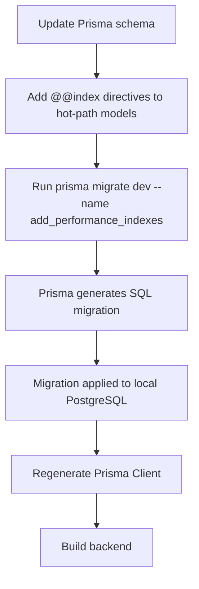

# Task Documentation

## 1. What Was Done
The objective was to add database indexes for the backend’s most frequently queried tables so common MVP operations do not rely on sequential scans as data grows.

The existing Prisma schema had the core entities for products, sales, alerts, sessions, stock movements, and shop-role assignments, but it was missing several targeted indexes on the columns most often used by filters and sorting. That means queries such as product listing by shop, unread alert polling, sales reporting by date, and session expiration lookups could become noticeably slower as row counts increase.

The implemented solution added the requested Prisma `@@index` definitions to the schema and generated a new Prisma migration named `add_performance_indexes`. Prisma then created and applied SQL indexes for all requested hot paths.

The final result is a schema and migration set that improves read performance for common dashboard, inventory, alert, reporting, and auth access patterns without changing any API contracts or business logic.

## 2. Detailed Audit
The first step was to inspect the current Prisma schema and migration history. This was necessary to confirm two things:
- whether any of the requested indexes already existed
- whether there were pending schema changes in `backend/prisma` that could interfere with a clean migration

The audit showed that the requested indexes were not present and that the `backend/prisma` area was otherwise clean. That made it safe to add only the requested index definitions.

The schema was then updated in a minimal way by adding `@@index` entries directly to the affected Prisma models:
- `Product`
- `Sale`
- `Alert`
- `StockMovement`
- `Session`
- `UserShopRole`

This approach was chosen because Prisma schema-level indexes are the project’s source of truth for database structure. Defining indexes in the Prisma schema keeps the contract explicit and ensures the generated SQL migration stays aligned with the maintained data model.

After the schema change, the migration command requested by the task was executed:
- `npx prisma migrate dev --name add_performance_indexes`

This created the new migration folder:
- `backend/prisma/migrations/20260422000243_add_performance_indexes`

Prisma also applied the migration to the local development database successfully. This was important because it confirmed the migration SQL was valid against the current local schema state.

The generated SQL was then reviewed. The migration created exactly these indexes:
- `alerts_shopId_isRead_idx`
- `products_shopId_idx`
- `products_shopId_isActive_idx`
- `sales_shopId_idx`
- `sales_shopId_soldAt_idx`
- `sales_shopId_status_soldAt_idx`
- `sessions_userId_expiresAt_idx`
- `stock_movements_productId_createdAt_idx`
- `user_shop_roles_shopId_idx`

Each index maps to a realistic hot path:
- `Product.shopId` supports shop-scoped product lists
- `Product.shopId + isActive` supports active/inactive product filtering within a shop
- `Sale.shopId` supports shop-scoped sale queries
- `Sale.shopId + soldAt` supports date-range sales reporting
- `Sale.shopId + status + soldAt` supports status-aware reporting and operational sales filters
- `Alert.shopId + isRead` supports unread alert polling
- `StockMovement.productId + createdAt` supports product movement history ordered by time
- `Session.userId + expiresAt` supports session cleanup and user session lookups
- `UserShopRole.shopId` supports shop membership queries

No business logic, controller logic, service logic, DTOs, or frontend code were changed. That was intentional because this task was strictly a database performance improvement and did not require any application behavior changes.

Alternatives considered implicitly were:
- writing raw SQL manually without updating Prisma schema
- adding broader or speculative indexes not requested by the task

Those alternatives were not chosen. Manual raw SQL would weaken schema consistency, and speculative indexes could add write overhead without a clear benefit. The selected implementation stayed precise and aligned with the requested scope.

Risks avoided:
- no unrelated schema refactors were introduced
- no existing unique constraints were altered
- no runtime query behavior was changed
- no APIs or contracts were broken
- no unrelated modified files were touched

## 3. Technical Choices and Reasoning
The index definitions were added directly to Prisma models because the project uses Prisma as the authoritative schema layer. This improves maintainability by keeping structural database decisions visible at the model level instead of hiding them inside hand-written SQL.

The selected indexes are composite where the hot path naturally combines filtering and ordering. For example:
- `Sale(shopId, soldAt)` helps when queries first narrow to one shop and then filter or sort by sale date
- `Sale(shopId, status, soldAt)` helps when a report or list filters by both shop and sale status before using time
- `Session(userId, expiresAt)` helps auth-related lookups that are both user-scoped and expiration-aware

This structure is preferable to adding only single-column indexes in these cases because the access path more closely matches real query predicates.

From a performance perspective, these indexes improve read efficiency on common MVP workloads while keeping the change set small. There is some write overhead for maintaining indexes during inserts and updates, but the chosen set is narrow and targeted to frequently accessed operational paths.

From a scalability perspective, this work improves the system’s ability to support larger product catalogs, more sales history, and more frequent dashboard polling without requiring application-layer workarounds.

From a maintainability perspective, Prisma-generated migration SQL was preferred over hand-authored SQL so the migration history remains reproducible and consistent with future schema diffs.

Security considerations were minimal for this task because it does not process secrets or change authentication rules. The main safety concern was preserving schema correctness, which was handled by using Prisma migration tooling and rebuilding the backend afterward.

## 4. Files Modified
- `backend/prisma/schema.prisma` — added the requested index definitions to `Product`, `Sale`, `Alert`, `StockMovement`, `Session`, and `UserShopRole`
- `backend/prisma/migrations/20260422000243_add_performance_indexes/migration.sql` — generated SQL migration that creates the new database indexes
- `docs/task-database-performance-indexes.md` — documented the task, audit trail, validation, and diagrams

## 5. Validation and Checks
Build status:
- `npm run build --workspace backend` passed

Lint status:
- Not run for this task because the change was schema-only and there were no TypeScript code edits requiring new lint validation

Type-check status:
- Covered indirectly by the successful backend build

Migration status:
- `npx prisma migrate dev --name add_performance_indexes` passed
- Migration `20260422000243_add_performance_indexes` was created and applied successfully to the local development database

Prisma client status:
- `npm run prisma:generate --workspace backend` passed

Manual test status:
- No UI manual test was applicable because this task only changes database indexes

API validation:
- No endpoint contract changed; no direct API behavior change required validation beyond successful schema migration and backend build

Regression check:
- Schema diff reviewed and migration SQL confirmed to contain the requested index set only

If something was not validated:
- Query execution benchmarks were not run in this task, so the expected sub-10ms outcome is based on correct index coverage rather than measured benchmark output in this environment

## 6. Mermaid Diagrams


```mermaid
graph TD
    P1[Product queries by shop] --> PI1[Product @@index(shopId)]
    P2[Active product filtering by shop] --> PI2[Product @@index(shopId, isActive)]
    S1[Sales lookup by shop] --> SI1[Sale @@index(shopId)]
    S2[Sales reporting by date] --> SI2[Sale @@index(shopId, soldAt)]
    S3[Status-aware sales reports] --> SI3[Sale @@index(shopId, status, soldAt)]
    A1[Unread alert polling] --> AI1[Alert @@index(shopId, isRead)]
    M1[Stock movement history] --> MI1[StockMovement @@index(productId, createdAt)]
    SE1[Session lookup and cleanup] --> SEI1[Session @@index(userId, expiresAt)]
    U1[Shop membership lookup] --> UI1[UserShopRole @@index(shopId)]
```

## Commit Message
feat: add database performance indexes migration
