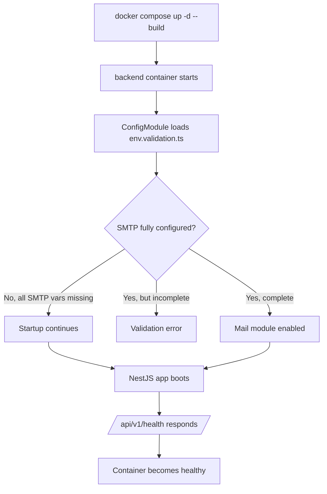
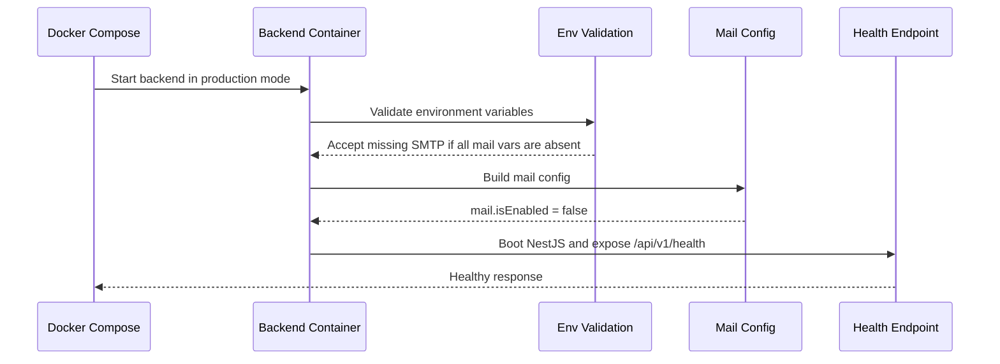
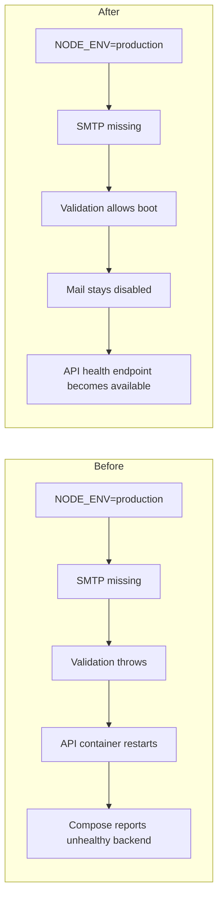

# Task Documentation

## 1. What Was Done
The objective of this task was to fix the Docker Compose startup failure where the backend container `moul_hanout_api` kept restarting and eventually became unhealthy.

The underlying problem was not a Docker networking issue. The backend process crashed during NestJS startup because `backend/src/config/env.validation.ts` treated SMTP configuration as mandatory whenever `NODE_ENV=production`. In the Docker Compose stack, the backend runs in production mode, but the local `.env` file did not define `SMTP_HOST`, `SMTP_PORT`, `SMTP_USER`, `SMTP_PASS`, or `MAIL_FROM`. That caused the application to exit before the health endpoint could become available.

The implemented solution was to relax startup validation so SMTP is optional when it is completely absent, while still rejecting partial SMTP configuration. This preserves configuration safety without blocking the whole API for an optional mail capability. I also added a focused unit test file to lock in the intended behavior.

The final result is that `docker compose up -d --build` now starts the full stack successfully, the backend reaches a healthy state, and the frontend is able to start after the backend healthcheck passes.

## 2. Detailed Audit
The first action was to inspect the real Compose configuration and the failing container logs instead of assuming the error from the terminal summary. This showed that the unhealthy container was `moul_hanout_api`, which maps to the `backend` service in `docker-compose.yml`.

I then inspected the backend logs with `docker logs moul_hanout_api --tail 200`. That log made the failure explicit: NestJS crashed with `SMTP configuration is required in production. Missing environment variables: SMTP_HOST, SMTP_PORT, SMTP_USER, SMTP_PASS, MAIL_FROM`.

After identifying the exact crash point, I reviewed `backend/src/config/env.validation.ts`. The file already had two useful concepts:
- a required core environment set for database and JWT values
- a completeness check for SMTP configuration so partial mail setup is rejected

The issue was a stricter third rule layered on top: when `NODE_ENV` was `production`, completely missing SMTP variables caused a hard startup failure. That was the direct reason the API container never became healthy.

I reviewed the surrounding mail implementation before changing validation. This was necessary to avoid breaking the architecture:
- `backend/src/config/mail.config.ts` marks mail as enabled only when all SMTP variables exist
- `backend/src/modules/mail/mail.service.ts` already handles disabled mail explicitly
- in production, the mail service throws only when an email send is attempted without configuration

This review mattered because it showed SMTP is an optional runtime capability, not a core boot dependency like the database or JWT secrets. That made the validation rule the wrong layer for enforcing startup failure.

I chose not to solve the issue by inserting fake SMTP defaults into `docker-compose.yml`. That alternative would have made the stack boot, but it would also hide the fact that no real mail service is configured. It would replace an honest configuration state with placeholder credentials, which is weaker operationally.

I also chose not to change `NODE_ENV` away from `production` inside Compose. That would have masked the symptom by changing runtime behavior, not by fixing the actual configuration policy. Keeping the backend in production mode is a cleaner and more realistic local stack for this project.

The code change itself was minimal. I removed only the rule that forced SMTP to exist whenever the app booted in production. I deliberately preserved:
- the required checks for `DATABASE_URL`, `JWT_SECRET`, and `JWT_REFRESH_SECRET`
- the validation for `AUTH_PASSWORD_RESET_EXPIRES_IN_MINUTES`
- the validation that rejects partially filled SMTP configuration
- the validation that rejects invalid SMTP ports

That preservation is important because it means the fix does not lower overall config quality. It only removes the specific boot-time constraint that was making the Docker stack unusable.

I then added `backend/src/config/env.validation.spec.ts` to prove three cases:
- production config without SMTP is accepted
- partial SMTP config is still rejected
- invalid SMTP port values are still rejected

This test file acts as an audit trail and a regression guard. Without it, a future refactor could accidentally reintroduce the same startup problem.

After the code change, I validated the backend package directly:
- `npm run test --workspace backend -- env.validation.spec.ts`
- `npm run build --workspace backend`

Once those passed, I rebuilt and started the real stack using `docker compose up -d --build`. The result changed from repeated API restarts to a healthy stack:
- `moul_hanout_db`: healthy
- `moul_hanout_redis`: healthy
- `moul_hanout_api`: healthy
- `moul_hanout_web`: healthy

I then performed one direct host-level API validation with `Invoke-WebRequest http://localhost:4000/api/v1/health`, which returned a successful JSON health payload. This confirmed the fix at the service contract level, not just at the container status level.

I also ran `npm run lint --workspace backend` because the project rules require recording validation honestly. That command failed, but the failure was not introduced by this task. The output showed a large set of pre-existing lint violations in unrelated files such as:
- `backend/src/common/decorators/current-user.decorator.ts`
- `backend/src/common/filters/http-exception.filter.ts`
- `backend/test/app.e2e-spec.ts`

I did not modify those files because the task was specifically about Docker Compose startup failure, and changing unrelated files would have violated the instruction to make minimal and precise changes.

## 3. Technical Choices and Reasoning
The naming remained unchanged because the existing environment validation naming was already explicit and aligned with the codebase.

The main structural choice was to keep the fix inside the configuration validation layer instead of spreading Docker-specific workarounds into infrastructure files. This was preferred because the real bug was application boot policy, not orchestration syntax.

No new dependencies were added. That was intentional because the issue could be solved with existing application logic, and adding tools like a mail sandbox container or new runtime packages would have increased complexity unnecessarily.

From a performance perspective, this change has effectively zero runtime cost. It only affects startup validation rules and a small unit test.

From a maintainability perspective, preserving the partial SMTP validation rule is important. It prevents ambiguous states where someone sets one or two SMTP variables and assumes email is ready. The application still requires all mail settings together before enabling mail.

From a scalability perspective, this change keeps core platform boot dependencies narrow:
- database access remains mandatory
- auth secrets remain mandatory
- optional infrastructure stays optional until the feature that uses it is invoked

From a security perspective, this is safer than using fake SMTP credentials in Compose. The application now reports the real state of mail configuration honestly, and it still refuses malformed SMTP config. It also avoids encouraging hardcoded fake values that could accidentally survive into a shared environment.

## 4. Files Modified
- `backend/src/config/env.validation.ts` — removed the production-only hard failure for completely missing SMTP configuration while preserving all other validation rules
- `backend/src/config/env.validation.spec.ts` — added focused regression tests for optional SMTP, incomplete SMTP, and invalid SMTP port handling
- `docs/task-docker-compose-backend-smtp-startup.md` — added the required post-task engineering documentation and audit trail

## 5. Validation and Checks
- Build status: `npm run build --workspace backend` passed
- Type-check status: backend build passed through NestJS compilation
- Unit test status: `npm run test --workspace backend -- env.validation.spec.ts` passed with 3/3 tests
- Docker Compose validation: `docker compose up -d --build` completed successfully after the fix
- Container health validation: `docker compose ps` showed `postgres`, `redis`, `backend`, and `frontend` all healthy on April 23, 2026
- API validation: `http://localhost:4000/api/v1/health` returned `{"success":true,...}` from the host machine
- Manual runtime validation: backend logs confirmed NestJS boot completed and the health route was served successfully
- Lint status: `npm run lint --workspace backend` failed due pre-existing unrelated lint errors already present in the repository; this task did not resolve those broader issues
- Regression check: the SMTP completeness and port validation behavior was preserved through the new unit tests

## 6. Mermaid Diagrams

## Commit Message
fix: allow docker compose backend startup without smtp config
