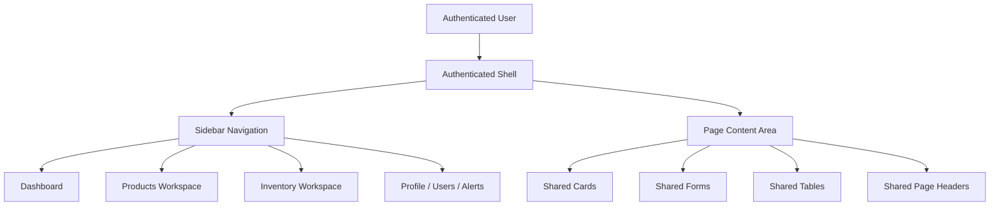
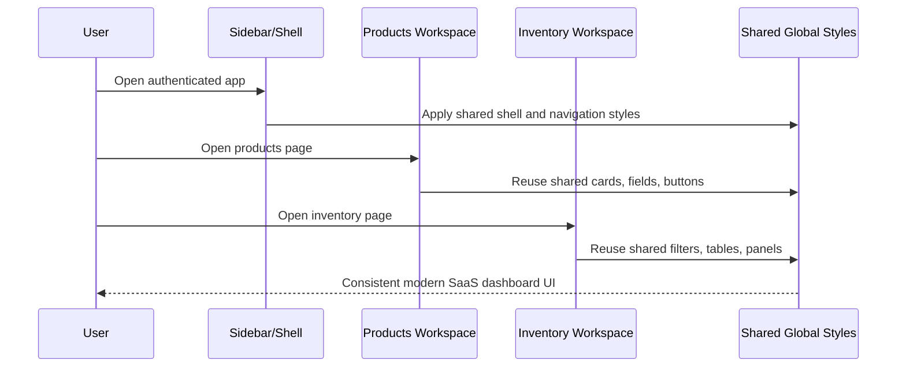

# Task Documentation

## 1. What Was Done
The task objective was to improve the frontend presentation of the Moul Hanout application without changing backend behavior, routes, schema, authentication rules, or business logic.

The main problem was visual inconsistency. The application already had multiple redesign attempts, but the authenticated shell, dashboard, inventory area, products area, and login surface did not look like one coherent product. Some screens used decorative gradients, large rounded cards, and "studio" styling, while other pages used flatter administrative layouts. This made the app feel less like a clean SaaS dashboard and more like several unrelated interfaces.

The implemented solution was a frontend-only UI refresh centered on a shared visual system:
- neutral background surfaces
- soft green accent usage
- tighter spacing and card radii
- simpler sidebar/navigation structure
- calmer tables, forms, and action buttons
- responsive behavior that keeps the same product language on desktop and mobile

The final result is a more consistent Moroccan grocery management dashboard with a cleaner shell, clearer navigation, improved dashboard density, a more practical products workspace, and shared styling improvements that propagate to visible screens built on the global UI classes.

## 2. Detailed Audit
The first step was inspection of the project structure. The frontend was identified as a Next.js 15 + React 19 application using Tailwind 4, CSS modules, shared workspace packages, and some shadcn-style utility patterns. This confirmed that the work should remain frontend-only and that shared CSS would be the lowest-risk way to improve multiple screens at once.

The authenticated shell was reviewed before making changes. This was necessary because the shell is visible on every protected page and sets the visual tone for the whole product. The previous shell used warm decorative gradients and a more ornamental sidebar treatment. That design direction conflicted with the requested minimal SaaS look. The shell styles were rewritten to use a flatter neutral background, cleaner spacing, and a consistent desktop/mobile framing system.

The sidebar was then updated because it was one of the most visible problem areas. The previous sidebar had a floating panel style, decorative quote card, and mixed English/French labels. These patterns were replaced with:
- French navigation labels
- a simpler brand block
- cleaner active and hover states
- operational quick actions
- a compact session summary card instead of decorative copy
- a more standard profile block

This was preferred over adding a new navigation component because the existing layout behavior, unread alert badge logic, and owner-only visibility rules were already correct. Only the presentation layer needed change.

The dashboard overview was the next priority. It already had the right business data, but the card system, header, pills, and chart containers were more decorative than necessary. CSS-module overrides were added instead of rewriting dashboard logic. This preserved:
- API loading behavior
- owner/cashier branching
- chart rendering
- recent sales rendering
- alerts/profile shortcuts

The chosen approach avoided risk to business behavior while still improving the visible structure of KPI cards, data panels, table appearance, and responsive spacing.

The products workspace was identified as the largest visual outlier. It used a separate "studio" language with more expressive copy and a different page frame. The logic in that file is non-trivial because it handles:
- create vs edit state
- draft vs publish intent
- inventory initialization rules
- form validation
- image preview behavior
- catalog refresh after mutations

Because of that complexity, the implementation avoided changing product creation behavior. Instead, the UI was improved in two layers:
- copy was rewritten on the visible form to use clearer French product-management language
- shared global CSS overrides normalized the page, cards, fields, preview panel, footer actions, and catalog cards to match the main dashboard system

This preserved all existing product workflows while making the screen feel more aligned with the rest of the application.

Global styling was then extended. This step was necessary because several visible screens such as profile, users, login, inventory, alerts, and pages using `AppPageHeader`, `panel`, `field`, or `app-btn` classes inherit their appearance from `globals.css`. Instead of modifying every page independently, a shared override layer was added near the end of the stylesheet. This was chosen because:
- it reuses the existing component and utility structure
- it minimizes React code churn
- it keeps backend/business code untouched
- it improves multiple screens consistently from one place

The shared override layer intentionally targeted:
- page width and vertical rhythm
- panel/card surfaces
- headers
- form controls
- app buttons
- tables
- login screen framing
- inventory screen cards and filters
- product workspace cards and preview sections

Validation was then performed. Frontend lint initially failed because three JSX text labels in `ProductsWorkspace` used raw apostrophes. Those strings were corrected with escaped entities. After that, `eslint` passed. The first sandboxed `next build` failed with Windows `spawn EPERM`, which indicated an environment/process restriction rather than a TypeScript or React compile problem. The build was rerun outside the sandbox with a longer timeout and completed successfully. This confirmed the UI changes were build-safe.

Throughout the task, backend modules, API contracts, authentication flows, and database schema were not edited. This preserved the project architecture requirement that frontend remains a consumer of existing backend logic.

## 3. Technical Choices and Reasoning
The visual direction stayed intentionally restrained. The application now leans on neutral surfaces, green accents, and lighter shadows rather than decorative gradients or oversized rounded elements. This fits grocery management software better because the content should feel operational and dependable instead of promotional.

Naming choices in the sidebar and product workspace were adjusted toward direct operational language such as `Tableau de bord`, `Inventaire`, `Nouveau produit`, and `Session active`. This improves readability for real dashboard use and removes generic design copy.

Structural choices favored CSS-layer normalization over component rewrites when business-heavy files were involved. This was especially important for `ProductsWorkspace`, where changing React structure aggressively would have increased risk around submission flows and form state. Using style overrides preserved behavior while still producing a large visual improvement.

Dependency decisions were conservative. No new frontend libraries were added. This keeps bundle risk low, avoids introducing new maintenance overhead, and respects the requirement to reuse the current stack where possible.

Performance considerations:
- no new data fetching was introduced
- no extra client-side state layers were added
- chart and table logic were preserved
- improvements are primarily styling and copy adjustments

Maintainability considerations:
- shared classes in `globals.css` now enforce a more coherent visual baseline
- shell and sidebar modules were simplified so future page work inherits a cleaner frame
- dashboard refinements were isolated to the CSS module, which keeps data logic separate from presentation

Scalability considerations:
- future authenticated pages will benefit automatically from the updated shell and shared utility classes
- future workspace forms can reuse the normalized panel, field, and button styles
- the design system now encourages consistency instead of one-off "studio" pages

Security considerations were unchanged because no authentication logic, permissions logic, or API request flow was modified.

## 4. Files Modified
- `frontend/src/components/layout/app-sidebar.tsx` — simplified sidebar content, localized navigation labels, replaced decorative quote block with an operational session summary
- `frontend/src/components/layout/app-sidebar.module.css` — rebuilt sidebar styling to use a flatter, product-style admin navigation system
- `frontend/src/components/layout/authenticated-shell.module.css` — simplified the authenticated shell background, spacing, and mobile topbar treatment
- `frontend/src/components/dashboard/dashboard-overview.module.css` — normalized dashboard cards, pills, chart containers, table presentation, and responsive spacing
- `frontend/src/app/produits/products-workspace.tsx` — updated visible copy in the products workspace to clearer French product-management language without changing workflow logic
- `frontend/src/app/globals.css` — added shared UI refresh overrides for cards, headers, forms, tables, auth, inventory, products, and other common frontend surfaces
- `docs/task-frontend-ui-refresh.md` — added the mandatory engineering audit and validation documentation for this task

## 5. Validation and Checks
- Frontend stack inspection: completed before editing
- Backend logic changes: none
- API route changes: none
- Database schema changes: none
- Authentication behavior changes: none
- Lint status: passed with `npm run lint --workspace frontend`
- Build status: passed with `npm run build --workspace frontend`
- Build note: the first sandboxed build failed with Windows `spawn EPERM`; rerunning outside the sandbox completed successfully
- Type-check status: validated indirectly by successful `next build`, which completed linting and type validation during production build
- Manual UI validation: not executed in a browser session during this run
- Regression check: limited to frontend lint/build verification; no end-to-end manual scenario testing was performed

## 6. Mermaid Diagrams

