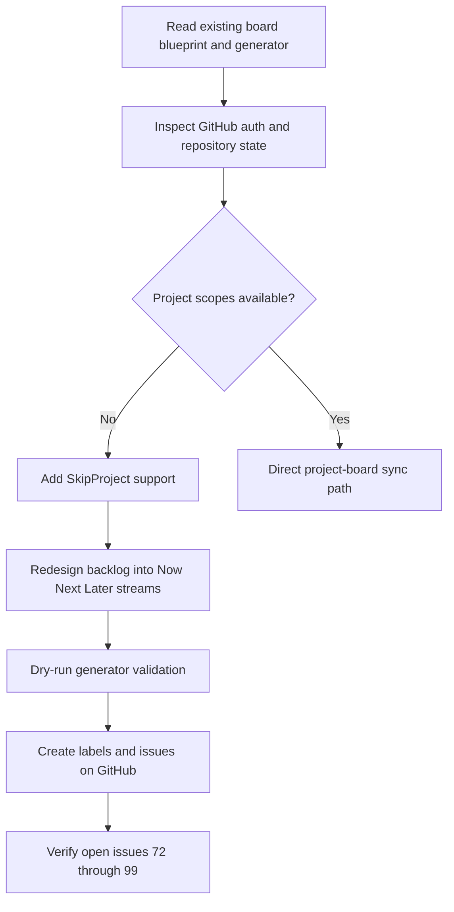
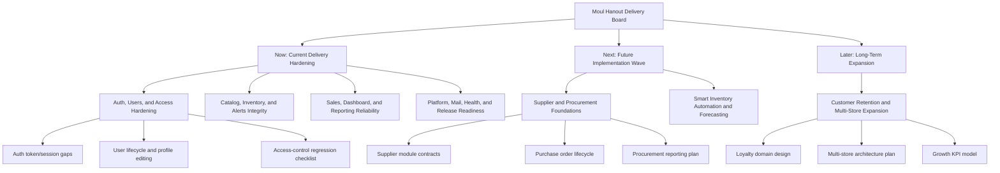

# Task Documentation

## 1. What Was Done
The task objective was to make the GitHub project planning structure more organized and to include future implementation work using parent issues and sub-issues.

The existing board definition was already module-based, but it was still flat from a delivery-management perspective. It described current modules well, but it did not separate immediate production hardening from medium-term and long-term roadmap work. That made it harder to understand what should be delivered now, what should come next, and what is intentionally future scope.

The implemented solution replaced the old module-only backlog definition with a roadmap-oriented structure organized into three horizons:
- `Now` for current production hardening
- `Next` for the next implementation wave
- `Later` for longer-term expansion

I updated the board blueprint and the generator script, then created the refreshed backlog issues directly on GitHub. The live result is a new issue hierarchy with 7 parent roadmap epics and 21 child issues:
- current hardening epics for auth/users, catalog/inventory/alerts, sales/reports, and platform/release
- future epics for suppliers/procurement, smart inventory automation/forecasting, and customer retention/multi-store expansion

The final result is a clearer issue system that separates current delivery from future implementation and makes each parent issue act as a roadmap container for actionable child work.

## 2. Detailed Audit
I started by reviewing the existing repository-managed GitHub board assets:
- `.github/project-board/modules-board.json`
- `scripts/create-github-board.ps1`
- `docs/task-github-module-board.md`

That review showed that the project already had a useful backlog definition, but it was structured mainly around modules. It also showed that the older automation assumed direct GitHub Project access through `gh project`.

I then checked the live GitHub state. The repository remote still points to `monssefbaakka/Moul-Hanout-Digital-Transformation-of-Traditional-Grocery-Stores-via-Smart-Tracking`, and `gh auth status` confirmed that the local GitHub CLI session is authenticated. However, when I attempted to inspect projects with `gh project list --owner monssefbaakka --limit 100 --format json`, GitHub returned a scope error indicating that the token is missing `read:project`. I also attempted `gh auth refresh --hostname github.com -s read:project -s project`, but the command could not complete non-interactively in this session.

That constraint mattered because the user asked for a more organized GitHub project board, not only a local JSON edit. I therefore chose a two-layer solution:

1. Improve the repository-managed board definition.
I replaced the old `modules-board.json` structure with a roadmap-oriented schema. The new schema introduces:
- top-level reusable labels for type, stream, horizon, area, and module scope
- `streams` for `Current Delivery Hardening` and `Future Implementation Roadmap`
- `epics` under each stream
- `subIssues` under each epic
- explicit dependencies and exit criteria for each parent issue

This made the backlog more understandable as a delivery system instead of just a module catalog.

2. Improve the generator script so it can still create useful GitHub objects without project scopes.
The previous script required project access for normal execution. That was too rigid once the `read:project` / `project` scope gap was discovered. I updated the script so it now supports `-SkipProject`. In that mode, it still:
- ensures labels exist
- creates parent issues
- creates child issues
- reuses exact-title matches to avoid duplication

but it skips project lookup and project item attachment.

This was necessary because otherwise the authenticated repository write access would have been wasted due to one missing permission area.

3. Create the live issue hierarchy on GitHub.
After validating the new structure with:

```powershell
powershell -ExecutionPolicy Bypass -File scripts/create-github-board.ps1 -DryRun -SkipProject
```

I executed:

```powershell
powershell -ExecutionPolicy Bypass -File scripts/create-github-board.ps1 -SkipProject
```

This created the new open backlog issues on GitHub. I then verified the result with:

```powershell
gh issue list --repo monssefbaakka/Moul-Hanout-Digital-Transformation-of-Traditional-Grocery-Stores-via-Smart-Tracking --state open --limit 100 --json number,title,labels,url
```

The live verification showed the newly created hierarchy from issue `#72` through `#99`. That confirms the new roadmap backlog exists in GitHub, even though it is not yet attached to a project board in this session.

4. Preserve honesty about what is still blocked.
I did not claim that the GitHub Project board itself was fully updated, because that would be false. The issues and label structure are live. The missing step is project-board linking, blocked by the current `gh` token scopes. The updated script already documents the rerun path once those scopes are refreshed.

Alternatives considered:
- Leaving the old module board in place and only adding a few future issues: rejected because it would not materially improve organization.
- Creating future work only as a markdown roadmap: rejected because the user explicitly asked for issues and sub-issues.
- Using the GitHub app tools alone: rejected because the available toolset in this session supports issue operations but not complete project-board creation and organization.

The chosen solution was preferred because it improved the planning model, produced live GitHub issue artifacts immediately, and stayed honest about the remaining project-board scope blocker.

## 3. Technical Choices and Reasoning
The core structural choice was to shift from a flat module board to a horizon-based roadmap:
- `Now`
- `Next`
- `Later`

This is more maintainable for delivery because it gives the team immediate prioritization semantics without requiring a reader to infer timing from issue titles manually.

I kept the backlog as JSON in `.github/project-board/modules-board.json` because:
- it stays version-controlled
- it is easy to review in pull requests
- it keeps data separate from automation logic
- PowerShell can load it directly with `ConvertFrom-Json`

The script remains in PowerShell because the repository environment is Windows-based and the existing automation was already PowerShell-native. That avoided adding a Node or Python script purely for board generation.

The `-SkipProject` switch was the most important implementation choice. It allows the organization work to proceed even when GitHub Project scopes are unavailable. This makes the automation more robust in real contributor environments where issue scopes and project scopes are often granted separately.

Label design was also intentional:
- `type:*` distinguishes epics from child tasks
- `stream:*` separates hardening from future scope
- `horizon:*` makes time priority visible
- `area:*` captures architecture ownership
- `module:*` preserves domain traceability

This label system was chosen because it supports multiple views later:
- by delivery horizon
- by module/domain
- by architectural area
- by current vs future scope

From a scalability perspective, the board definition can now grow by adding new epics to a stream or adding a new stream without rewriting the generator flow.

From a maintainability perspective, parent issues now include:
- dependencies
- sub-issue checklists
- exit criteria

This makes the parent issues useful as control objects instead of being just descriptive titles.

No new dependency was added. The solution still uses only:
- PowerShell
- `gh`

## 4. Files Modified
- `.github/project-board/modules-board.json` — replaced the old flat module backlog with a roadmap-oriented `Now` / `Next` / `Later` structure including future implementation epics and sub-issues
- `scripts/create-github-board.ps1` — upgraded the generator to support the new schema and added `-SkipProject` so labels and issues can still be created without project scopes
- `docs/task-github-board-roadmap-refresh.md` — added the required post-task documentation and audit trail

## 5. Validation and Checks
- Build status: not run, because no application runtime code was changed
- Lint status: not run, because this task changed JSON and PowerShell planning artifacts only
- Type-check status: not run, because no TypeScript source was changed
- Manual validation: completed for the planning workflow

Validation performed:
- reviewed the old board blueprint and generator script
- confirmed the live repository target from Git remote
- confirmed `gh` authentication state
- attempted live project inspection with `gh project list`, which failed because the current token lacks `read:project`
- attempted scope refresh with `gh auth refresh --hostname github.com -s read:project -s project`, which could not complete non-interactively in this session
- ran a dry validation of the new generator with `-DryRun -SkipProject`
- ran the real generator with `-SkipProject`
- verified the resulting live issues with `gh issue list`

Live GitHub result:
- new open backlog issues were created from `#72` to `#99`
- this includes 7 roadmap epics and 21 child issues

Explicit limitation:
- the issues and labels are live on GitHub
- the GitHub Project board itself was not updated in this session because the current `gh` token is missing `read:project` and `project` scopes

Follow-up command once scopes are refreshed:

```powershell
gh auth refresh --hostname github.com -s read:project -s project
powershell -ExecutionPolicy Bypass -File scripts/create-github-board.ps1
```

## 6. Mermaid Diagrams




## Commit Message
`feat: reorganize github roadmap board with future epics`
