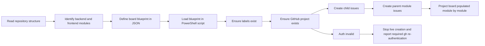
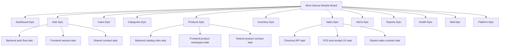

# Task Documentation

## 1. What Was Done
The objective was to create a GitHub board for this project, organized module by module, with each module broken into smaller sub-issues.

The main problem was that the repository already had a clear architecture and several real modules, but there was no executable board-definition artifact that could turn that architecture into GitHub planning objects in a consistent way. A second problem appeared during execution: the local GitHub CLI account was not authenticated correctly, so direct project and issue creation could not be completed safely against the live repository.

To solve this, I created a board blueprint in `.github/project-board/modules-board.json` and a PowerShell generator script in `scripts/create-github-board.ps1`. The JSON file defines the project title, repository target, labels, parent issues, and child issues. The script reads that file and creates:

- the GitHub Project board
- module labels
- one parent issue per module
- sub-issues for each module
- automatic issue reuse if a title already exists

The final result is that the board structure now exists as code inside the repository, aligned with the real modules from the monorepo. The only missing step is live execution against GitHub after re-authenticating `gh`.

## 2. Detailed Audit
The work started by inspecting the repository root, the configured Git remote, the backend module folders, the frontend authenticated workspaces, and the README. That was necessary because the request explicitly asked for a board "module par module", and the board needed to reflect the actual system structure rather than a guessed backlog.

I confirmed that the repository points to `monssefbaakka/Moul-Hanout-Digital-Transformation-of-Traditional-Grocery-Stores-via-Smart-Tracking` and that the application already contains the main operational modules: `auth`, `users`, `categories`, `products`, `inventory`, `sales`, `alerts`, `reports`, `health`, and `mail`, plus important frontend workspaces such as dashboard, alerts, inventory, products, profile, reports, users, and sales.

I then checked the available GitHub integrations. The GitHub connector available in the session exposed repository, PR, and file operations, but it did not expose direct issue or project-board creation tools. I also checked the local GitHub CLI authentication state with `gh auth status` and found that the configured token was invalid. This was a critical constraint because actual board creation depends on authenticated GitHub write access.

Instead of stopping at the blocker, I converted the requested board into repository-managed automation:

1. I created `.github/project-board/modules-board.json`.
This file acts as the source of truth for the board definition. It contains:
- the target repository
- the project owner
- the board title
- reusable labels
- a parent issue definition for each module
- child issue definitions for each module

This approach was necessary because it prevents the board from existing only as a one-time CLI command. It also makes the backlog reviewable and editable in version control.

2. I created `scripts/create-github-board.ps1`.
This script was designed to execute the backlog definition against GitHub using `gh`. It:
- loads the JSON configuration
- checks authentication
- creates or updates labels
- creates the project if it does not already exist
- creates child issues first
- creates the parent module issue afterward
- reuses existing issues by exact title match to avoid accidental duplication

Creating child issues first was intentional. It allows the parent issue body to include a checklist referencing the actual child issue numbers. That gives the parent issue a real module-tracking role instead of being only descriptive.

3. I used module boundaries that respect the repository architecture.
The board is not organized arbitrarily. It follows the system boundaries described in the project instructions:
- backend is the source of truth
- frontend consumes backend APIs
- shared packages form the contract

For that reason, most modules include sub-issues that separate backend work, frontend work, shared-contract work, or validation work. This keeps the board aligned with the architecture instead of mixing unrelated concerns into generic issues.

4. I avoided modifying unrelated files.
The working tree already contained unrelated user changes. I did not touch those files. Only new planning-related artifacts were added. This reduced the risk of interfering with ongoing work.

5. I documented the live blocker explicitly.
The task could not be fully applied to GitHub because `gh auth status` reported an invalid token for the active GitHub account. I preserved honesty in the validation section and in the script error handling. The script now tells the operator to run:
- `gh auth login`
- `gh auth refresh -s project`

This avoids pretending that the board was created when it was not.

Alternatives considered:
- Creating a markdown-only board document: rejected because the user explicitly asked for a GitHub board, and a static document would not create reusable GitHub objects.
- Using the connector alone: rejected because the exposed connector tools in this session did not support issue or project creation.
- Creating issues manually through ad hoc shell commands without a config file: rejected because that would be harder to review, repeat, or adjust later.

The chosen solution was preferred because it is reproducible, architecture-aware, minimal in scope, and ready to execute once authentication is fixed.

## 3. Technical Choices and Reasoning
The naming choice `modules-board.json` was made because the content is a board definition organized around modules, not a generic task dump. Issue titles use a `[Module] ...` prefix so GitHub lists remain readable and exact-title matching stays deterministic.

Structurally, JSON was used as the board-definition format because PowerShell can load it directly with `ConvertFrom-Json`, and it keeps the backlog data separate from the execution logic. This separation improves maintainability: editing the backlog does not require editing the script.

PowerShell was used for the automation because the environment is Windows-based and the repository instructions already assume PowerShell command execution. This avoids introducing an unnecessary runtime or dependency just to create GitHub issues.

No new dependency was added. The script relies only on:
- PowerShell
- `gh`

This respects the project rule forbidding unnecessary dependencies.

From a maintainability perspective, issue reuse by exact title was added to reduce duplication risk if the script is rerun. That matters because planning scripts are often iterative.

From a scalability perspective, the board is data-driven. Adding a new module or sub-issue requires only changing the JSON configuration. The script does not need structural rewrites for future expansion.

From a security and safety perspective, the script checks authentication before writing to GitHub and fails with a clear message if credentials are not valid. That is safer than partial creation attempts that could leave an inconsistent board state.

Performance was not a major constraint here, but the script still avoids unnecessary complexity. It uses direct `gh` commands and simple title-based reuse checks rather than a more complex GraphQL orchestration layer.

## 4. Files Modified
- `.github/project-board/modules-board.json` — created the module-by-module board blueprint with labels, parent issues, and child issues
- `scripts/create-github-board.ps1` — created the PowerShell automation script that turns the blueprint into a GitHub Project and GitHub issues
- `docs/task-github-module-board.md` — created the required post-task documentation and audit trail

## 5. Validation and Checks
- Build status: not run, because this task added planning artifacts only and did not modify application runtime code
- Lint status: not run, because no repository lint target exists for JSON/PowerShell planning artifacts in this task scope
- Type-check status: not run, because no TypeScript source was modified
- Manual test status: partial
- Script validation: the script was designed against the actual `gh project`, `gh issue`, `gh issue list`, and `gh label create` CLI help output from this environment
- Live GitHub creation: not completed
- Reason: `gh auth status` reported an invalid token for the active GitHub account, which blocks authenticated creation of projects and issues
- Regression check: not applicable to runtime behavior, since no product code path was changed

To complete the live board creation, run:

```powershell
gh auth login
gh auth refresh -s project
.\scripts\create-github-board.ps1
```

If a non-destructive preview is preferred first:

```powershell
.\scripts\create-github-board.ps1 -DryRun
```

## 6. Mermaid Diagrams




## Commit Message
feat: add github module board generator and backlog blueprint
