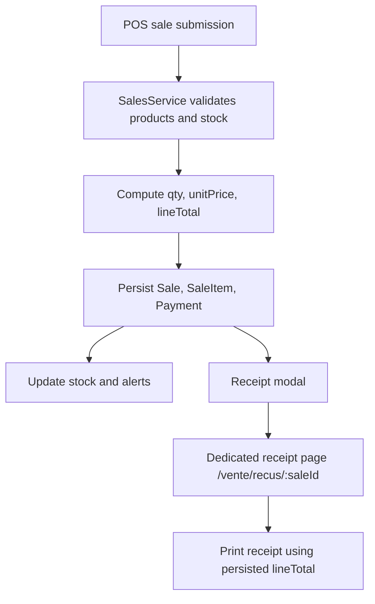
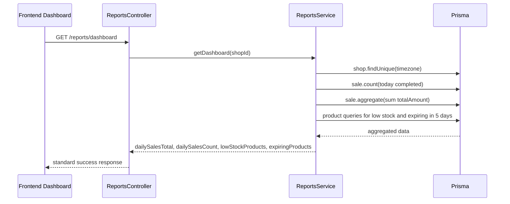

# Task Documentation

## 1. What Was Done
The objective of this task was to close the remaining MVP operational gaps without changing unrelated modules.

Two backend gaps were completed:
- the sales data model was extended so each `SaleItem` now stores a required `lineTotal`
- a new aggregated `GET /reports/dashboard` endpoint was added to return daily sales totals, daily sales count, low-stock products, and products expiring within five days

One frontend gap was completed:
- the POS flow now exposes a dedicated authenticated receipt page at `/vente/recus/[saleId]`, and the sale-confirmation modal links directly to that page

The sales flow was also updated so `lineTotal` is calculated centrally during sale creation and stored with each sold line. Existing receipt displays and printing logic were updated to reuse the persisted value instead of recomputing it in multiple places.

For Prisma connectivity, the repository was validated against Prisma `7.7.0`. In this version, datasource URLs are resolved from `backend/prisma.config.ts` instead of `schema.prisma`. The existing config-based connection path was preserved because adding `url = env("DATABASE_URL")` to `schema.prisma` breaks `prisma generate` on Prisma 7. The result is that Prisma commands now validate successfully in the current toolchain while the schema remains compatible.

## 2. Detailed Audit
The first step was to inspect the existing sales, reports, Prisma, and POS files to avoid broad edits. This confirmed that:
- `SaleItem` did not persist `lineTotal`
- reporting was split across separate sales and inventory endpoints
- the POS used an in-place receipt modal but had no dedicated receipt route
- the repository already used Prisma 7 config files (`prisma.config.ts` and `prisma.config.js`) to supply `DATABASE_URL`

The Prisma schema was then updated by adding a required `lineTotal Float` field to `SaleItem`. A dedicated migration was created in `backend/prisma/migrations/20260423153000_add_sale_item_line_total/migration.sql`. The migration safely adds the column, backfills old rows with `qty * unitPrice`, and only then marks the column as `NOT NULL`. This avoided a production migration risk where historical sale rows could fail the constraint immediately.

The sales creation flow in `backend/src/modules/sales/sales.service.ts` was adjusted next. The calculation was centralized in helper methods so the service computes `lineTotal` once per item, validates that any discount cannot exceed that stored gross line amount, and uses the stored `lineTotal` when calculating subtotal and product revenue summaries. This preserved existing sale totals while removing duplicate line-total logic.

The shared contract was then extended in `packages/shared-types/src/index.ts` so frontend consumers receive `lineTotal` on sale details and can type the new dashboard payload. This prevented frontend code from drifting away from backend responses.

For the dashboard blocker, the reports service was extended instead of creating a new isolated module. `backend/src/modules/reports/reports.service.ts` now exposes `getDashboard(shopId)`, which reuses the shop timezone lookup and existing inventory-report logic. This avoided duplicating the low-stock and expiry logic already present in the reports module. The controller exposes this through `GET /reports/dashboard`.

On the frontend, the API client was extended with `reportsApi.dashboard()`. The dashboard view was updated to consume the aggregated endpoint for the owner flow while preserving the existing cashier-compatible fallback flow. This kept backward compatibility for the richer dashboard cards that still rely on recent sales and trend endpoints, while removing the MVP blocker around fragmented operational summary data.

For the receipt gap, a new authenticated page was added at `frontend/src/app/(authenticated)/vente/recus/[saleId]/page.tsx`. This page loads the sale detail, displays the persisted line totals, and supports printing. The existing POS confirmation modal was kept, and a clear link to the dedicated receipt page was added. This was preferred over replacing the modal entirely because it kept the cashier workflow familiar and minimized UI regression risk.

Receipt rendering and sales-history detail rendering were updated to use `item.lineTotal` instead of recomputing `qty * unitPrice` in multiple places. This preserved the displayed net amount logic by subtracting any stored discount from the persisted gross line total.

Focused tests were added:
- `backend/src/modules/reports/reports.service.spec.ts` now covers the new dashboard aggregation
- `backend/src/modules/sales/sales.service.spec.ts` verifies that sale creation persists `lineTotal`

During validation, Prisma reported that `url = env("DATABASE_URL")` is invalid in Prisma `7.7.0` schema files. That was treated as a real technical constraint rather than forcing a broken schema change. The final implementation kept the working connection source in `backend/prisma.config.ts`, which is the current supported location in this repository.

Files impacted were limited to the sales flow, reports flow, shared contract, receipt flow, migration, and required documentation. Authentication, users, categories, products, inventory business rules, payments, alerts, and audit module behavior were not redesigned.

## 3. Technical Choices and Reasoning
Naming choices:
- `lineTotal` was used because it is explicit and matches the sale-line accounting meaning
- `getDashboard` and `dashboard` were used because they match the existing reports module naming and API client style

Structural choices:
- the reports endpoint was added inside the existing reports module instead of creating a new dashboard module
- sale line-total calculation stayed in `SalesService`, which is the correct business-logic layer in the existing NestJS architecture
- the receipt flow was extended with a new page instead of replacing the modal, which reduced regression risk

Dependency decisions:
- no new dependencies were added
- existing Prisma, NestJS, Next.js, and shared contract layers were reused

Performance considerations:
- the dashboard endpoint uses aggregate/count queries for daily sales instead of loading full sale rows
- inventory logic was reused from the reports service to avoid duplicate queries and inconsistent filtering rules

Maintainability considerations:
- line-total computation was centralized in helper methods
- frontend receipt consumers now depend on the persisted contract instead of each view recomputing totals
- the shared types package was updated so backend and frontend stay aligned

Scalability considerations:
- persisting `lineTotal` supports historical correctness even if pricing rules evolve later
- the aggregated dashboard endpoint gives the frontend a single operational summary contract for the MVP owner dashboard

Security considerations:
- existing guards and role checks were preserved
- the dashboard endpoint remains inside the authenticated reports controller with owner-only access
- no secrets or connection strings were hardcoded

## 4. Files Modified
- `backend/prisma/schema.prisma` — added required `SaleItem.lineTotal`
- `backend/prisma/migrations/20260423153000_add_sale_item_line_total/migration.sql` — added and backfilled the new column safely
- `backend/src/modules/sales/sales.service.ts` — centralized sale line-total calculation and persistence
- `backend/src/modules/sales/sales.service.spec.ts` — added focused coverage for persisted line totals
- `backend/src/modules/reports/reports.service.ts` — added dashboard aggregation logic
- `backend/src/modules/reports/reports.controller.ts` — exposed `GET /reports/dashboard`
- `backend/src/modules/reports/reports.service.spec.ts` — added coverage for dashboard aggregation
- `packages/shared-types/src/index.ts` — added `lineTotal` on sale detail items and added the dashboard response contract
- `frontend/src/lib/api/api-client.ts` — added the dashboard API client method
- `frontend/src/app/(authenticated)/page.tsx` — mounted the current dashboard entry component used by the authenticated home route
- `frontend/src/components/dashboard/dashboard-overview.tsx` — consumed the aggregated dashboard endpoint in the owner dashboard path
- `frontend/src/components/dashboard/dashboard-overview.module.css` — provided the dashboard component styling required by the mounted owner dashboard view
- `frontend/src/app/(authenticated)/vente/recus/[saleId]/page.tsx` — added the dedicated receipt page
- `frontend/src/app/vente/pos-workspace.tsx` — linked sale confirmation to the dedicated receipt page and reused stored line totals
- `frontend/src/app/ventes/sales-history-workspace.tsx` — reused stored line totals in the sales-history receipt details
- `frontend/src/lib/receipt-print.ts` — reused stored line totals in print rendering
- `docs/task-mvp-dashboard-receipt-gaps.md` — added the required post-task documentation

## 5. Validation and Checks
- `npm run prisma:generate --workspace backend` — passed
- `npm run build --workspace backend` — passed
- `npm run build --workspace @moul-hanout/shared-types` — passed
- `npm run test --workspace backend -- reports.service.spec.ts sales.service.spec.ts` — passed
- `npm run lint --workspace frontend` — passed
- `npm run build --workspace frontend` — passed

Explicit limitation:
- `npm run lint --workspace backend` still fails because of a large pre-existing set of unrelated repository lint issues outside the MVP scope. Those failures were not introduced by this task.

Manual flow readiness:
- the backend now exposes the aggregated dashboard endpoint
- the POS confirmation flow now links to a dedicated receipt page
- the receipt page loads sale details and supports printing

Regression note:
- existing endpoints such as `/reports/sales`, `/reports/inventory`, and existing sales APIs were preserved

## 6. Mermaid Diagrams

## Commit Message
feat: close MVP dashboard and receipt gaps
