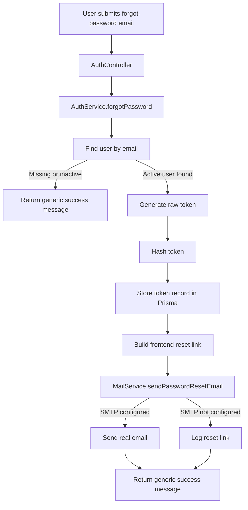
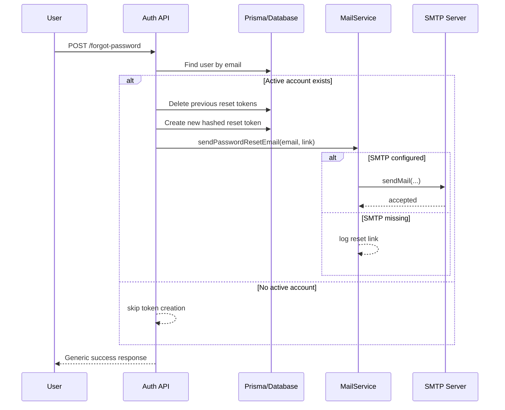

# Task Documentation

## 1. What Was Done
The objective was to make the password reset flow send a real email instead of only writing the reset link to application logs.

The existing backend already created secure password reset tokens, stored only a hash of the token in the database, and built a frontend reset URL. The missing part was outbound delivery. Because of that gap, a user could request a password reset, but no email would be sent in production.

The implemented solution adds a dedicated `MailModule` and `MailService` inside the backend. `AuthService` now delegates password reset delivery to that mail service instead of handling logging directly. When SMTP settings are fully configured, the backend sends a password reset email through Nodemailer. When SMTP is not configured at all, the system preserves the current developer-friendly behavior by logging the reset link instead of crashing.

The final result is a production-ready password reset delivery path with a safe development fallback, updated environment templates, and automated backend test coverage for both the auth integration and the mail service behavior.

## 2. Detailed Audit
The first step was to inspect the existing authentication flow and identify where password reset delivery currently happened. The reset-token generation, hashing, persistence, and frontend link building were already implemented inside `AuthService`, so the missing capability was isolated to outbound delivery.

The next step was dependency selection. `nodemailer` was chosen because the task requirements were SMTP-oriented (`SMTP_HOST`, `SMTP_PORT`, `SMTP_USER`, `SMTP_PASS`, `MAIL_FROM`) and Nodemailer provides a direct SMTP transport without introducing a vendor-specific dependency. This kept the architecture aligned with the requirement and avoided coupling the system to one external mail provider.

After that, a new backend domain slice was created for mail delivery:
- `backend/src/modules/mail/mail.module.ts`
- `backend/src/modules/mail/mail.service.ts`

This kept the architecture consistent with the project rules:
- controller logic stayed out of mail delivery
- auth business flow stayed in `AuthService`
- infrastructure-specific SMTP work moved into its own injectable service

Configuration was then extended in two places. First, `backend/src/config/mail.config.ts` was added so the NestJS config layer can expose a structured `mail.*` configuration contract. Second, `backend/src/config/env.validation.ts` was updated so SMTP settings are optional as a complete group, but invalid if only partially provided. This was necessary because the project needed two valid modes:
- production mode with complete SMTP configuration
- local/dev mode with no SMTP configuration and log fallback

The partial-configuration validation avoids a common operational failure mode where only some SMTP variables are present. Without that guard, the application might boot successfully and then fail later in a confusing way during password reset delivery.

The `AppModule` config bootstrap was updated to load the new `mailConfig`, and `AuthModule` was updated to import `MailModule`. This wiring was necessary so `AuthService` could receive `MailService` through Nest dependency injection without breaking module boundaries.

Inside `AuthService`, the old private `deliverPasswordResetLink` method was removed. That method only logged the reset link and contained environment branching logic. It was replaced with an injected `MailService` call:
- the password reset token creation logic was preserved
- the database transaction behavior was preserved
- the generic user-facing forgot-password response was preserved
- only the delivery mechanism changed

This was an important design choice because it minimized behavioral risk. The password reset security model remained the same:
- token generation still uses cryptographic randomness
- token storage still uses a SHA-256 hash rather than raw token persistence
- the API still returns the same generic message for missing or inactive accounts

The mail service itself was designed with a graceful fallback. If SMTP is not configured, `sendPasswordResetEmail()` logs the reset link and exits successfully. This preserves developer workflows and avoids application crashes in environments where mail delivery is intentionally absent. When SMTP is configured, the service sends a plain-text and HTML email with the reset link.

Error handling was intentionally conservative. Send failures are logged with context instead of crashing the process. This preserves system availability and keeps the forgot-password endpoint from exposing account-existence differences through an obvious transport-level failure pattern.

Environment support was then extended:
- `.env.example` now documents the required SMTP variables for real mail delivery
- `docker-compose.yml` now passes those SMTP variables into the backend container

This was necessary so the new mail capability is not only implemented in code, but also deployable in the project’s documented environments.

Testing was updated in two layers:
- `AuthService` unit tests now verify that forgot-password delegates delivery to `MailService`
- new `MailService` unit tests verify both SMTP delivery mode and no-SMTP logging fallback

This preserved the existing auth coverage while adding focused tests for the new infrastructure behavior.

During validation, one important constraint was discovered: full backend lint already fails because of a large pre-existing repository baseline in files unrelated to this task. That issue was not introduced by this change, so the work was validated with:
- full backend unit tests
- backend build
- targeted lint on the new mail service files

Risks avoided:
- no raw SQL was introduced
- no frontend business logic was duplicated
- no existing auth API contract was changed
- no secrets were hardcoded
- no unrelated modified files were reverted

Files impacted by this task were kept narrow and directly related to password reset email delivery.

## 3. Technical Choices and Reasoning
`MailService` was named explicitly to match the infrastructure responsibility. The method name `sendPasswordResetEmail` is specific and intention-revealing, which makes the dependency obvious at the call site inside `AuthService`.

Structurally, a separate mail module was preferred over embedding SMTP logic directly in `AuthService`. This improves maintainability because future email flows, such as welcome emails or stock alerts, can reuse the same backend service without expanding auth responsibilities.

Nodemailer was selected instead of a provider SDK because the task was framed around SMTP environment variables. This keeps the system provider-agnostic and makes deployment flexible across SendGrid SMTP, Mailgun SMTP, SES SMTP, or any equivalent relay.

Performance considerations were minor but still addressed. The password reset path performs the same database work as before, and the new mail sending occurs only after the token record is stored. No additional database queries were introduced.

Maintainability improved because SMTP configuration is centralized in `mail.config.ts`, and validation for incomplete SMTP configuration lives in `env.validation.ts`. This makes failures easier to diagnose and keeps configuration rules explicit.

Scalability also improved. Email delivery is now abstracted behind a dedicated service, so the implementation can later be replaced by a queue-based sender, a Kafka event, or a third-party transactional email API without changing the auth controller contract.

Security considerations that were preserved or improved:
- reset tokens are still never stored in raw form
- forgot-password still returns a generic success message
- mail credentials are environment-based only
- partial SMTP configuration is rejected early during startup instead of failing unpredictably later

## 4. Files Modified
- `backend/package.json` — added the `nodemailer` dependency
- `package-lock.json` — recorded the dependency installation
- `backend/src/config/mail.config.ts` — added structured mail configuration parsing
- `backend/src/config/env.validation.ts` — added grouped SMTP validation and `SMTP_PORT` numeric validation
- `backend/src/app.module.ts` — loaded the new mail config
- `backend/src/modules/mail/mail.module.ts` — created the mail module
- `backend/src/modules/mail/mail.service.ts` — implemented password reset email delivery with SMTP and log fallback
- `backend/src/modules/mail/mail.service.spec.ts` — added tests for SMTP send mode and fallback logging mode
- `backend/src/modules/auth/auth.module.ts` — imported `MailModule`
- `backend/src/modules/auth/auth.service.ts` — injected `MailService` and replaced placeholder link delivery with real mail delegation
- `backend/src/modules/auth/auth.service.spec.ts` — updated forgot-password tests to assert mail delegation
- `.env.example` — documented SMTP variables for local and deployment setup
- `docker-compose.yml` — passed SMTP variables into the backend service container
- `docs/task-password-reset-email-delivery.md` — documented the completed task and validation audit

## 5. Validation and Checks
Build status:
- `npm run build --workspace backend` passed

Lint status:
- `npx eslint src/modules/mail/mail.service.ts src/modules/mail/mail.service.spec.ts` passed from the `backend` workspace
- `npm run lint --workspace backend` still fails because the repository already has a large pre-existing lint baseline in unrelated files such as common decorators, filters, reports, and e2e tests

Type-check status:
- Covered through the successful Nest backend build

Manual test status:
- Not run against a live SMTP server in this task

API validation:
- Password reset backend unit flow validated through `npm run test --workspace backend`

UI validation:
- Not run manually in the browser during this task

Regression check:
- `npm run test --workspace backend` passed with 18/18 tests

Operational note:
- Real outbound email delivery requires valid values for `SMTP_HOST`, `SMTP_PORT`, `SMTP_USER`, `SMTP_PASS`, and `MAIL_FROM`
- If none of those values are configured, the backend intentionally logs the reset link instead of throwing

## 6. Mermaid Diagrams

