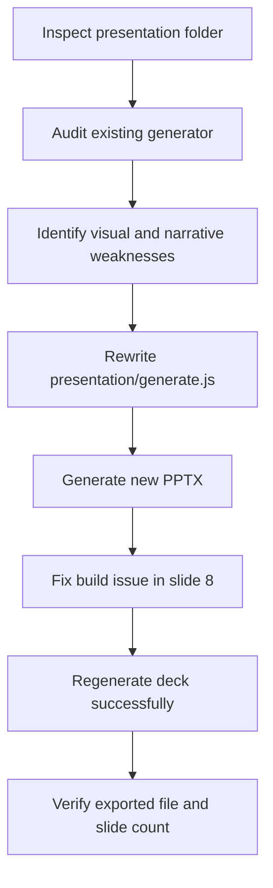
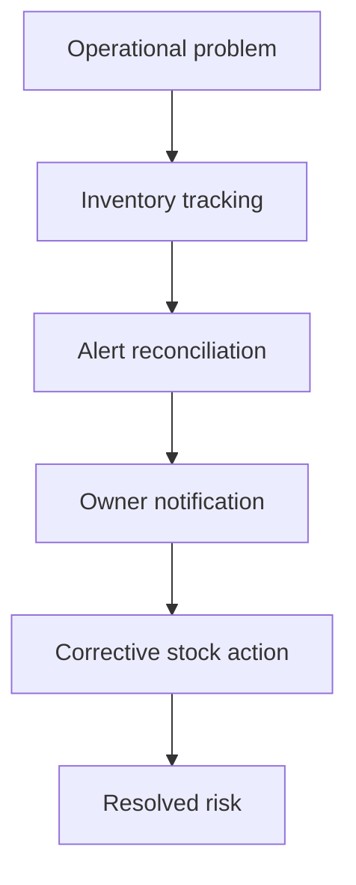

# Task Documentation

## 1. What Was Done
The objective was to make the project presentation in the `presentation/` folder look substantially more professional.

The existing presentation already contained the right technical story, but its visual execution felt dated: the deck relied on a heavy dark-blue template style, repeated rounded cards, and section titles that behaved more like labels than clear presentation claims. That made the project feel less polished than the implementation itself.

The solution was to redesign the deck generator at the source level instead of manually editing the exported PowerPoint. The file `presentation/generate.js` was rewritten to produce a new 12-slide deck with:

- a cleaner editorial visual system
- a more restrained color palette
- clearer slide hierarchy
- more professional cover, architecture, flow, and conclusion slides
- improved narrative sequencing around problem, solution, architecture, workflow, and outcomes

The final result is a new generated presentation file:

- `presentation/moul-hanout-inventory-alerts-professional.pptx`

This deck presents the same project in a more credible and professional format for review, demonstration, or academic defense.

## 2. Detailed Audit
The work was performed in a controlled sequence to avoid damaging unrelated repository files and to keep the change reproducible.

First, the `presentation/` folder was inspected. It contained only two relevant artifacts:

- `presentation/generate.js`
- `presentation/inventory-alerts.pptx`

This showed that the PowerPoint was generated from code, so the correct engineering decision was to improve the source generator rather than attempting binary edits to the `.pptx` output.

Next, the current generator was reviewed. Several structural issues were identified:

- the visual language depended almost entirely on dark navy backgrounds and saturated blue accents
- many slides reused the same card-heavy composition
- the typography was based on a default office-style presentation treatment
- the deck had content, but several titles read as topics instead of presentation claims
- the overall impression was closer to a technical template than to a polished, professional narrative deck

Based on that audit, the generator was rewritten from scratch instead of patched incrementally. This decision was preferred because a partial cosmetic refactor would have preserved the same visual grammar and made the file harder to maintain. A clean rebuild allowed the deck to adopt one consistent system across all slides.

The new generator introduced:

- a shared color system centered on ink, paper, green, amber, and muted slate tones
- a consistent header/footer frame with section labels and slide numbers
- helper functions for cards, metrics, bullets, titles, quotes, arrows, and footers
- a deliberate 12-slide narrative structure
- lighter, cleaner surfaces for most slides with dark usage reserved for emphasis

The slide story was also tightened. Instead of presenting only module descriptions, the deck now follows a clearer demonstration arc:

1. project introduction
2. operational problem
3. value proposition
4. system architecture
5. transactional workflow
6. inventory module depth
7. alert engine depth
8. owner journey
9. architecture decisions
10. before/after comparison
11. engineering lessons
12. conclusion

During validation, the first build failed because of a concrete implementation mistake in slide 8: `addCard` was accidentally called as `slide.addCard`. This was corrected immediately in the generator source, and the deck was rebuilt successfully afterward.

After the fix, the generator was executed successfully with:

- `node presentation\generate.js`

The generated output file was confirmed to exist:

- `presentation/moul-hanout-inventory-alerts-professional.pptx`

An additional package-level verification was then performed by opening the `.pptx` as a ZIP archive and counting slide XML entries. That check confirmed the exported deck contains 12 slides, matching the intended structure.

Files impacted were kept limited to the presentation artifact path and the required task documentation path. No backend, frontend, shared-contract, or infrastructure logic was modified.

## 3. Technical Choices and Reasoning
The main design choice was to regenerate the presentation from code instead of editing the PowerPoint manually.

This was preferred because:

- it preserves reproducibility
- it allows future revisions by rerunning the generator
- it keeps the presentation maintainable as a project artifact

The naming choice `moul-hanout-inventory-alerts-professional.pptx` was intentional. It distinguishes the redesigned deck from the old exported file and makes the output self-explanatory.

Structural choices:

- Shared helper functions were used to reduce repetition and keep slide construction consistent.
- A lighter editorial system was chosen because it looks more professional for defense/demo use than the previous saturated dashboard look.
- Visual hierarchy was simplified so claims, metrics, architecture blocks, and process flows read faster.

Dependency decisions:

- No new dependency was added.
- The existing `pptxgenjs` package was reused.

Performance considerations:

- The new generator remains a single script with static slide composition, so generation cost is small.
- No heavy assets or external fetches were introduced.

Maintainability considerations:

- Reusable helpers now centralize card, title, metric, bullet, and footer behavior.
- Slide structure is easier to modify without reworking the whole file.

Scalability considerations:

- The current helper-based structure makes it straightforward to add new slides or adjust the visual system later.
- The deck can evolve with the project without redoing the presentation architecture.

Security considerations:

- No secrets were introduced.
- No environment assumptions were added.
- No runtime network behavior was introduced into the presentation generator.

## 4. Files Modified
- `presentation/generate.js` — rewritten to generate a more professional 12-slide deck with a new narrative and visual system
- `presentation/moul-hanout-inventory-alerts-professional.pptx` — new exported PowerPoint generated from the rewritten script
- `docs/task-presentation-professional-redesign.md` — required post-task audit and documentation file

## 5. Validation and Checks
- Build status: successful for the presentation generator via `node presentation\generate.js`
- Lint status: not run for the repository as a whole; task scope was limited to the presentation artifact
- Type-check status: not applicable to the PowerPoint generator script
- Manual test status: partial; the generated file path and export success were verified
- API validation: not applicable
- UI validation: not applicable to the frontend application
- Presentation validation: confirmed generated `.pptx` exists and is non-empty
- Package validation: confirmed 12 slide XML entries inside the exported `.pptx`
- Regression check: limited to the presentation folder; no application code paths were changed

What could not be fully validated:

- A rendered visual slide-by-slide image review was not performed inside this task
- Full PowerPoint manual visual QA in Microsoft PowerPoint was not performed from within the terminal session

## 6. Mermaid Diagrams

## Commit Message
`feat: redesign project presentation deck`
