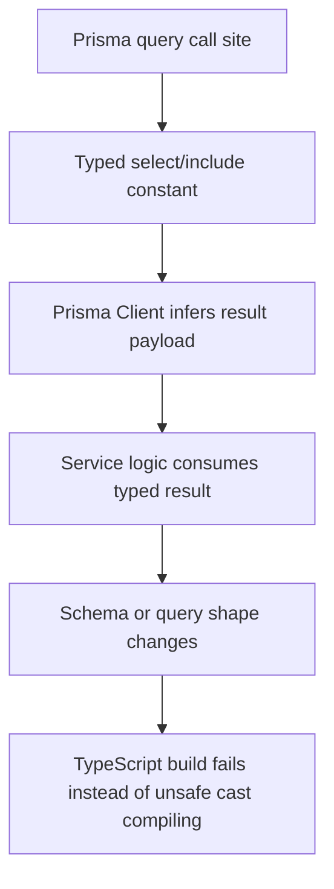
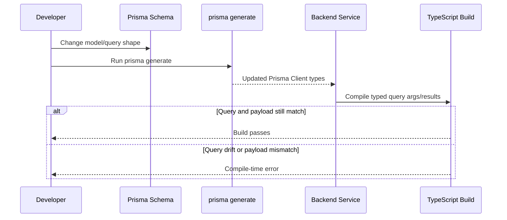

# Task Documentation

## 1. What Was Done
The objective was to remove Prisma-related type escape hatches such as `as never` so query arguments and result shapes are checked by TypeScript instead of being forced through unsafe casts.

The problem was that several backend services were calling Prisma with `as never` and related cast chains. Those casts hid mismatches between Prisma query shapes and application code. If the schema changed or Prisma Client generated different types after an upgrade, TypeScript would not catch drift in those query sites.

The implemented solution removed all `as never` and `as unknown as ...` workarounds from the backend codebase, replaced them with typed Prisma `select`/`include` objects plus `Prisma.*GetPayload` model payload types, enabled `"strict": true` in the backend TypeScript configuration, and fixed the real strict-mode errors that surfaced in DTO classes.

The final result is that Prisma queries in the backend are now type-checked directly by the generated Prisma Client, and the backend build can catch query/schema drift without relying on unsafe casts.

## 2. Detailed Audit
The first step was to audit the Prisma client setup in `backend/src/database/prisma.service.ts`. The service already instantiated Prisma Client with a driver adapter:
- `const adapter = new PrismaPg(pool)`
- `super({ adapter, ... })`

This is consistent with Prisma’s adapter-based client creation model, where Prisma Client is instantiated as `new PrismaClient({ adapter })`. Prisma’s official docs show the common `new PrismaPg({ connectionString })` form, and the installed `@prisma/adapter-pg` type definitions for version `7.7.0` confirm that the constructor accepts `pg.Pool | pg.PoolConfig | string`. That means the current `new PrismaPg(pool)` usage is valid, not a misuse of the adapter API.

The next step was version verification. The installed versions were:
- `@prisma/client@7.7.0`
- `prisma@7.7.0`
- `@prisma/adapter-pg@7.7.0`

Because these versions were already aligned and the type cleanup succeeded after regeneration, there was no evidence that the adapter/client pair needed pinning to a different compatibility set. For that reason, no package version changes were made.

After that, the cast cleanup was done module by module.

In `ReportsService`, Prisma result types were made explicit using typed `select` and `include` constants:
- sales report rows now use a typed `SaleSelect`
- inventory report rows now use a typed `ProductInclude`

This removed the report module’s `as never` query argument casts and the follow-up result casts.

In `AlertsService`, reusable typed selectors were added for:
- product fields embedded in alerts
- product fields used for alert synchronization

That allowed alert fetches, updates, deletes, and sync routines to compile without `as never`, while preserving the alert reconciliation behavior.

In `InventoryService`, typed include definitions were introduced for:
- product/category inventory rows
- stock movements with product and user relations

This removed the inventory module’s Prisma query casts and let `toInventoryItem()` accept an explicit Prisma payload type instead of a loose structural object.

In `HealthController`, the health check now passes `PrismaService` directly to `PrismaHealthIndicator.pingCheck()` instead of forcing the service through `as unknown as PrismaClient`. Since `PrismaService` extends `PrismaClient`, the cast was unnecessary.

The largest cleanup happened in `SalesService`. The service now uses typed Prisma payload constants for:
- sales list entries
- sale detail fetches
- daily summary sale items

This removed the remaining `as never` casts from:
- shop timezone lookup
- summary aggregates
- sales list queries
- transactional create flow
- sale detail reads

The cleanup also removed the `as unknown as SummarySaleItem[]` result cast by letting `saleItem.findMany()` infer its result from a typed `select` object.

Once the Prisma casts were removed, `"strict": true` was added to `backend/tsconfig.json`. That surfaced a second class of real type issues in DTOs. The DTO classes use decorators and are populated by NestJS validation pipes at runtime, so the required properties were updated with definite assignment markers (`!`) where appropriate. This was necessary to keep strict mode enabled without introducing constructor boilerplate that does not fit the framework’s DTO pattern.

The `roles.guard.spec.ts` test file also still contained `as unknown as ExecutionContext` casts. Those were replaced with a typed helper that returns an `ExecutionContext`-shaped object instead of casting a partial object through an unsafe assertion chain.

At the end of the cleanup, a repo-wide search confirmed that no `as never` or `as unknown as` casts remain in `backend/src` or `backend/test`.

Important decisions and why they were preferred:
- typed `select`/`include` constants were preferred over inline structural casts because they keep the query contract close to the call site and let Prisma infer result payloads automatically
- the adapter/client versions were left unchanged because the current aligned `7.7.0` set compiled, generated, and tested cleanly
- strict mode was enabled after the Prisma cleanup so real compiler errors could be addressed explicitly rather than hidden under the old cast pattern

Risks avoided:
- no Prisma schema changes were introduced
- no runtime query behavior was changed intentionally
- no manual database logic was added outside Prisma
- no package downgrade or speculative version pinning was applied without evidence

## 3. Technical Choices and Reasoning
The most important structural choice was to replace casts with typed Prisma selectors. For example, instead of:
- passing a query object as `as never`
- separately forcing the result to a hand-written type

the code now uses:
- `const salesListInclude = { ... } satisfies Prisma.SaleInclude`
- `type SalesListEntry = Prisma.SaleGetPayload<{ include: typeof salesListInclude }>`

This is better because the query arguments and the inferred result type stay connected. If the query shape changes, the payload type changes with it. That directly supports the task’s goal of catching schema/query drift in CI.

The adapter was not rewritten to use a different instantiation style because the current implementation is valid for the installed adapter version. Prisma’s docs present the `connectionString` form as the standard example, but the shipped adapter typings also support a `pg.Pool`. Keeping the current approach avoided unnecessary connection-management changes.

Strict mode was enabled because it increases compiler coverage across the backend. The main new strict-mode issues were DTO property initialization warnings, which were resolved with definite assignment markers. This is a common and maintainable pattern in NestJS DTO classes that rely on framework population rather than manual constructors.

Maintainability improved because Prisma query definitions are now self-documenting. The typed `select` and `include` constants describe exactly what each service expects from the database, and those shapes are linked to Prisma-generated payload types rather than duplicated manually.

Scalability improved in a tooling sense: future Prisma upgrades or schema changes are more likely to fail at compile time in the affected service instead of compiling successfully and failing later at runtime.

Security considerations were indirect but relevant. Unsafe casts can hide bad assumptions in data access paths. Removing them reduces the chance of silently shipping mismatched query logic into production.

## 4. Files Modified
- `backend/src/modules/alerts/alerts.service.ts` — replaced Prisma query casts with typed `select`/`include` constants and inferred payloads
- `backend/src/modules/inventory/inventory.service.ts` — removed Prisma query casts and typed inventory/movement payloads
- `backend/src/modules/reports/reports.service.ts` — removed Prisma casts from report queries and inventory report payloads
- `backend/src/modules/sales/sales.service.ts` — removed Prisma query/result casts and introduced typed query payload definitions
- `backend/src/modules/health/health.controller.ts` — removed the unsafe Prisma client cast in health checks
- `backend/src/modules/auth/dto/auth.dto.ts` — added definite assignment markers required by strict mode
- `backend/src/modules/categories/dto/category.dto.ts` — added definite assignment marker required by strict mode
- `backend/src/modules/inventory/dto/inventory.dto.ts` — added definite assignment markers required by strict mode
- `backend/src/modules/products/dto/product.dto.ts` — added definite assignment markers required by strict mode
- `backend/src/modules/sales/dto/sale.dto.ts` — added definite assignment markers required by strict mode
- `backend/src/common/guards/roles.guard.spec.ts` — replaced `ExecutionContext` cast chains with a typed helper
- `backend/tsconfig.json` — enabled `"strict": true`
- `docs/task-prisma-type-cast-cleanup.md` — documented the task, audit trail, validation, and diagrams

## 5. Validation and Checks
Build status:
- `npm run build --workspace backend` passed

Lint status:
- Full backend lint was not used as the completion gate because the repository still has unrelated pre-existing lint debt outside this task
- The modified files were formatted with Prettier

Type-check status:
- `backend/tsconfig.json` now includes `"strict": true`
- strict-mode build passed after DTO fixes

Prisma validation:
- `npx prisma generate` passed

Test status:
- `npm run test --workspace backend` passed with 21/21 tests

Cast removal validation:
- Search for `as never` in `backend/src` and `backend/test` returned no results
- Search for `as unknown as` in `backend/src` and `backend/test` returned no results

Adapter verification:
- Verified against Prisma’s official adapter documentation and the installed `@prisma/adapter-pg` README/type definitions
- The current `PrismaPg(pool)` usage is valid for the installed adapter version

If something was not validated:
- Full backend ESLint was not made green in this task because unrelated existing lint issues remain elsewhere in the repository

## 6. Mermaid Diagrams

## Commit Message
refactor: remove unsafe Prisma query type casts
