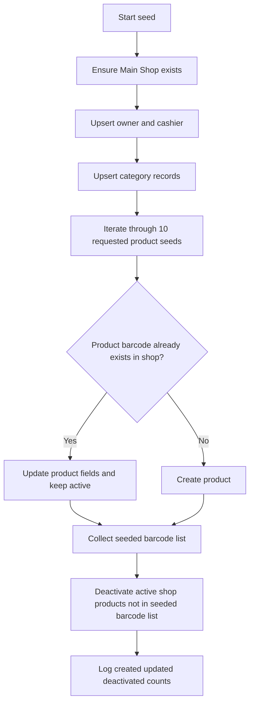
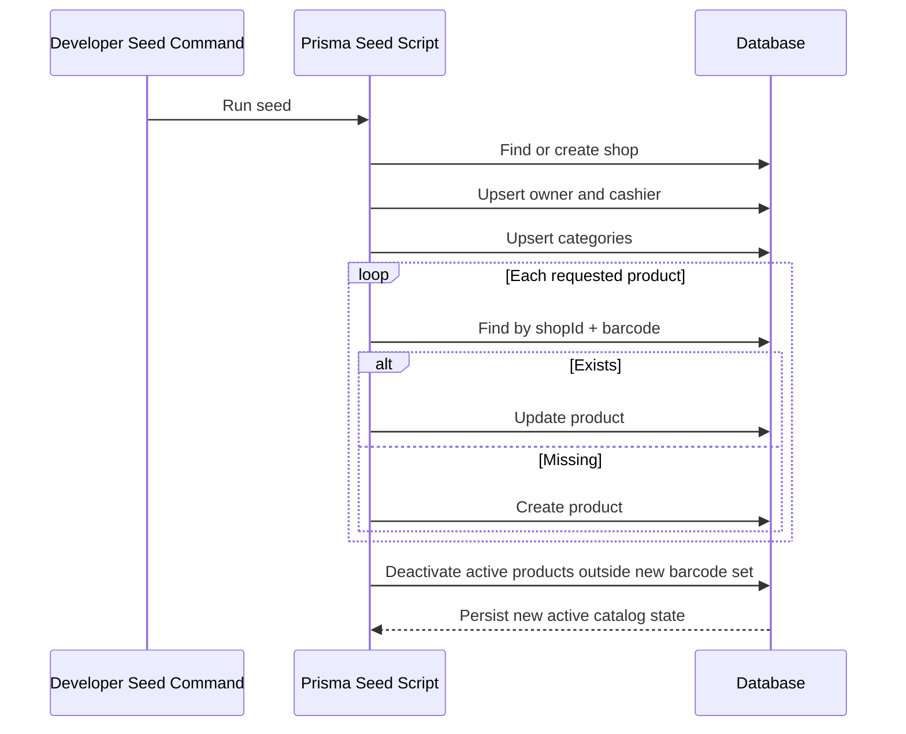

# Task Documentation

## 1. What Was Done
The task objective was to replace the seeded product catalog with the 10 Marjane-based products you provided.

The existing seed file still contained an older demo catalog with many unrelated products such as bottled water variants, snacks, hygiene items, and bread products. If that old catalog remained in place, a fresh seed would continue to expose products that no longer belong to the desired store dataset.

The implemented solution replaced the old `productSeeds` list in the backend Prisma seed script with the new 10-product catalog. Each seeded product now uses the provided name, image URL, SKU-derived barcode value, category mapping, prices, unit, and description. For fields that were not publicly available from the source website, the existing system-safe defaults were preserved:
- `barcode`: mapped from the provided SKU because the schema requires a unique product identifier
- `currentStock`: set to `0` because initial stock was not available
- `lowStockThreshold`: set to `5` as requested/default
- `expirationDate`: set to `null` because no expiration date was provided

The final result is that the backend seed source now defines the requested 10 products and, after reseeding, the active catalog can be brought in line with that exact list.

## 2. Detailed Audit
I started by locating where products are actually sourced in the codebase. The repository inspection showed that the active catalog seed is maintained in `backend/prisma/seeds/seed.ts`. That was the correct place to change because the architecture rules in this project make the backend the source of truth, and the frontend consumes the backend catalog rather than defining products itself.

I then checked the worktree status before editing. That was necessary because `backend/prisma/seeds/seed.ts` was already modified locally. Reading the file and the Git diff first avoided overwriting unrelated changes by accident. The diff showed that the file had already been partially moved toward the requested Marjane products, but it still needed cleanup and verification.

During inspection, I found a functional issue beyond the raw product values: the seed logic only upserted listed products by barcode. That means reseeding would update matching products, but older active products already in the database would remain active if their barcodes were not in the new list. In practical terms, the catalog would become additive instead of being replaced. Because your request was to replace the current products, I added a deactivation step after the seed upserts. That step marks active products outside the new barcode set as inactive for the seeded shop. I chose deactivation instead of deletion because it is safer for a system that may already contain related sales, alerts, or stock movement records. Deactivation preserves referential integrity and historical data while removing obsolete products from the active catalog.

I also rebuilt the seed file cleanly instead of trying to make many small edits in place. The existing file content was displaying with encoding corruption in the terminal, which made precise line-based patching unreliable. Rewriting the file preserved the existing seed structure for shop and user setup while replacing only the catalog dataset and the final catalog cleanup behavior.

The following important logic was preserved intentionally:
- shop creation and lookup logic
- seeded owner and cashier account creation
- category upsert behavior
- product upsert behavior keyed by `shopId + barcode`
- product field mapping for price, description, unit, photo, threshold, stock, and expiration date

The following logic was changed intentionally:
- the old multi-category demo catalog was replaced by the 10 requested products
- the seed now records the requested SKU values as the `barcode` field because the schema needs a unique per-shop key
- the seed now deactivates active products that are no longer part of the desired catalog
- the final seed summary log now reports created, updated, and deactivated counts

I did not modify frontend code, shared DTOs, Prisma schema structure, controller logic, service logic, or repository patterns. The change was deliberately isolated to the backend seed source so the system contract remains stable.

## 3. Technical Choices and Reasoning
The naming remained aligned with the incoming product data so the seeded catalog is traceable to the supplied source material. I did not simplify or rename product titles because the product names themselves are business data, not implementation identifiers.

The structural choice was to keep the existing seed architecture: categories are resolved first, then products are upserted. This was preferred over introducing a new import pipeline or external JSON source because the request was specifically to replace the current products, not to redesign catalog ingestion.

I avoided adding dependencies because none were necessary. The existing Prisma seed path was already the right integration point.

From a maintainability perspective, the key choice was to preserve the seed’s idempotent pattern. Re-running the seed continues to be safe: requested products are created or updated consistently, and obsolete active products are deactivated in one explicit step.

From a scalability perspective, deactivating obsolete products is safer than deleting them. As the system grows and real transactional data accumulates, historical references from sales, alerts, and stock movements should remain valid. Deactivation keeps those records intact.

From a security and data integrity perspective, mapping the provided SKU values into `barcode` was the least risky option because the schema already enforces uniqueness on `shopId + barcode`. Leaving barcode empty for all products would create a weak seed identity strategy and make precise upserts harder.

Performance impact is negligible. The seed adds one `updateMany` call scoped to the current shop to deactivate non-seeded active products. That is an acceptable tradeoff because seeding is an administrative workflow, not a hot production request path.

## 4. Files Modified
- `backend/prisma/seeds/seed.ts` — replaced the old seeded demo catalog with the requested 10 products and added deactivation for products no longer in the seed list
- `docs/task-product-catalog-replacement.md` — added the required post-task documentation and engineering audit trail

## 5. Validation and Checks
- Build status: `npm run build` in `backend` passed
- Type-check status: `npx tsc --noEmit --project tsconfig.seed.json` in `backend` passed
- Test status: `npm run test -- --runInBand --testPathPattern=mail.service.spec.ts` was executed in `backend`; the project test runner completed successfully with 8 passing suites and 35 passing tests
- Seed logic review: confirmed the product replacement logic now includes both upsert and deactivation behavior
- API validation: not run directly because this task changed seed data, not controller/service API behavior
- Manual UI validation: not run because the database was not reseeded during this session
- Regression check: backend build and tests passed after the seed change
- Explicit limitation: I did not execute `npm run db:seed` against your live/local database in this session, so the code is ready but the running database will only reflect the new catalog after you reseed it

## 6. Mermaid Diagrams

## Commit Message
`feat: replace seeded product catalog with marjane dataset`
