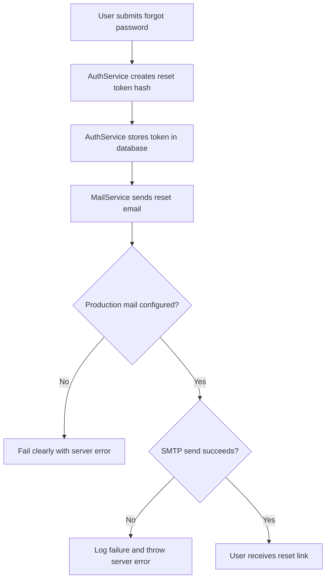
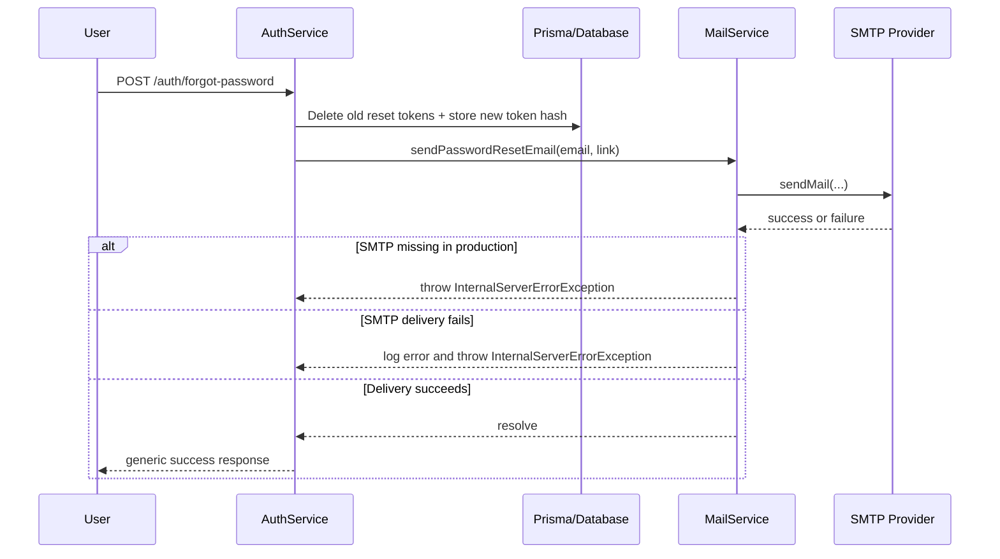

# Task Documentation

## 1. What Was Done
The task objective was to review four listed MVP production gaps and fix only the ones that were still unresolved in the current repository.

After inspecting the current codebase, I found that the Docker healthcheck gaps were already solved. The backend already exposes a health endpoint, `docker-compose.yml` already defines a backend healthcheck, Redis already has a healthcheck, and the backend already waits for Redis to become healthy before starting.

Two gaps were still unresolved:
- Password reset email delivery was implemented, but it was not production-safe. If SMTP configuration was missing, the system silently logged the reset link instead of failing clearly. If SMTP delivery failed, the error was logged but not surfaced.
- Docker Compose still mapped backend `FRONTEND_URL` from `NEXTAUTH_URL`, even though the frontend does not use NextAuth. That left stale deployment configuration in place.

The implemented solution hardened the backend mail flow for production and removed the stale NextAuth compose alias. The final result is that production now fails clearly when password reset email infrastructure is missing or broken, and Compose now uses the correct frontend URL variable name.

---

## 2. Detailed Audit
The first step was repository verification. I inspected `docker-compose.yml`, the backend auth service, the health controller, frontend auth usage, and the mail module to confirm the real current state instead of assuming the gap list was still accurate.

During that verification:
- I confirmed Gap 2 was already solved because the backend service already had a Docker healthcheck pointing to `http://localhost:4000/api/v1/health`.
- I confirmed Gap 3 was already solved because Redis already had a healthcheck and the backend already depended on Redis with `condition: service_healthy`.
- I confirmed the frontend uses Zustand and custom JWT handling rather than NextAuth.
- I found that Gap 4 was partially still present because the compose file still derived backend `FRONTEND_URL` from `NEXTAUTH_URL`, which is a stale variable name.
- I found that Gap 1 was still unresolved in a production-safety sense because the mail service still downgraded to logging when SMTP was unavailable, and send failures were only logged.

The next action was to review the existing mail architecture. The project already had a dedicated `MailService`, `MailModule`, `mailConfig`, and auth-service integration. Because that pattern already existed, I preserved it instead of introducing a new mailer dependency or a parallel implementation. This avoided architectural drift and kept the fix aligned with the existing NestJS module boundaries.

I then updated environment validation in `backend/src/config/env.validation.ts`. The original validation only checked SMTP completeness if some SMTP variables were present. That was acceptable for development, but not for production. I added a production-specific rule: when `NODE_ENV=production`, all required SMTP variables must be present, or boot fails with an explicit error listing the missing keys. This was necessary because password reset is a production-critical account recovery path and should not degrade to a silent no-op.

I then updated `backend/src/modules/mail/mail.service.ts`. Two behaviors were changed:
- If mail is not configured and the app is running in production, `sendPasswordResetEmail()` now throws an `InternalServerErrorException` instead of logging the reset link and pretending delivery happened.
- If SMTP is configured but the provider call fails, the service now logs the failure and throws an `InternalServerErrorException` so the caller can fail clearly instead of silently accepting the request.

This choice was preferred over keeping a silent fallback because the listed gap specifically identified a production lockout risk. The preserved logic is important here: the auth service still generates the reset token, stores it securely as a hash, and builds the reset link using the frontend URL. I did not change token generation, hashing, expiry calculation, or the reset-password completion logic. I only changed the delivery guarantees around the existing flow.

I also removed the stale Compose alias in `docker-compose.yml` by changing:
- `FRONTEND_URL: ${NEXTAUTH_URL:-http://localhost:3000}`
to:
- `FRONTEND_URL: ${FRONTEND_URL:-http://localhost:3000}`

This was necessary because the frontend does not use NextAuth, and the stale alias could mislead deployment operators into setting or troubleshooting the wrong variable.

For test coverage, I extended the mail service unit tests to cover the new production behavior. I added checks for:
- development fallback still logging the reset link when SMTP is intentionally absent
- production missing SMTP configuration failing clearly
- configured SMTP delivery success
- configured SMTP delivery failure surfacing as an exception

I kept the auth service tests unchanged except for re-running them, because the auth module contract did not change. The password reset flow still calls the same mail service method, and the behavior is now stricter in production while preserving the existing architecture.

During validation, backend lint initially reported strict type-safety errors around `nodemailer` usage. Rather than weakening lint rules or adding a new dependency, I introduced a small local transport interface and a narrow typed wrapper around `createTransport`. This preserved the existing dependency choice, satisfied strict lint rules, and kept the implementation small.

Risks avoided by this approach:
- no broad auth refactor
- no duplicate mail pathway
- no Docker changes beyond the verified stale variable
- no removal of already-correct healthcheck configuration
- no fake success path for password reset delivery in production

Files impacted were limited to the mail delivery path, environment validation, compose configuration, and the required documentation output.

---

## 3. Technical Choices and Reasoning
Naming choices were kept consistent with the current codebase. I reused existing names such as `MailService`, `mail.isEnabled`, and `FRONTEND_URL` instead of introducing alternate configuration names.

The structural choice was to fix the problem inside the existing NestJS mail module rather than modifying auth logic directly. This keeps responsibilities clean:
- auth service remains responsible for reset-token generation and orchestration
- mail service remains responsible for outbound delivery
- environment validation remains responsible for startup configuration safety

No new dependency was added because `nodemailer` was already present and already integrated. Adding another mail package would have created unnecessary technical debt and duplicated responsibilities.

Performance considerations were minimal because this task does not add new queries or heavier logic. The password reset flow still performs the same database operations as before. The only behavioral difference is that mail misconfiguration or delivery failure now surfaces explicitly.

Maintainability improved because production mail requirements are now enforced in a single startup validation location, and delivery failures are no longer silent. This makes operational debugging much easier.

Scalability improved because production deployments now have a clearer contract: password-reset delivery requires valid SMTP configuration. That is safer than relying on environment-specific logging behavior as the system grows.

Security considerations:
- I preserved hashed password reset token storage.
- I preserved the generic forgot-password response to avoid account enumeration.
- I did not expose secrets or raw tokens outside the existing flow.
- I avoided leaving a silent production path that could mislead operators into believing secure account recovery was functioning when it was not.

---

## 4. Files Modified
- `backend/src/config/env.validation.ts` — added production-only SMTP requirement validation and reused the missing-key list for clearer errors
- `backend/src/modules/mail/mail.service.ts` — made production mail misconfiguration and SMTP send failures raise explicit server errors instead of silently logging
- `backend/src/modules/mail/mail.service.spec.ts` — added tests for production failure cases and preserved development fallback coverage
- `docker-compose.yml` — replaced the stale `NEXTAUTH_URL` alias with the correct `FRONTEND_URL` variable
- `docs/task-production-gap-review-fix.md` — added the required post-task engineering documentation and audit trail

---

## 5. Validation and Checks
Validation performed:
- Repository verification: completed by inspecting the current compose, health, auth, mail, and frontend auth usage files
- Backend unit tests: passed
  Command run: `npm run test --workspace backend -- mail.service.spec.ts auth.service.spec.ts`
- Backend build: passed
  Command run: `npm run build --workspace backend`
- Targeted backend lint on modified files: passed
  Command run: `npm exec --workspace backend eslint src/config/env.validation.ts src/modules/mail/mail.service.ts src/modules/mail/mail.service.spec.ts`
- Docker Compose validation: passed
  Command run: `docker compose config`

What was explicitly verified from the gap list:
- Gap 1: still unsolved before this task, now fixed
- Gap 2: already solved before this task
- Gap 3: already solved before this task
- Gap 4: partially still unsolved before this task because of stale `NEXTAUTH_URL` aliasing, now fixed

What was not fully validated:
- Live SMTP delivery against a real provider was not executed in this task because no real SMTP credentials were provided
- A full end-to-end production container boot was not run here; instead, Compose configuration was rendered and backend build/tests were validated locally

Regression check:
- The existing auth password reset unit flow still passes
- The Docker healthcheck configuration already in place was preserved unchanged

---

## 6. Mermaid Diagrams

## Commit Message
fix: harden production password reset mail delivery
