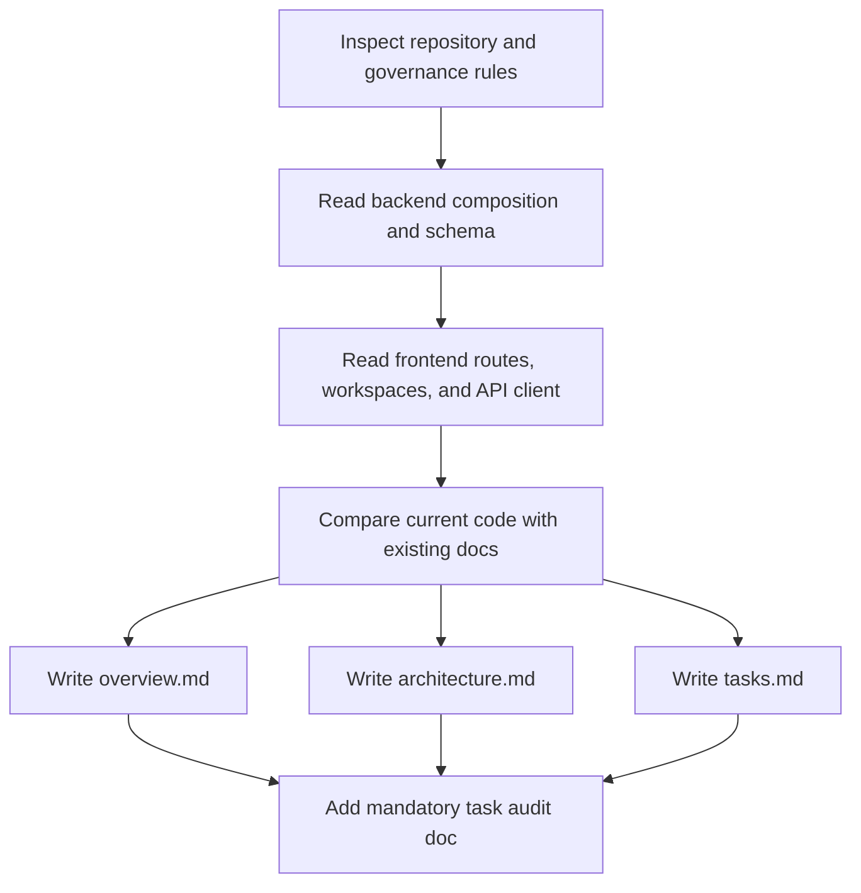
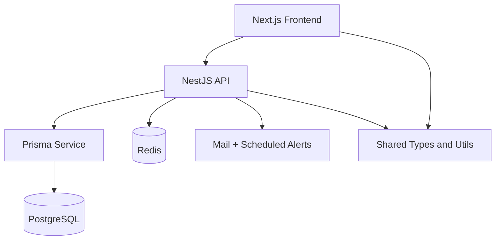

# Task Documentation

## 1. What Was Done
The task objective was to analyze the current repository and create three concise project documents:
- `docs/overview.md`
- `docs/architecture.md`
- `docs/tasks.md`

The main problem was that the repository already contains much more functionality than the older root `README.md` describes. That created a risk of inaccurate onboarding and poor planning. To solve that, I inspected the live codebase structure, backend modules, Prisma schema, frontend routes, shared packages, Docker setup, and existing project notes before writing the new documents.

The final result is a compact documentation set that explains what the project is, how it is structured, and what work still remains before the team can confidently call the product MVP-ready.

---

## 2. Detailed Audit
The first action was to inspect the repository layout. I reviewed the root folders, workspace packages, existing docs, and the project governance instructions so the new files would fit the established documentation style and folder placement. This confirmed that documentation belongs in `docs/` and that a mandatory post-task documentation file was required.

I then verified the real application surface from source code instead of relying on the older root `README.md`. That step was necessary because the root readme still presents the backend as a small auth-only foundation, while the current repository contains additional feature modules such as products, categories, inventory, sales, alerts, and reports. Using the code as the source of truth avoided copying stale information into the new docs.

For backend analysis, I reviewed:
- `backend/src/app.module.ts` and `backend/src/main.ts` to understand global composition, versioning, CORS, response wrapping, rate limiting, and feature-module registration
- module controllers and services for `auth`, `users`, `categories`, `products`, `inventory`, `sales`, `alerts`, `reports`, and `health` to understand the implemented business scope
- `backend/prisma/schema.prisma` to identify the real domain model
- `backend/prisma/seeds/seed.ts` to confirm the seeded operational baseline
- `backend/test/app.e2e-spec.ts` to understand what the repository currently validates automatically

For frontend analysis, I reviewed:
- the App Router structure under `frontend/src/app`
- authenticated and auth route groups
- the API client in `frontend/src/lib/api/api-client.ts`
- the auth store in `frontend/src/store/auth.store.ts`
- the main workspace files for dashboard, products, inventory, POS, reports, and users
- layout components such as the authenticated shell and sidebar

This analysis showed that the frontend is not a placeholder. It already provides screens for the main retail workflows and consumes typed backend APIs through shared contracts.

After the architecture pass, I created `docs/overview.md`. The goal of that file was not to repeat every technical detail, but to give a clear project description, identify who uses the product, list the implemented scope, and explain the platform at a high level. I kept it concise because the user explicitly requested concise output.

I then created `docs/architecture.md`. This file focuses on structural understanding: repository shape, backend modules, frontend route organization, shared packages, request flow, and runtime topology. I chose a compact structure with short sections and bullet points because that is faster to scan than a long narrative when onboarding engineers.

Next, I created `docs/tasks.md`. This document had to reflect actual remaining work to reach MVP, not a generic retail roadmap. Based on the codebase review, the key remaining work is mostly hardening rather than missing greenfield features. I therefore centered the tasks around real-environment validation, frontend automated testing, payment-scope alignment, device-level QA, operational configuration, and documentation cleanup.

I deliberately avoided inventing unfinished features that I could not verify in code. For example, I did not claim that product management or POS checkout were missing, because they are already implemented in the repository. I also did not claim frontend tests exist, because the repository inspection showed backend test coverage but no frontend test files.

Architecture choices were preserved rather than reinterpreted. The docs describe the actual implementation:
- NestJS modular monolith on the backend
- Next.js App Router frontend with workspace-style feature screens
- Prisma as the only database access layer
- shared contracts under `packages/` rather than a literal `/shared` folder

Risks avoided:
- copying stale README claims into the new documentation
- overstating MVP completeness without acknowledging remaining validation work
- inventing task items not supported by the repository
- modifying unrelated code paths when the request was documentation-focused

Files impacted were intentionally limited to the requested documentation outputs plus the mandatory task-audit document required by repository governance.

---

## 3. Technical Choices and Reasoning
The naming choices were intentionally direct:
- `overview.md` for product orientation
- `architecture.md` for technical structure
- `tasks.md` for actionable MVP completion work

This naming is simple, discoverable, and appropriate for both technical and non-technical readers.

The structural choice was to place the files in `docs/`, because the repository already stores project documentation there. That avoids scattering documentation between the root and the docs folder.

I did not add dependencies because this task only required repository analysis and markdown authoring.

Performance considerations were not relevant to runtime behavior, but they were relevant to analysis quality. I prioritized reading high-signal files such as `app.module.ts`, `schema.prisma`, route files, workspace files, and e2e coverage instead of exhaustively reading every file in full. That kept the documentation grounded without creating unnecessary noise.

Maintainability improved because the new documents give the project a current and concise entry point even though the root `README.md` still reflects an older phase of the codebase.

Scalability considerations were captured in the architecture document by describing module boundaries, shared contracts, and the runtime topology instead of only listing features. That helps future contributors understand where new work should fit.

Security considerations were relevant to the analysis because authentication, role guards, password reset, and environment-based secrets are already part of the implementation. I reflected those in the overview and architecture docs without overstating them or turning the docs into a security audit.

---

## 4. Files Modified
- `docs/overview.md` — added a clear high-level description of the project, product scope, users, stack, and current state
- `docs/architecture.md` — added a concise architecture map covering repository shape, backend modules, frontend structure, data model, and runtime flow
- `docs/tasks.md` — added an actionable MVP-focused task list based on actual implementation gaps and hardening needs
- `docs/task-project-documentation-baseline.md` — added the mandatory post-task audit documentation for this documentation task

---

## 5. Validation and Checks
Validation performed:
- Repository structure inspection: completed
- Backend architecture inspection: completed
- Frontend architecture inspection: completed
- Prisma schema inspection: completed
- Test surface inspection: completed
- Existing documentation comparison: completed

What was explicitly verified from code:
- The repository includes backend modules for auth, users, categories, products, inventory, sales, alerts, reports, health, and mail
- The frontend includes authenticated pages and workspace UIs for dashboard, products, inventory, POS, alerts, reports, profile, users, and sales history
- Shared contracts are implemented in `packages/shared-types` and `packages/shared-utils`
- Backend tests exist, including a large e2e suite
- Frontend test files were not present during inspection

What was not run:
- `npm run verify`
- frontend build
- backend build
- automated tests
- Docker Compose boot

These were not necessary to write the requested documentation files, so I am not claiming any build or test status beyond source inspection.

Regression check:
- No application code was changed
- Only documentation files were added

---

## 6. Mermaid Diagrams

## Commit Message
docs: add project overview architecture and MVP task docs
