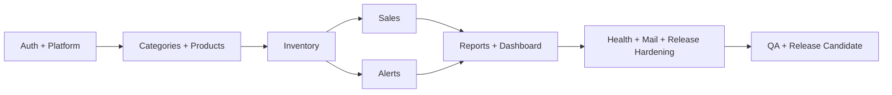
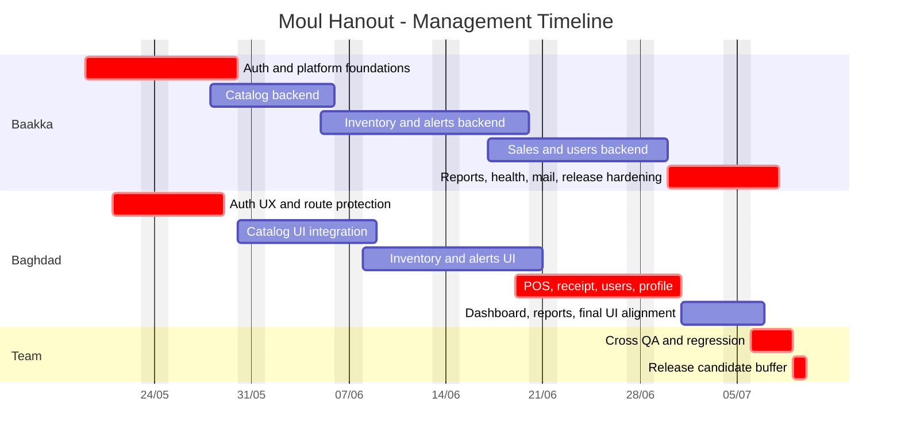

# Task Documentation

## 1. What Was Done
The task objective was to create a professional Gantt diagram for the Moul Hanout project, taking into account that the team contains two people: `Baakka` and `Baghdad`.

The problem was that the repository already contains many implemented modules, but there was no manager-level planning view that organizes the remaining work in a realistic execution sequence with ownership, overlap, milestones, and stabilization time.

I created a new roadmap document in `docs/project-gantt-roadmap-2026-05.md`. This file contains:
- project planning assumptions
- team responsibility split
- a delivery strategy
- a Mermaid Gantt diagram
- management cadence
- risks and mitigations

The final result is a practical 8-week roadmap starting on `2026-05-19` and ending on `2026-07-10`, with backend-first sequencing on critical modules and parallel frontend integration where appropriate.

## 2. Detailed Audit
I first reviewed the current project context from the repository rather than inventing a generic software plan. This was necessary because the project is not a blank product: it already contains real modules and documentation.

I used the following repository sources as planning inputs:
- `.github/project-board/modules-board.json`
- `docs/overview.md`
- `docs/MVP-2-WEEK-SCOPE.md`

These files were necessary for different reasons.

The module-board JSON was used to identify the real execution domains that already structure the codebase:
- dashboard
- auth
- users
- categories
- products
- inventory
- sales
- alerts
- reports
- health
- mail
- platform

The overview document was used to understand the product’s current maturity. It explicitly shows that the application is beyond pure MVP foundation and that the main remaining work is stabilization, validation, and production-readiness. This changed the nature of the Gantt plan. Instead of planning greenfield construction from zero, the roadmap had to emphasize hardening and integration sequencing.

The MVP scope document was used as a control reference for core business flows:
- authentication
- category/product management
- inventory control
- sales and checkout
- dashboard and reporting

This mattered because a professional Gantt should sequence critical flows according to operational dependency. For example:
- `inventory` depends on reliable `products`
- `alerts` depends on reliable `inventory`
- `sales` depends on both `products` and `inventory`
- `dashboard` and `reports` depend on stabilized business data

I then converted the module structure into a phased plan. The phases were chosen to respect technical dependencies and to minimize integration risk:

1. Foundations
This phase covers auth and platform work first because authentication, contracts, and workflow stability affect every other module. Starting with frontend cosmetics or reporting first would create avoidable rework.

2. Catalog
Categories and products were scheduled next because inventory and sales cannot be stabilized if the catalog layer still has contract drift or lifecycle issues.

3. Inventory and alerts
Inventory must be stabilized before alerts because alerts are derived from stock state. This phase also isolates one of the highest business-risk areas: stock integrity.

4. Sales and store operations
Sales were placed after inventory intentionally. The sales module writes business-critical data and changes stock, so it should not be treated as independent from stock rules.

5. Reporting and release
Reports and dashboard alignment were placed near the end because they depend on stable business definitions from earlier modules. Health checks, Docker readiness, and mail hardening were also placed in this phase because they are essential for a credible release candidate.

I assigned responsibilities based on a practical two-person team model.

`Baakka` was assigned backend, shared contracts, Prisma, and release hardening responsibilities. This includes the modules where architectural consistency and data integrity are most sensitive.

`Baghdad` was assigned frontend integration, UX flow consistency, route and workspace validation, and cross-module user-facing stabilization. This assignment matches the natural split between API source-of-truth work and interface delivery work.

I also inserted overlapping work rather than serializing everything. This was important because a professional project plan for two developers should not leave one contributor idle while the other completes a long technical stream. For example:
- Baghdad starts auth frontend after the first backend auth work begins
- catalog frontend work overlaps with backend catalog hardening
- inventory and alerts frontend work begin once the relevant backend baselines are reasonably stable

Finally, I added explicit milestones and a correction buffer. This was necessary because many project plans fail by ending exactly when development ends, leaving no time for regression fixes. The roadmap therefore includes:
- a catalog and inventory stabilization milestone
- a core operations stabilization milestone
- a final release candidate milestone
- a short defect buffer before the end date

I attempted to generate an external FigJam gantt diagram through the available Figma tooling as an additional artifact. That operation was blocked because the tool requires a `planKey` that was not available in the current session. I did not fabricate one. I continued with the repository-native Mermaid deliverable instead.

## 3. Technical Choices and Reasoning
The roadmap was written as Mermaid inside Markdown because:
- it is version-controlled
- it stays editable in the repository
- it renders well in GitHub-compatible viewers
- it avoids dependence on external tools for the main deliverable

The chosen file name `project-gantt-roadmap-2026-05.md` makes the planning period explicit and avoids ambiguity with implementation or audit documents.

The timeline starts on `2026-05-19`, which is the first working day after the current session date `2026-05-18`. Using an explicit start date avoids ambiguity around relative terms like “next week”.

An 8-week planning window was selected because the current repository state suggests the work is mainly integration, hardening, and release preparation across many modules. A shorter plan would look artificially optimistic for a two-person team; a much longer one would reduce management usefulness.

The task grouping follows dependency logic rather than folder order:
- auth and platform first
- catalog before inventory
- inventory before alerts and sales
- reports after transactional stabilization

This ordering was preferred because it reduces rework and helps preserve backend-as-source-of-truth architecture.

The plan deliberately reserves `Baakka` for backend/platform-critical work and `Baghdad` for frontend/integration work. This improves maintainability because each contributor has a coherent stream of responsibility, while still allowing paired QA and synchronization checkpoints.

From a scalability perspective, the roadmap can be extended by adding a second phase after the release candidate for post-MVP items such as suppliers, purchases, advanced analytics, or multi-store support.

From a security and quality perspective, the plan explicitly includes:
- auth hardening
- shared contract alignment
- health checks
- mail behavior verification
- regression and QA buffer

This prevents the project plan from becoming feature-only and ignoring release risk.

## 4. Files Modified
- `docs/project-gantt-roadmap-2026-05.md` — created the professional project roadmap and Mermaid Gantt diagram for Baakka and Baghdad
- `docs/task-project-gantt-roadmap.md` — created the required post-task documentation and audit trail

## 5. Validation and Checks
- Build status: not run, because this task creates documentation only
- Lint status: not run, because no application source code was modified
- Type-check status: not run, because no TypeScript code was changed
- Manual validation: completed at document level
- Validation performed:
  - checked the roadmap against the real repository module structure
  - aligned sequencing with documented MVP and current product scope
  - verified that owner assignments remain coherent for a two-person team
  - confirmed the Mermaid Gantt syntax is repository-ready
- External diagram generation: attempted but not completed
- Blocking reason: the Figma gantt tool required a `planKey` not available in this session

## 6. Mermaid Diagrams

## Commit Message
docs: add professional gantt roadmap for baakka and baghdad
