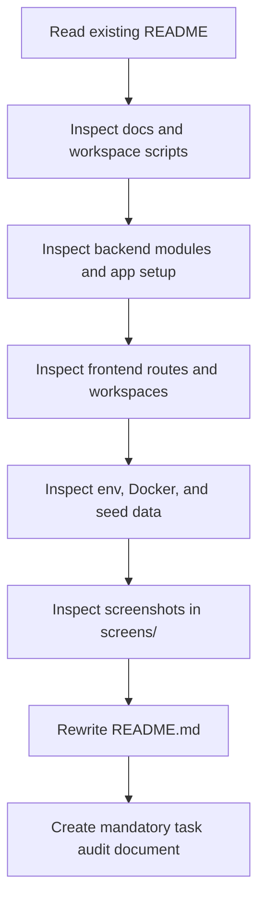
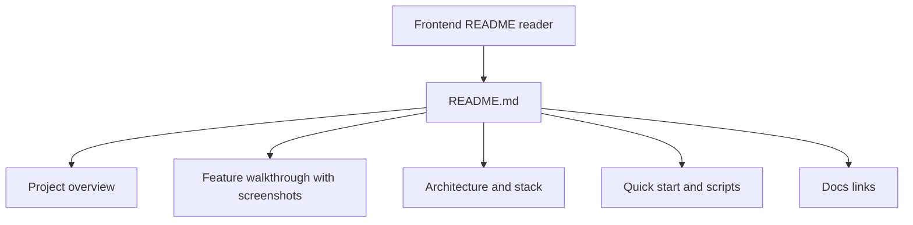

# Task Documentation

## 1. What Was Done
The task objective was to transform the root `README.md` from an outdated placeholder into a real project-level documentation entry point for the Moul Hanout platform.

The problem was that the previous README still described the repository as a small "Phase 1 foundation" focused mainly on auth, users, health, and Prisma basics. That was no longer accurate. The codebase already contains a much broader retail workflow including products, categories, inventory, sales, alerts, reports, team management, and profile/email settings. Keeping the old README would mislead contributors, reviewers, and anyone trying to understand the product.

To solve this, I rewrote `README.md` so it now:
- explains the project in product terms
- documents the implemented feature set
- shows the system architecture and stack
- explains repository structure
- includes setup and run instructions
- lists useful scripts
- documents seeded demo accounts
- embeds screenshots from the `screens/` folder and ties them to feature explanations

The final result is a more complete and accurate root README that helps an engineering student or new contributor quickly understand what the system does, how it is organized, and how to run it.

---

## 2. Detailed Audit
The first action was to inspect the current state of the repository instead of editing the README blindly. This was necessary because the user's request was specifically to make the README a "full documentation" entry point, and accuracy mattered more than speed.

I started by reading the existing `README.md`. That confirmed the current document was stale. It still described the backend as a reduced foundation and explicitly claimed later modules such as products, categories, stock, sales, reports, and alerts had been removed. That statement conflicted with the actual repository contents.

To determine the real product scope, I inspected the root workspace and documentation files. I reviewed:
- the root `package.json` to understand workspace structure and available scripts
- `docs/overview.md` and `docs/architecture.md` to compare existing high-level documentation with live code
- the `docs/` directory to understand the repository's documentation conventions

This step was necessary to avoid rewriting the README in a way that disagreed with the project's established documentation set.

I then validated the backend feature surface by reviewing `backend/src/modules`. This confirmed the live backend includes:
- `auth`
- `users`
- `categories`
- `products`
- `inventory`
- `sales`
- `alerts`
- `reports`
- `health`
- `mail`

That check was important because the README needed to describe the real source of truth instead of repeating outdated claims.

Next, I inspected the frontend route and workspace structure under `frontend/src/app`. This showed that the frontend already contains authenticated screens and workspaces for:
- dashboard
- sales/POS
- inventory
- products
- categories
- users
- alerts
- profile
- reports
- auth flows such as login, forgot password, and reset password

This was necessary because the README now needed to explain both the backend and the frontend product surface.

To document runtime setup and developer commands, I reviewed:
- `.env.example`
- `backend/package.json`
- `frontend/package.json`
- `docker-compose.yml`

This confirmed the actual run modes available in the repo:
- local workspace development with npm scripts
- full-stack container orchestration with Docker Compose
- Prisma client generation and seeding
- backend verification and frontend verification scripts

I also inspected `backend/src/main.ts` and `backend/src/app.module.ts` to document:
- API versioning under `/api/v1`
- Swagger availability in non-production
- global validation
- exception filtering
- response transformation
- throttling
- Redis integration

This was useful because a complete README should not only list features, but also communicate the main engineering conventions of the application.

To document demo access accurately, I reviewed `backend/prisma/seeds/seed.ts`. That confirmed:
- the seeded owner account email and password
- the seeded cashier account email and password
- that baseline categories and products are also created

This avoided the risk of documenting incorrect credentials or making assumptions about seeded data.

Because the user explicitly asked to include images from `/screens`, I inspected the screenshot folder and then viewed the actual images one by one. That step was necessary because the screenshot filenames were timestamp-based and not self-describing. By reading the visuals directly, I could map each image to the right feature:
- dashboard
- POS checkout
- inventory monitoring
- product creation
- category management
- user management
- alerts
- profile/email settings
- reports and reporting detail

This allowed the README to include relevant captions and explanations instead of generic "Screenshot 1/2/3" labels.

After gathering the context, I replaced the old README entirely. I chose replacement instead of incremental editing because the previous content was structurally centered on a narrow foundation narrative that no longer matched the product. Trying to preserve that structure would have made the file harder to understand.

The new README was organized into sections that support onboarding:
- project overview
- feature coverage
- screenshot-based walkthrough
- architecture diagram and module explanation
- tech stack
- repository structure
- quick start for npm and Docker Compose
- seeded demo accounts
- useful commands
- API conventions
- links to additional docs
- current project status

This structure was preferred over a shorter changelog-style README because the user's request was for fuller documentation, not just a summary.

Alternatives considered:
- keeping the old README and adding a short "updated scope" note
- moving the fuller documentation into a new file under `docs/` and leaving the README small

I did not choose those options because they would leave the root README weak as the main entry point. The user's request was specifically to modify `README.md`, and the stale content was too misleading to keep as the primary framing.

Architecture choices were preserved rather than changed. The README reflects the existing implementation:
- backend remains the source of truth
- frontend remains an API consumer
- shared contracts remain in `packages/shared-types` and `packages/shared-utils`
- Prisma remains the only database access layer

Risks avoided:
- overstating or inventing features not validated in code
- assigning incorrect meanings to screenshots with timestamp names
- documenting wrong setup steps or wrong seeded credentials
- modifying unrelated application code during a documentation task

Files impacted were intentionally minimal:
- the root `README.md`
- this mandatory task audit document under `docs/`

No runtime logic, schema, API contract, or UI code was changed.

---

## 3. Technical Choices and Reasoning
The main naming choice was the task documentation file name: `task-readme-documentation-refresh.md`. This name is direct and discoverable. It clearly signals that the task focused on refreshing the root README rather than altering product logic.

The README structure was designed for layered reading:
- a short overview first for immediate orientation
- feature sections next for product understanding
- screenshots after that for visual confirmation
- architecture and setup sections later for technical onboarding

This order was chosen because new contributors usually first want to know what the system is, then what it does, then how to run it.

I used screenshot-led documentation because the user explicitly asked for images from `/screens`. The images were not inserted as decoration. Each image is paired with a feature explanation so the screenshots reinforce understanding instead of just increasing file length.

I included a Mermaid architecture diagram because it gives fast structural context and fits the educational requirement of the repository's documentation policy.

I did not add dependencies, scripts, or tooling because the task only required markdown changes.

Maintainability considerations:
- the README now aligns with the actual codebase and existing docs
- setup commands point to existing scripts rather than custom instructions
- feature sections are grouped by business capability instead of file names, which makes the document more stable as code evolves

Scalability considerations:
- the README presents the system as a modular full-stack platform, which is closer to the real architecture
- module lists and stack descriptions help future contributors place new work in the correct layer

Performance considerations were limited to documentation quality rather than runtime behavior. I chose to read high-signal source files and existing docs before editing so the README would be comprehensive without becoming speculative.

Security considerations included documenting:
- JWT-based auth
- role separation
- environment-based secrets
- optional SMTP configuration as a complete set

I avoided exposing any real secrets and only documented the seeded demo credentials already present in the repository seed script.

---

## 4. Files Modified
- `README.md` - replaced the outdated placeholder with full project documentation, setup guidance, architecture notes, commands, and screenshot-led feature explanations
- `docs/task-readme-documentation-refresh.md` - added the mandatory post-task audit document for this README refresh

---

## 5. Validation and Checks
Validation performed:
- existing README review: completed
- root workspace script review: completed
- backend module review: completed
- frontend route/workspace review: completed
- environment example review: completed
- Docker Compose review: completed
- seed script review: completed
- screenshot folder review: completed
- screenshot content review: completed

What was verified from source:
- the repository currently contains the documented backend modules
- the frontend contains the documented workspaces
- the demo credentials documented in the README match the seed script
- the screenshot captions correspond to the actual UI screens in `screens/`
- the commands documented in the README map to existing npm scripts

What was not run:
- `npm run build`
- `npm run lint`
- `npm run test`
- `npm run verify`
- `docker compose up --build`

These were not executed because the task was documentation-only and did not change runtime code. I am not claiming build, lint, or test success for this task.

Regression check:
- no backend code changed
- no frontend code changed
- no schema or migration changed
- only documentation files were modified

---

## 6. Mermaid Diagrams

## Commit Message
docs: refresh README with full project documentation and screenshots
