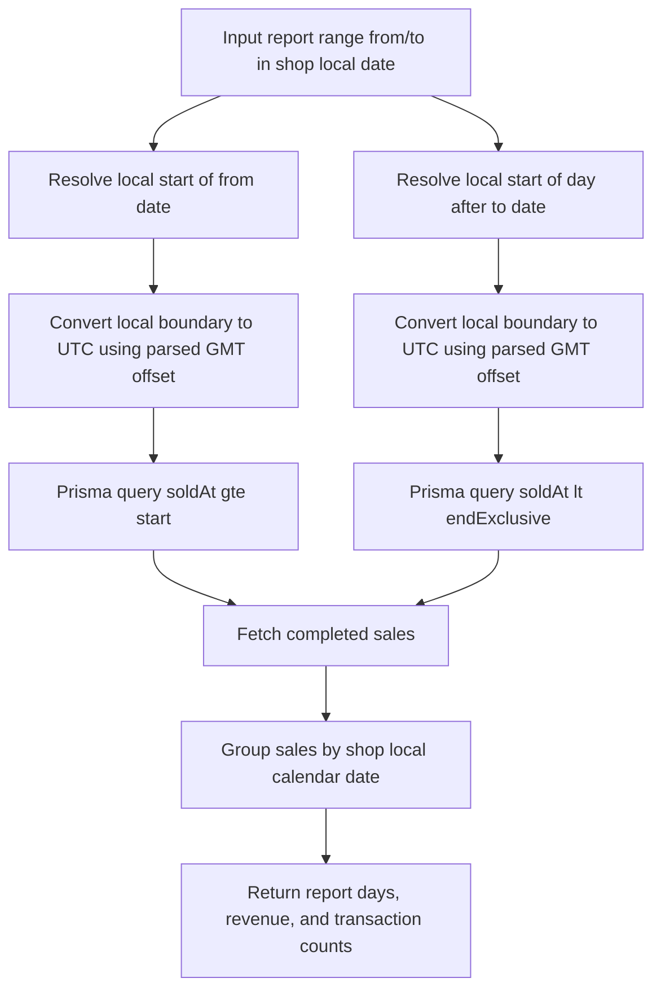
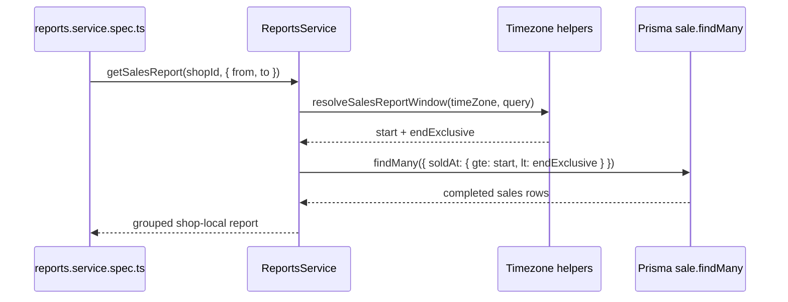

# Task Documentation

## 1. What Was Done
The objective was to resolve a backend test failure that blocked pushes in CI for the reports module.

The failing test was `ReportsService -> groups sales by the shop local date instead of UTC date`. The root problem was the way the sales report date window was converted from a shop-local date into UTC timestamps. The previous implementation built an end-of-day boundary with `Intl.DateTimeFormat(...).formatToParts(...)` and reconstructed a UTC date from calendar parts. That approach was fragile across operating systems and runtimes, especially around midnight. On the GitHub Actions Linux runner, it produced a different upper bound than the local Windows machine, which caused the test to fail only when pushing.

The implemented solution changed the sales query window to use:
- an inclusive lower bound: start of the selected local day
- an exclusive upper bound: start of the next local day

The timezone offset is now derived from the formatted GMT offset string such as `GMT+01:00`, then converted into milliseconds. This avoids the cross-platform midnight parsing issue and removes the previous off-by-millisecond behavior.

The final result is that the reports service now computes a stable shop-local sales window, the report test passes locally, and the backend test suite is green again.

## 2. Detailed Audit
1. I inspected the failing spec and the reports service implementation in `backend/src/modules/reports`.
   This was necessary to determine whether the failure was caused by incorrect business logic, a stale test expectation, or a platform-specific runtime difference.

2. I reproduced the timezone conversion behavior with a small Node script using `Africa/Casablanca`.
   This showed that the existing helper generated different results depending on how `Intl` exposed midnight-related values. It also exposed that the previous logic lost millisecond precision and relied on reconstructed calendar parts instead of a real offset.

3. I reviewed the report query semantics.
   The previous implementation queried with `gte start` and `lte end-of-day`. That pattern is more error-prone than using an exclusive upper bound because it depends on a synthetic `23:59:59.999` timestamp and can drift by a millisecond.

4. I changed `resolveSalesReportWindow` so it now returns:
   - `start`: the UTC timestamp for the local start of the `from` day
   - `endExclusive`: the UTC timestamp for the local start of the day after `to`

5. I replaced the old `createTimeZoneBoundary` helper with `createStartOfDayInTimeZone`.
   This new helper resolves only one kind of boundary: the start of a local day. That makes the method easier to reason about and keeps it aligned with the new `gte` / `lt` query shape.

6. I replaced the old offset reconstruction logic with `getTimeZoneOffsetInMilliseconds` plus `parseTimeZoneOffset`.
   The new flow asks `Intl` for `timeZoneName: 'longOffset'`, extracts values like `GMT+01:00`, parses them, and converts them to milliseconds. This is simpler, preserves precision, and avoids relying on runtime-specific calendar-part interpretations.

7. I kept a two-step offset resolution in `createStartOfDayInTimeZone`.
   The helper first computes an initial candidate date, then re-checks the offset for that resolved instant. This was chosen to reduce the risk of incorrect results around timezone transitions without adding a dependency.

8. I updated the unit test to assert the new, clearer query contract.
   The test now expects:
   - `gte: 2026-01-14T23:00:00.000Z`
   - `lt: 2026-01-15T23:00:00.000Z`
   for a Casablanca-local report on `2026-01-15`.

9. I removed one unused type alias from the same service file.
   This was a small cleanup to avoid carrying an avoidable unused symbol in a touched file.

10. I validated the change with the backend test suite and build.
    I also ran backend lint and documented that the repository currently has many unrelated lint violations outside this task. I did not modify unrelated modules just to silence existing project-wide issues, because that would violate the instruction to make minimal and precise changes.

Alternatives considered:
- Updating only the test expectation:
  This was rejected because it would hide a real cross-platform bug in the date-window calculation.
- Keeping `lte end-of-day` and only fixing the offset helper:
  This was less desirable because the inclusive end-of-day model is inherently more fragile than an exclusive next-day start.
- Adding a timezone library:
  This was rejected because the fix could be implemented safely with the platform APIs already in use, avoiding a new dependency.

Architecture choices preserved:
- Backend remains the source of truth for report window logic.
- Business logic stays inside the NestJS service.
- No frontend or shared-contract changes were introduced.

Risks avoided:
- No API contract changes were made to controllers or DTOs.
- No database schema or Prisma access pattern changes were introduced.
- No unrelated lint remediations were mixed into this focused fix.

Files impacted:
- `backend/src/modules/reports/reports.service.ts`
- `backend/src/modules/reports/reports.service.spec.ts`
- `docs/task-reports-ci-timezone-window-fix.md`

Logic preserved:
- Sales are still grouped by the shop local calendar date.
- CSV export still reuses the same sales aggregation logic.
- Missing-shop behavior still throws `NotFoundException`.

Logic changed:
- The UTC window used for the sales query now ends at the next local day start with `lt`, instead of a computed end-of-day timestamp with `lte`.
- Timezone offset calculation now uses parsed GMT offsets instead of reconstructed date parts.

## 3. Technical Choices and Reasoning
Naming choices:
- `createStartOfDayInTimeZone` was chosen because it states exactly what the helper returns.
- `endExclusive` was chosen because it makes the query semantics obvious at the call site.

Structural choices:
- The service still follows the existing NestJS service responsibility boundary.
- The query window logic remains private to the reports service because it is report-specific business behavior.

Dependency decisions:
- No new package was added.
- Native `Intl` support was retained, but used in a more stable way through `longOffset`.

Performance considerations:
- The fix does not add database queries.
- The new logic performs a few in-memory date calculations only once per report request, which is negligible compared with the Prisma query.

Maintainability considerations:
- Exclusive range queries are easier to read, test, and reason about than inclusive end-of-day ranges.
- Parsing explicit GMT offsets reduces hidden runtime behavior and makes future debugging easier.

Scalability considerations:
- The service logic remains encapsulated and reusable for future report expansion.
- The normalized date-window strategy is safer for additional timezone-aware reporting features.

Security considerations:
- No authentication, authorization, or secret-handling behavior was changed.
- No user input surface was widened.

## 4. Files Modified
- `backend/src/modules/reports/reports.service.ts` - replaced the fragile end-of-day timezone conversion with a stable start-of-day plus exclusive-next-day window calculation.
- `backend/src/modules/reports/reports.service.spec.ts` - updated the expected Prisma sales query window to the new `gte` / `lt` contract.
- `docs/task-reports-ci-timezone-window-fix.md` - added the required post-task engineering audit and validation record.

## 5. Validation and Checks
- Build status: `npm run build --workspace backend` passed.
- Test status: `npm run test --workspace backend` passed with 4 test suites and 21 tests passing.
- Narrow lint status for changed files: `npx eslint src/modules/reports/reports.service.ts src/modules/reports/reports.service.spec.ts` passed when run from `backend/`.
- Full backend lint status: `npm run lint --workspace backend` failed due pre-existing repository-wide ESLint issues in multiple unrelated files, including `current-user.decorator.ts`, `http-exception.filter.ts`, `roles.guard.ts`, `auth.service.ts`, `mail.service.ts`, `sales.service.ts`, and `backend/test/app.e2e-spec.ts`.
- Manual API validation: not run, because this task was a service-level CI test failure fix.
- UI validation: not applicable.
- Regression check: backend tests passed after the fix, covering the affected reports service path and existing auth/mail/roles guard suites.

## 6. Mermaid Diagrams

## Commit Message
fix: stabilize reports sales date window across CI timezones
