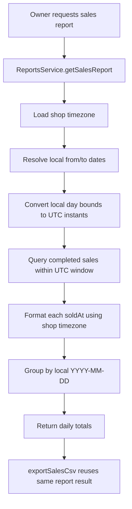
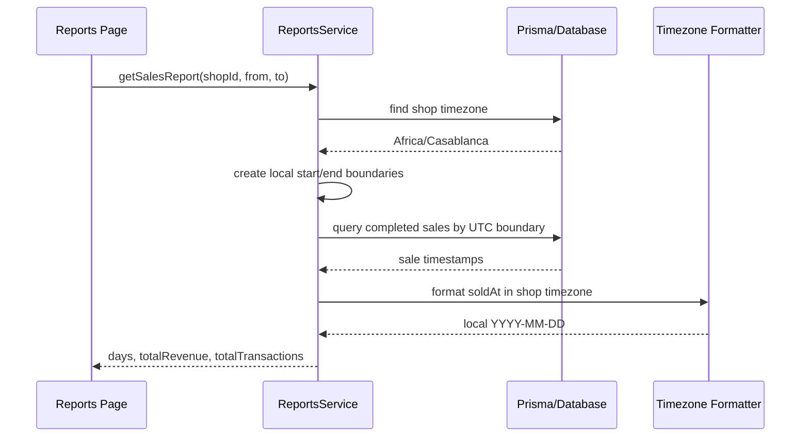

# Task Documentation

## 1. What Was Done
The objective was to make the reports module use the same shop-local timezone logic as the sales dashboard summary so both features calculate daily totals from the same business day.

The existing problem was that `ReportsService.getSalesReport()` grouped sales by UTC calendar date using `toISOString().split('T')[0]` and also built `from` and `to` boundaries in UTC. In contrast, `SalesService.getDailySummary()` already resolved day boundaries using the shop’s timezone. Because of that mismatch, the reports page and the dashboard could disagree on daily revenue and transaction totals for sales near midnight in the shop’s local time.

The implemented solution updated `ReportsService` to load the shop timezone before building the sales report, normalize the date boundaries using the same timezone-boundary pattern already used in `SalesService`, and aggregate each sale into a shop-local date string with `Intl.DateTimeFormat`. Since `exportSalesCsv()` already delegates to `getSalesReport()`, the CSV export now uses the same corrected local-day aggregation.

The final result is that dashboard and reports now evaluate sales against the same local business day definition, which makes daily totals consistent.

## 2. Detailed Audit
The first step was to inspect both `ReportsService` and `SalesService` side by side. This was necessary to confirm where the inconsistency came from and to avoid introducing a third date-handling approach.

The audit showed a clear mismatch:
- `SalesService.getDailySummary()` fetches the shop timezone from the database
- it resolves day start and day end with timezone-aware helpers
- `ReportsService.getSalesReport()` did not fetch the shop timezone
- it used UTC-based `Date` construction and UTC date-string grouping

This confirmed that the report path needed to adopt the same timezone strategy as the sales summary path.

The next change was to inject shop timezone context into `ReportsService.getSalesReport()`. A shop lookup was added using `shopId`, and the method now throws `NotFoundException` when the shop does not exist. This mirrors the defensive pattern already used in `SalesService.getDailySummary()` and prevents timezone logic from running without a valid shop context.

After that, the sales-report time window logic was replaced. The old implementation used:
- `new Date(dto.from + 'T00:00:00.000Z')`
- `new Date(dto.to + 'T23:59:59.999Z')`

Those boundaries are UTC-based and do not represent the beginning and end of the day in the shop timezone. The new implementation resolves report windows with the same helper pattern used in sales summaries:
- compute a local reference date in the shop timezone
- derive the local `from` and `to` dates
- convert local day start/day end into UTC `Date` boundaries with `createTimeZoneBoundary`

This was necessary because the database stores timestamps as absolute instants, but reporting should interpret those instants according to the shop’s local business calendar.

The aggregation logic was then updated. Instead of grouping rows by:
- `sale.soldAt.toISOString().split('T')[0]`

the report now groups them by:
- `new Intl.DateTimeFormat('en-CA', { timeZone: shop.timezone, year: 'numeric', month: '2-digit', day: '2-digit' }).format(sale.soldAt)`

This is the key behavioral fix. It ensures a sale is assigned to the date seen by the shop locally, not by UTC.

`exportSalesCsv()` did not require separate date logic because it already delegates to `getSalesReport()`. That means the CSV export automatically inherits the corrected shop-local aggregation and boundary handling. This kept the implementation small and avoided duplicating reporting rules in two places.

Focused unit tests were then added in `backend/src/modules/reports/reports.service.spec.ts`. These tests validate:
- report aggregation uses the Casablanca local date rather than the UTC date
- CSV export uses the same corrected aggregation
- a missing shop triggers `NotFoundException`

The main regression scenario covered by the new tests uses a sale timestamp of `2026-01-14T23:30:00.000Z`, which falls on `2026-01-15` in `Africa/Casablanca`. This verifies that the report now counts the sale on the local day rather than the prior UTC day.

Important logic that was preserved:
- only completed sales are included
- revenue totals still sum `totalAmount`
- transaction totals still count returned sale rows
- CSV export structure stayed the same

Important logic that changed:
- shop timezone is now loaded before report aggregation
- report date filtering is timezone-aware
- day buckets are timezone-local instead of UTC

Risks avoided:
- no frontend logic was changed
- no API contract was changed
- no database schema changes were introduced
- no duplicate CSV aggregation path was created

## 3. Technical Choices and Reasoning
The implementation stayed inside `ReportsService` because this task is a reporting behavior fix, not a controller concern. That keeps the controller thin and preserves the project’s service-centered business logic rule.

The shop timezone is read directly from the `Shop` model because the business day belongs to the shop, not to the requesting user or the server environment. This is the correct source of truth for multi-shop correctness.

`Intl.DateTimeFormat` with `en-CA` was chosen for local-day formatting because it produces stable `YYYY-MM-DD` style strings that are suitable for grouping and CSV output. This avoids locale-dependent ambiguity while still respecting the shop timezone.

The same timezone-boundary helper pattern from `SalesService` was reused in `ReportsService` rather than inventing a different conversion method. This was the most important structural choice because the bug came from inconsistent date logic between two modules. Matching the pattern removes that inconsistency.

Maintainability improved because both dashboard summary and reports now follow the same conceptual rule:
- interpret sales days in the shop’s timezone
- query the database using UTC instants derived from local day boundaries

Scalability improved in a correctness sense because additional shops in different timezones will now receive date-grouped reports based on their own configured timezone instead of the server’s UTC interpretation.

Security impact was minimal because this task does not affect authentication, authorization, or secret handling. The main reliability concern was deterministic date grouping, which was addressed through explicit tests.

## 4. Files Modified
- `backend/src/modules/reports/reports.service.ts` — added shop-timezone lookup, timezone-aware report boundaries, and local-date aggregation
- `backend/src/modules/reports/reports.service.spec.ts` — added regression tests for local-day grouping, CSV output, and missing-shop handling
- `docs/task-reports-timezone-consistency.md` — documented the task, audit trail, validation, and diagrams

## 5. Validation and Checks
Build status:
- `npm run build --workspace backend` passed

Lint status:
- Full backend lint was not used as the completion gate for this task because the repository already contains unrelated lint debt in other backend files
- The modified report files were formatted with Prettier

Type-check status:
- Covered through the successful backend build

Manual test status:
- Browser/manual UI validation was not run in this task

API validation:
- Covered indirectly through unit tests for `ReportsService`

UI validation:
- Not run manually; no frontend code was changed

Regression check:
- `npm run test --workspace backend` passed with 21/21 tests
- New tests specifically cover a timestamp that crosses the UTC/local-day boundary for `Africa/Casablanca`

If something could not be validated:
- No live end-to-end comparison was run against a populated browser dashboard and reports page in this turn

## 6. Mermaid Diagrams

## Commit Message
fix: align sales reports with shop timezone boundaries
