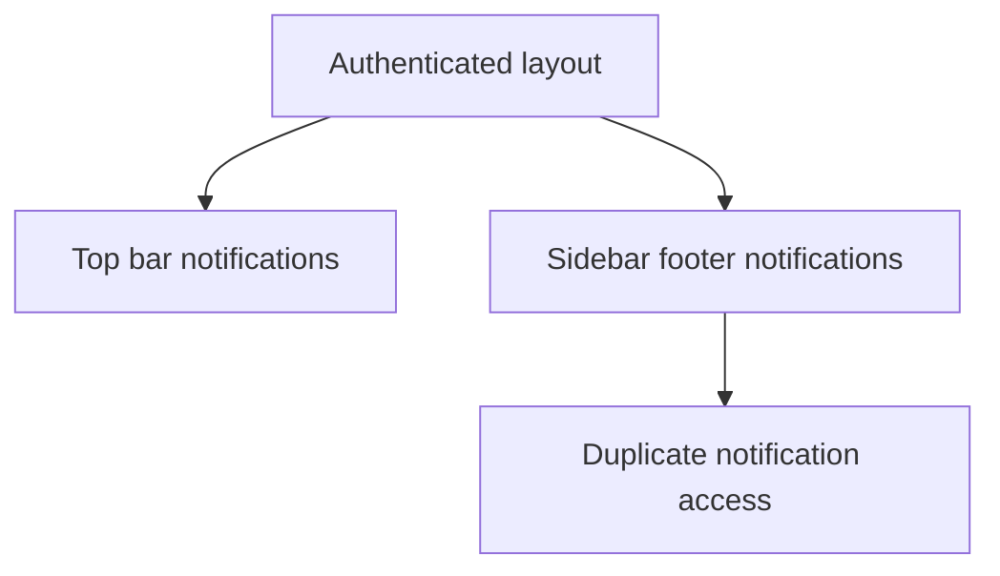
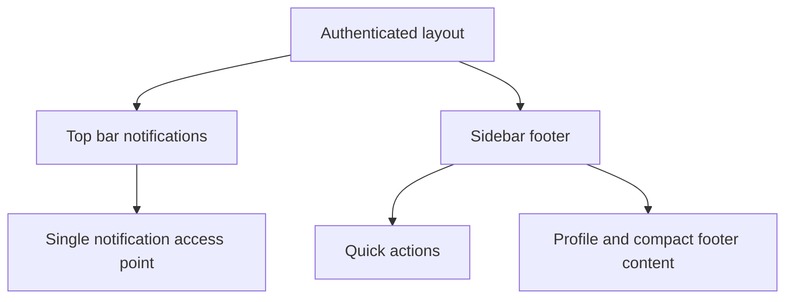

# Task Documentation

## 1. What Was Done
The task objective was to simplify the dashboard shell UI by removing the duplicate notifications control from the side panel and keeping only the notification control at the top.

The problem was that notifications were available in two places at once:
- in the top area of the authenticated UI
- again inside the sidebar footer

This duplication made the layout feel heavier and less consistent, especially on smaller screens where sidebar space is more limited.

The implemented solution was to remove the sidebar `AlertsDropdown` instance and keep the top notification entry point as the single notification access location. At the same time, the sidebar spacing was slightly refined so the remaining footer content still feels balanced after the duplicate control was removed.

The final result is a cleaner sidebar, one clear notification entry point at the top, and a more compatible layout on tighter screen heights.

---

## 2. Detailed Audit
The first step was to inspect the authenticated shell and sidebar components to confirm where notifications were rendered. This was necessary because the requested change was specifically about duplicate notification UI, not about the alerts feature itself.

The inspection showed that the authenticated shell already renders a top notification control using `AlertsDropdown`, while the sidebar footer also rendered another `AlertsDropdown`. Since the user explicitly wanted only the top notification control to remain, the sidebar version was the correct element to remove.

The sidebar component was updated by removing:
- the `AlertsDropdown` import
- the footer block that rendered the second notification control

This was the smallest correct change because it preserves the working top notification access and avoids touching the alerts data flow, provider setup, or navigation routing.

After removing the duplicate control, the sidebar footer had more vertical whitespace than before. To keep the UI visually balanced and more compatible across viewport sizes, the sidebar CSS was refined:
- reduced internal panel gap slightly
- reduced footer gap slightly
- reduced the decorative quote card minimum height
- added a `max-height` media query to make the quote card and quote text more compact on shorter screens

These adjustments were chosen because they improve vertical fit without changing the sidebar structure or removing any working feature.

Files impacted were intentionally minimal and limited to the sidebar implementation and styling. No unrelated modules, routes, APIs, or business logic were changed.

Logic preserved:
- the top notification control remains available
- unread alert badge logic on the `Alerts` navigation link remains intact
- sidebar navigation, drawer behavior, and quick actions remain intact

Logic changed:
- sidebar no longer renders a second notifications dropdown
- footer spacing is slightly tighter for better layout balance

Risks avoided:
- no alerts functionality was removed
- no API contract was changed
- no auth or navigation behavior was rewritten

---

## 3. Technical Choices and Reasoning
The naming and structure were left unchanged because this task did not require any new domain concepts. The right choice here was subtraction rather than refactoring.

The structural choice to keep the top notification control and remove the sidebar one was preferred because the top control is globally visible and already aligns better with standard dashboard navigation patterns.

No dependencies were added, and no existing feature modules were modified beyond the UI composition of the sidebar.

From a compatibility perspective, the small CSS refinements matter because removing a block from a vertically structured sidebar can leave awkward spacing on shorter displays. Making the quote card more compact at lower viewport heights helps the side panel remain usable and visually stable.

Maintainability improved because there is now only one obvious notification entry point, which reduces UI duplication and lowers the chance of future inconsistency between two separate notification triggers.

---

## 4. Files Modified
- `frontend/src/components/layout/app-sidebar.tsx` — removed the duplicate notifications dropdown from the sidebar footer
- `frontend/src/components/layout/app-sidebar.module.css` — tightened sidebar spacing and improved short-height compatibility after removing the duplicate notification control
- `docs/task-sidebar-notification-streamline.md` — added post-task documentation for this UI cleanup

---

## 5. Validation and Checks
Validation completed:
- Frontend lint: passed via `npm run lint --workspace frontend`

Validation not run:
- Frontend production build was not rerun for this small UI-only cleanup
- Manual browser validation was not run in this task

The change is low risk because it removes a duplicated UI control while leaving the main notification control at the top untouched.

---

## 6. Mermaid Diagrams

## Commit Message
refactor: remove duplicate sidebar notification control
