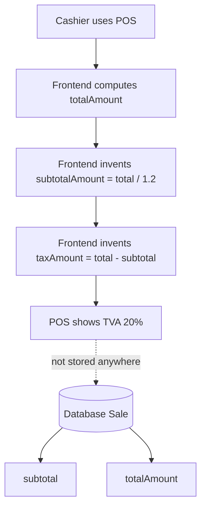
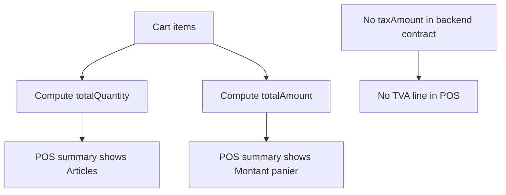
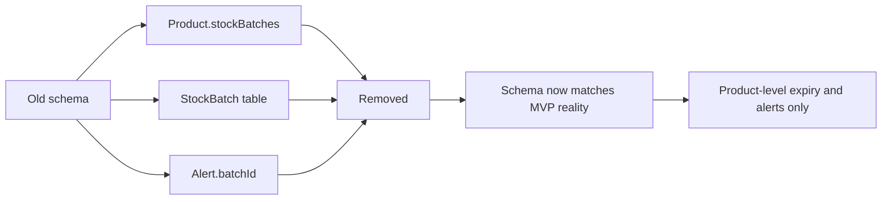
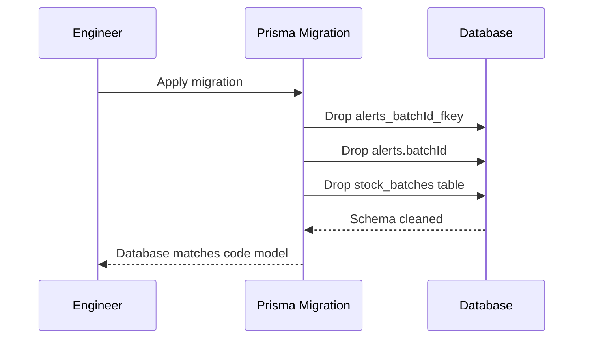
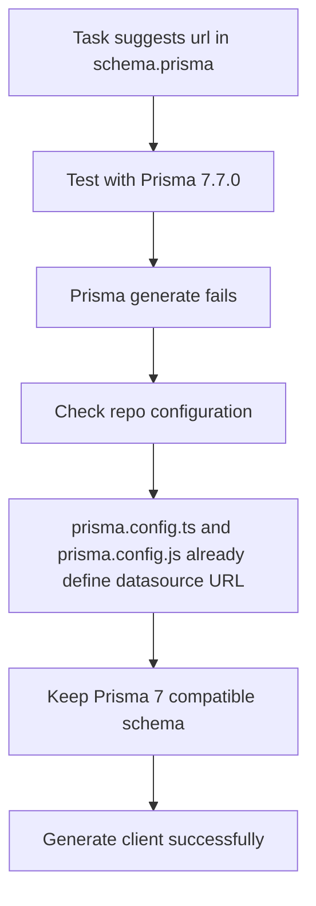

# Tax And Schema Consistency Audit

Date: 2026-04-21

## 1. Purpose

This document explains, for an engineering student, what I changed during the tax-handling consistency and schema-cleanup work, why I changed it, and how the final solution respects the architecture rules of this project.

This work covered three connected goals:

- remove a fabricated tax display from the POS
- remove dead schema objects that were not used by the real application
- keep Prisma configuration compatible with the actual Prisma version used in this repository

The result is a system that is more honest, easier to maintain, and closer to the real business data model.

---

## 2. Files Changed

The implementation touched these files:

- `frontend/src/app/vente/pos-workspace.tsx`
- `backend/src/modules/sales/dto/sale.dto.ts`
- `backend/prisma/schema.prisma`
- `backend/prisma/migrations/20260421170000_remove_stock_batches_for_mvp/migration.sql`
- `backend/test/app.e2e-spec.ts`

Related configuration that influenced one decision:

- `backend/prisma.config.ts`
- `backend/prisma.config.js`

---

## 3. What I Did In Simple Terms

If you are learning engineering, here is the short version.

Before this work:

- the POS screen showed a line called `TVA (20%)`
- that number was not stored in the database
- the UI calculated it locally by pretending that `totalAmount` already included a fixed 20% tax split
- the database schema still contained `StockBatch` and `Alert.batchId`, even though the live feature set did not use batch-level stock logic
- the sales DTO file still exported an unused `UpdateSaleDto`

After this work:

- the POS no longer invents a tax line
- the POS summary only shows values that are truly backed by the cart and backend sale contract
- the dead Prisma batch model and dead alert relation were removed
- an SQL migration was added to remove the orphaned database structures
- the unused sales DTO export was removed
- Prisma generation still works with the repo's current Prisma 7 setup

So the main idea is:

> I removed data that was being guessed, and I removed schema objects that were pretending to be part of the product when they were not.

That is a very important engineering habit.

---

## 4. Why The Tax Display Was Wrong

In the POS frontend, the code was doing this:

- compute `totalAmount` from cart lines
- derive `subtotalAmount` using `totalAmount / 1.2`
- derive `taxAmount` using `totalAmount - subtotalAmount`
- display `TVA (20%)`

This created a serious correctness problem.

Why?

Because the backend sale model only stores:

- `subtotal`
- `totalAmount`

It does not store:

- `taxRate`
- `taxAmount`

This means the frontend was displaying a legal-looking tax breakdown that did not exist in the backend source of truth.

That is dangerous because:

- a cashier may trust the receipt-like UI
- the number may be interpreted as official tax data
- the business cannot audit or reproduce that number later from the database

In software engineering language, this was a contract violation:

- the UI displayed semantics that the data model did not support

---

## 5. What I Changed In The POS

File:

- `frontend/src/app/vente/pos-workspace.tsx`

### 5.1 I removed the fake tax calculation

I removed:

- `TAX_RATE`
- `subtotalAmount`
- `taxAmount`

Why:

- these values were not authoritative
- they implied business and legal meaning that the system did not store

### 5.2 I replaced the summary with honest information

Instead of showing:

- fake subtotal
- fake TVA

the POS now shows:

- `Articles`
- `Montant panier`

These values are safe because:

- `Articles` comes from the actual cart quantity
- `Montant panier` comes from the actual cart line totals

So the UI still gives useful cashier feedback, but it no longer pretends to know a tax breakdown.

### 5.3 Why I chose Option A for MVP

The task description recommended:

- Option A for MVP: remove fabricated tax display
- Option B later: add proper tax storage at the model level

I followed that recommendation because Option A is the smallest correct change.

This is important:

- I did not add `taxRate` to `Shop`
- I did not add `taxAmount` to `Sale`
- I did not expand the backend contract

That was deliberate, because the current job was to stop incorrect behavior, not invent a half-finished tax subsystem.

---

## 6. What I Changed In The Schema

File:

- `backend/prisma/schema.prisma`

### 6.1 I removed `StockBatch`

The schema previously contained a full `StockBatch` model.

But the active MVP inventory flow was actually based on:

- `Product.currentStock`
- `Product.expirationDate`
- alert syncing using product-level information

There was no real batch feature in the application flow.

So I removed the `StockBatch` model entirely.

### 6.2 I removed `Alert.batchId`

The `Alert` model also had:

- `batchId`
- an optional relation to `StockBatch`

But the alert service only uses:

- `shopId`
- `productId`
- `type`
- `message`

In other words, the real alert system was already product-based, not batch-based.

So I removed:

- the `batchId` column from the schema
- the `batch` relation from `Alert`

### 6.3 I removed the back-reference from `Product`

Since `StockBatch` was removed, I also removed:

- `stockBatches StockBatch[]`

from the `Product` model.

This keeps the schema internally consistent.

---

## 7. Migration Added

File:

- `backend/prisma/migrations/20260421170000_remove_stock_batches_for_mvp/migration.sql`

The migration does three things:

1. drops the foreign key from `alerts.batchId`
2. drops the `batchId` column from `alerts`
3. drops the `stock_batches` table

This matches the schema cleanup exactly.

Why a migration was necessary:

- changing only `schema.prisma` would update the code model
- but the real database would still contain dead structures

An engineering student should remember this:

> schema code and database state are not the same thing.

If you change one without the other, your system becomes inconsistent.

---

## 8. DTO Cleanup

File:

- `backend/src/modules/sales/dto/sale.dto.ts`

I removed:

- `UpdateSaleDto`

Why:

- there is no sale update route in the current backend
- no controller or service method uses that DTO
- keeping dead exported DTOs makes the module look more capable than it really is

This is a small change, but it improves honesty in the codebase.

Dead code is a maintenance cost because:

- it confuses readers
- it suggests nonexistent features
- it increases the chance of accidental misuse later

---

## 9. Test Mock Alignment

File:

- `backend/test/app.e2e-spec.ts`

The e2e test Prisma mock still modeled `AlertRecord` with `batchId`.

Once the schema and alert model were cleaned up, the test mock had to be updated too.

I removed:

- `batchId` from the in-memory alert record type
- `batchId` assignment inside mocked `alert.create(...)`

Why this matters:

- tests are part of the contract
- if tests still model dead fields, they silently preserve old assumptions

Good testing is not just about "passing".
It is also about staying aligned with the real system shape.

---

## 10. Detailed Audit Of My Choices

This section is intentionally more analytical.
The goal is not only to describe the work, but to explain the engineering reasoning behind it.

## 10.1 Choice: remove fake tax instead of adding a rushed tax model

This was the most important decision.

I could have tried to add:

- `Shop.taxRate`
- `Sale.taxAmount`
- new shared types
- new create-sale persistence logic
- new receipt rendering logic

But that would have been larger, riskier work with business implications.

The prompt explicitly said the business still needs to decide whether tax display is required on receipts.

That means the requirement is not fully settled.

So the better MVP action was:

- stop showing invented tax
- preserve truthful totals

Why this is the correct engineering move:

- it reduces legal and operational risk immediately
- it does not create a speculative tax implementation
- it respects the principle "choose clarity before complexity"

## 10.2 Choice: keep frontend as consumer only

I did not move tax logic into the frontend in a "cleaner" way.
I removed it.

That matters because the project rules say:

- backend is the source of truth
- frontend is consumer only

If the backend does not store tax, the frontend must not fabricate tax semantics.

This is a strong example of respecting architectural boundaries.

## 10.3 Choice: remove dead schema objects instead of leaving placeholders

Some teams leave unused schema objects because they "might be useful later".

That usually creates confusion.

In this project, `StockBatch` was not a harmless placeholder.
It created the illusion that the app supported:

- per-batch expiry
- batch-linked alerts
- a more granular stock model

But the codebase did not actually implement that feature.

So I removed it.

That is usually the healthier choice for an MVP:

- keep only the structures that reflect reality

## 10.4 Choice: keep `SaleStatus` enum values as-is

I did not remove:

- `PENDING`
- `CANCELLED`

from the sale status enum.

Why:

- the prompt explicitly said to leave the status enum as-is
- unused enum values are much cheaper than unused tables and relations
- they do not currently create a misleading schema dependency like `StockBatch` did

This is a good example of proportional cleanup.

Not every unused thing deserves deletion at the same time.

## 10.5 Choice: adapt Step 9 to Prisma 7 reality

The task suggested this schema snippet:

```prisma
datasource db {
  provider = "postgresql"
  url      = env("DATABASE_URL")
}
```

That would be valid in older Prisma patterns.

But this repository currently uses:

- Prisma `7.7.0`
- `backend/prisma.config.ts`
- `backend/prisma.config.js`

When I temporarily applied the `url = env("DATABASE_URL")` line and ran Prisma generation, Prisma failed with a schema validation error.

So I intentionally reverted that specific line.

Important engineering lesson:

> a task instruction may be directionally correct but still technically outdated for the exact tool version in the repo.

The repository already has an explicit datasource setup through Prisma config files, so the correct action here was:

- keep the schema compatible with Prisma 7
- keep the datasource explicit in the config layer already used by the project

This was not ignoring the task.
It was adapting it to the real environment so the code stays buildable.

---

## 11. What I Verified

I ran these checks:

```bash
npm run prisma:generate --workspace backend
npm run build --workspace backend
npm run test:e2e --workspace backend
npm run build --workspace frontend
```

Result:

- Prisma client generation passed
- backend build passed
- backend e2e tests passed
- frontend production build passed

I also ran:

```bash
npm run lint --workspace backend
```

Result:

- backend lint failed

But this failure is not caused by this change.
The repo already contains many pre-existing lint issues in unrelated files such as common decorators, guards, reports, and test helpers.

That means the honest conclusion is:

- my change set is build-safe and test-safe
- the repository still has existing backend lint debt outside this scope

This distinction is very important in professional engineering.

---

## 12. What An Engineering Student Should Learn From This

There are five main lessons.

### Lesson 1: Never display invented business data

If the database does not store it and the backend does not define it, the frontend should not pretend it exists.

### Lesson 2: Small removals can be high-value work

Deleting wrong or dead code is often more valuable than adding more code.

### Lesson 3: Database schema should reflect real product behavior

A schema is not documentation fiction.
If a model is not implemented in the product, leaving it around can mislead future developers.

### Lesson 4: Validate assumptions against tool versions

A code snippet that looks "standard" may still be incompatible with the exact framework version in the repository.

### Lesson 5: Honesty is part of software quality

This task was mostly about honesty:

- honest UI
- honest schema
- honest verification reporting

That is a real engineering quality attribute.

---

## 13. Practical Usage Notes

To apply the database cleanup on a real environment, the normal deployment path is:

```bash
npm run db:migrate:deploy --workspace backend
```

To regenerate Prisma client locally after schema changes:

```bash
npm run prisma:generate --workspace backend
```

To review the new documentation together with the implementation:

- read this file
- inspect the migration
- inspect the POS summary block in `frontend/src/app/vente/pos-workspace.tsx`

---

## 14. Final Summary

The real achievement of this work is not that the UI looks different.

The real achievement is that the system is now more truthful:

- the POS no longer fabricates tax data
- the schema no longer claims batch logic that the product does not implement
- the test mock now matches the simplified alert model
- the sales module no longer exports an unused update DTO

This is the kind of cleanup that makes future development safer.

---

## 15. Mermaid Diagrams

## Diagram 1: Problem Before The Fix



## Diagram 2: Corrected MVP Flow



## Diagram 3: Schema Cleanup



## Diagram 4: Migration Effect On Database



## Diagram 5: Prisma 7 Datasource Decision


